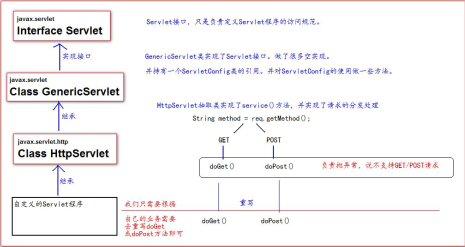
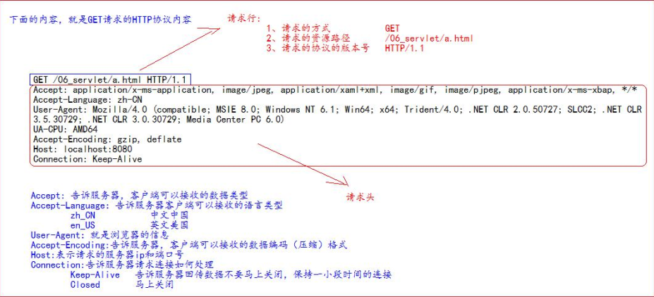
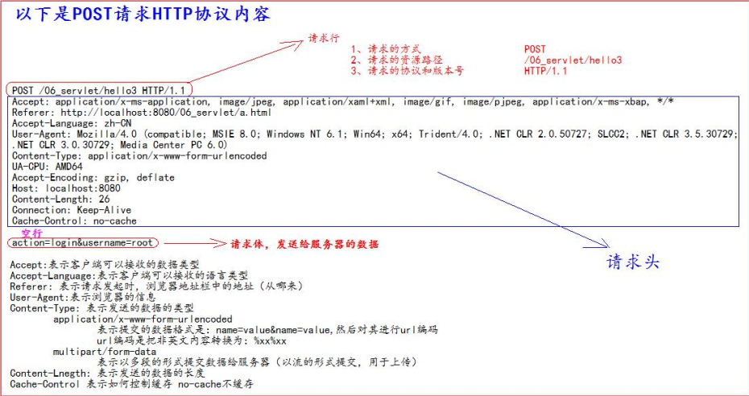
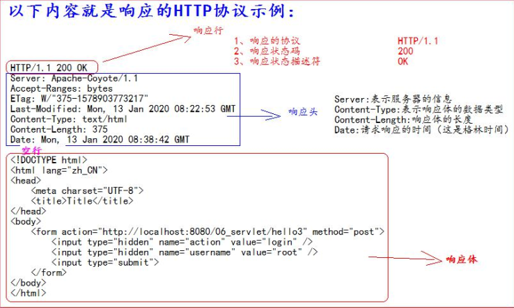
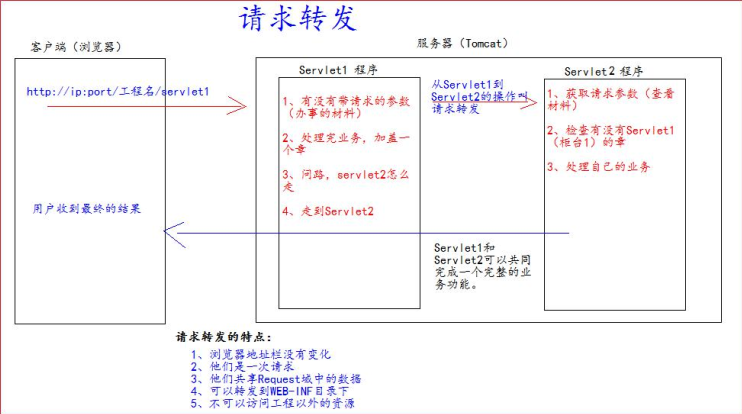
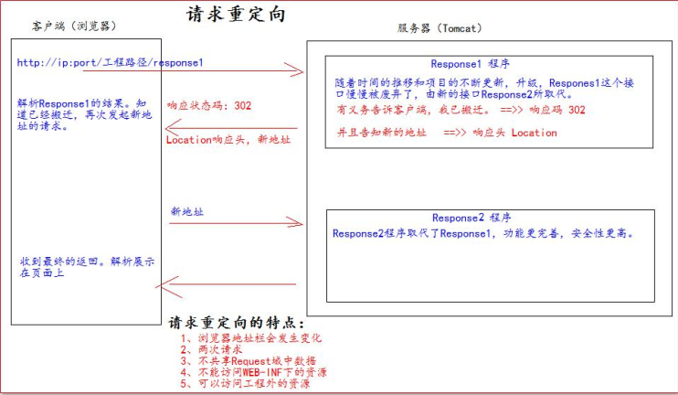

## 三人行-Java-Web复习-第二天


### 0. 今日目标


#### 了解 XML

1. 什么是XML？

   > xml 是可扩展的标记性语言。  

2. xml 的作用

> 1. 用来保存数据， 而且这些数据具有自我描述性
> 2. 它.还可以做为项目或者模块的配置文件
> 3. 还可以做为网络传输数据的格式（现在 JSON 为主） 。  

3. xml 语法

   > xml语法很简单，类似于html 但标签名都可以自定义

4. xml 解析技术介绍  

   > 早期 JDK 为我们提供了两种 xml 解析技术 DOM 和 Sax 简介（已经过时， 但我们需要知道这两种技术）  
   >
   > 第三方的解析：
   > jdom 在 dom 基础上进行了封装 、
   > dom4j 又对 jdom 进行了封装。
   > pull 主要用在 Android 手机开发， 是在跟 sax 非常类似都是事件机制解析 xml 文件。  


#### 了解Java Web常用的服务器 Tomcat


1. 安装

   略！

2. 目录介绍

   > bin 专门用来存放 Tomcat 服务器的可执行程序
   > conf 专门用来存放 Tocmat 服务器的配置文件
   > lib 专门用来存放 Tomcat 服务器的 jar 包
   > logs 专门用来存放 Tomcat 服务器运行时输出的日记信息
   > temp 专门用来存放 Tomcdat 运行时产生的临时数据
   > webapps 专门用来存放部署的 Web 工程。
   > work 是 Tomcat 工作时的目录， 用来存放 Tomcat 运行时 jsp 翻译为 Servlet 的源码， 和 Session 钝化的目录。  

​	

3. 使用

   >  一般都是结合编辑器使用，比如 IDEA、eclipse、myeclipse
   >
   > 还有就是在项目部署的时候使用，这个就需要配置响应的环境变量了

   - 我这里使用的是IDEA整合Tomcat

     > 整合步骤的话也没必要多说，网上一大堆教程


#### 在这之前，我们先来看一下Servlet 技术  


1. 什么是Servlet?

   > 1、 Servlet 是 JavaEE 规范之一。 规范就是接口
   > 2、 Servlet 就 JavaWeb 三大组件之一。 三大组件分别是： Servlet 程序、 Filter 过滤器、 Listener 监听器。
   > 3、 Servlet 是运行在服务器上的一个 java 小程序， 它可以接收客户端发送过来的请求， 并响应数据给客户端。  

2. Servlet 的生命周期

   > 1、 执行 Servlet 构造器方法
   > 2、 执行 init 初始化方法
   > 第一、 二步， 是在第一次访问， 的时候创建 Servlet 程序会调用。
   > 3、 执行 service 方法
   > 第三步， 每次访问都会调用。
   > 4、 执行 destroy 销毁方法
   > 第四步， 在 web 工程停止的时候调用  


3. Servlet 的使用

   > - 自定义处理l类，继承HttpServlet，重写service方法，在service方法中编写处理逻辑
   > - 在web.xml中配置servlet的访问路径
   > - 启动tomcat，访问localhost:8080 + 项目web路径 + servlet路径

4. Servlet 类的继承体系  

   


5. ServletConfig 类  

   > 是 Servlet 程序的配置信息类。  
   >
   > Servlet 程序默认是第一次访问的时候创建， ServletConfig 是每个 Servlet 程序创建时， 就创建一个对应的 ServletConfig 对
   > 象。  
   >
   > ServletConfig 类的三大作用
   > 1、 可以获取 Servlet 程序的别名 servlet-name 的值
   > 2、 获取初始化参数 init-param
   > 3、 获取 ServletContext 对象  


```java
@Override
public void init(ServletConfig servletConfig) throws ServletException {
    System.out.println("2 init 初始化方法");
    // 1、 可以获取 Servlet 程序的别名 servlet-name 的值
    System.out.println("HelloServlet 程序的别名是:" + servletConfig.getServletName());
    // 2、 获取初始化参数 init-param
    System.out.println("初始化参数 username 的值是;" + servletConfig.getInitParameter("username"));
    System.out.println("初始化参数 url 的值是;" + servletConfig.getInitParameter("url"));
    // 3、 获取 ServletContext 对象
    System.out.println(servletConfig.getServletContext());
}
```


6. ServletContext 类  

   > **什么是 ServletContext?**  
   >
   > 1、 ServletContext 是一个接口， 它表示 Servlet 上下文对象
   > 2、 一个 web 工程， 只有一个 ServletContext 对象实例。
   > 3、 ServletContext 对象是一个域对象。
   > 4、 ServletContext 是在 web 工程部署启动的时候创建。 在 web 工程停止的时候销毁。
   >
   > **什么是域对象?**
   > 域对象， 是可以像 Map 一样存取数据的对象， 叫域对象。
   > 这里的域指的是存取数据的操作范围， 整个 web 工程。
   > 存数据 取数据 删除 数据
   >
   > | Map    | put()          | get()          | remove()           |
   > | ------ | -------------- | -------------- | ------------------ |
   > | 域对象 | setAttribute() | getAttribute() | removeAttribute(); |
   >
   > **ServletContext 类的四个作用**
   > 1、 获取 web.xml 中配置的上下文参数 context-param
   > 2、 获取当前的工程路径， 格式: /工程路径
   > 3、 获取工程部署后在服务器硬盘上的绝对路径
   > 4、 像 Map 一样存取数据  

```java
protected void doGet(HttpServletRequest request, HttpServletResponse response) throws
    ServletException, IOException {
    // 1、 获取 web.xml 中配置的上下文参数 context-param
    ServletContext context = getServletConfig().getServletContext();
    String username = context.getInitParameter("username");
    System.out.println("context-param 参数 username 的值是:" + username);
    System.out.println("context-param 参数 password 的值是:" +
    context.getInitParameter("password"));
    // 2、 获取当前的工程路径， 格式: /工程路径System.out.println( "当前工程路径:" + context.getContextPath() );
    // 3、 获取工程部署后在服务器硬盘上的绝对路径
    /**
    * / 斜杠被服务器解析地址为:http://ip:port/工程名/ 映射到 IDEA 代码的 web 目录<br/>
    */
    System.out.println("工程部署的路径是:" + context.getRealPath("/"));
    System.out.println("工程下 css 目录的绝对路径是:" + context.getRealPath("/css"));
    System.out.println("工程下 imgs 目录 1.jpg 的绝对路径是:" + context.getRealPath("/imgs/1.jpg"));
}
```


#### HTTP 协议  


细节可[参考博客https://www.cnblogs.com/an-wen/p/11180076.html](https://www.cnblogs.com/an-wen/p/11180076.html)


1. 什么是 HTTP 协议  ?

   > **什么是协议?**
   > 协议是指双方， 或多方， 相互约定好， 大家都需要遵守的规则， 叫协议。
   >
   > **所谓 HTTP 协议**， 就是指， 客户端和服务器之间通信时， 发送的数据， 需要遵守的规则， 叫 HTTP 协议。
   > HTTP 协议中的数据又叫报文。  


2. 请求的 HTTP 协议格式  

   > GET 请求
   >
   > 1、 请求行
   >
   > ​	1) 请求的方式  get
   >
   > ​	2)  请求的资源路径[+?+请求参数]
   >
   > ​	3)  请求的协议的版本号 HTTP/1.1
   >
   > 2. 请求头
   >
   >    key : value




>  POST 请求
>
> 1、 请求行
>
> ​	1) 请求的方式  POST
>
> ​	2) 请求的资源路径[+?+请求参数] (3) 请求的协议的版本号
>
> 2. 请求头
>
>     key : value





3. 响应的 HTTP 协议格式  

   > 1、 响应行
   > 	(1) 响应的协议和版本号
   > 	(2) 响应状态码
   > 	(3) 响应状态描述符
   > 2、 响应头
   >
   > ​	key : value





4. 常用的响应码说明  

   > 200 表示请求成功
   > 302 表示请求重定向
   > 404 表示请求服务器已经收到了， 但是你要的数据不存在（请求地址错误）
   >
   > 403 表示没有权限访问该路径
   >
   > 500 表示服务器已经收到请求， 但是服务器内部错误（代码错误）  


5. MIME 类型说明
   MIME 是 HTTP 协议中数据类型。
   MIME 的英文全称是"Multipurpose Internet Mail Extensions" 多功能 Internet 邮件扩充服务。 MIME 类型的格式是“大类型/小
   类型” ， 并与某一种文件的扩展名相对应。
   常见的 MIME 类型：

| 文件               | MIME 类型              |
| ------------------ | ---------------------- |
| 超文本标记语言文本 | .html , .htm text/html |
| 普通文本           | .txt text/plain        |
| RTF 文本           | .rtf application/rtf   |
| GIF 图形           | .gif image/gif         |
| JPEG 图形          | .jpeg,.jpg image/jpeg  |
| au 声音文件        | .au audio/basic        |


| MIDI 音乐文件      | mid,.midi audio/midi,audio/x-midi |
| ------------------ | --------------------------------- |
| RealAudio 音乐文件 | .ra, .ram audio/x-pn-realaudio    |
| MPEG 文件          | .mpg,.mpeg video/mpeg             |
| AVI 文件           | .avi video/x-msvideo              |
| GZIP 文件          | .gz application/x-gzip            |
| TAR 文件           | .tar application/x-tar            |


#### 相关概念解释


1. HttpServletRequest 类  

   > 每次只要有请求进入 Tomcat 服务器， Tomcat 服务器就会把请求过来的 HTTP 协议信息解析好封装到 Request 对象中。
   > 然后传递到 service 方法（doGet 和 doPost） 中给我们使用。 我们可以通过 HttpServletRequest 对象， 获取到所有请求的
   > 信息。  
   >
   > **HttpServletRequest 类的常用方法  :**
   >
   > getRequestURI() 获取请求的资源路径
   > getRequestURL() 获取请求的统一资源定位符（绝对路径）
   > getRemoteHost() 获取客户端的 ip 地址
   > getHeader() 获取请求头
   > getParameter() 获取请求的参数
   > getParameterValues() 获取请求的参数（多个值的时候使用）
   > getMethod() 获取请求的方式 GET 或 POST
   > setAttribute(key, value); 设置域数据
   > getAttribute(key); 获取域数据
   > getRequestDispatcher() 获取请求转发对象  

   

乱码问题：

> doGet 请求的中文乱码解决  
>
> ```java
> // 获取请求参数
> String username = req.getParameter("username");
> //1 先以 iso8859-1 进行编码
> //2 再以 utf-8 进行解码
> username = new String(username.getBytes("iso-8859-1"), "UTF-8");
> ```
>
> POST 请求的中文乱码解决  
>
> ```java
> // 设置请求体的字符集为 UTF-8， 从而解决 post 请求的中文乱码问题
> req.setCharacterEncoding("UTF-8");
> ```
>
> 响应的乱码解决  
>
> ```java
> // 解决响应中文乱码方案一（不推荐使用）
> 
> // 设置服务器字符集为 UTF-8
> resp.setCharacterEncoding("UTF-8");
> // 通过响应头， 设置浏览器也使用 UTF-8 字符集
> resp.setHeader("Content-Type", "text/html; charset=UTF-8");
> 
> // 解决响应中文乱码方案二（推荐） 
> 
> // 它会同时设置服务器和客户端都使用 UTF-8 字符集， 还设置了响应头
> // 此方法一定要在获取流对象之前调用才有效
> resp.setContentType("text/html; charset=UTF-8");
> ```
>
> 


2. 请求的转发  

   > 什么是请求的转发?
   > 请求转发是指， 服务器收到请求后， 从一次资源跳转到另一个资源的操作叫请求转发。  
   >
   > req.getRequestDispatcher("/servlet2") .forward(req,resp);  



​	

3. base 标签的作用  

   > base 标签设置页面相对路径工作时参照的地址

```java
<!DOCTYPE html>
<html lang="zh_CN">
<head>
<meta charset="UTF-8">
<title>Title</title>
<!--base 标签设置页面相对路径工作时参照的地址
href 属性就是参数的地址值
-->
<base href="http://localhost:8080/07_servlet/a/b/">
</head>
<body>
    这是 a 下的 b 下的 c.html 页面<br/>
    <a href="../../index.html">跳回首页</a><br/>
</body>
</html>
```


4. Web 中的相对路径和绝对路径  

   > 在 javaWeb 中， 路径分为相对路径和绝对路径两种：
   > 相对路径是：
   >
   > | .      | 表示当前目录        |
   > | ------ | ------------------- |
   > | ..     | 表示上一级目录      |
   > | 资源名 | 表示当前目录/资源名 |
   >
   >
   > 绝对路径：
   > http://ip:port/工程路径/资源路径
   > 在实际开发中， 路径都使用绝对路径， 而不简单的使用相对路径。
   > 1、 绝对路径
   > 2、 base+相对	


5. web 中 / 斜杠的不同意义  

   > 在 web 中 / 斜杠 是一种绝对路径。
   > / 斜杠 如果被浏览器解析， 得到的地址是： http://ip:port/
   > 	\<a href="/">斜杠</a>
   > / 斜杠 如果被服务器解析， 得到的地址是： http://ip:port/工程路径
   > 1、 <url-pattern>/servlet1</url-pattern>
   > 2、 servletContext.getRealPath(“/”);
   > 3、 request.getRequestDispatcher(“/”);
   > 特殊情况： response.sendRediect(“/”); 把斜杠发送给浏览器解析。 得到 http://ip:port/  


6. HttpServletResponse 类  

   > **作用：**
   >
   > HttpServletResponse 类和 HttpServletRequest 类一样。 每次请求进来， Tomcat 服务器都会创建一个 Response 对象传
   > 递给 Servlet 程序去使用。 HttpServletRequest 表示请求过来的信息， HttpServletResponse 表示所有响应的信息，
   > 我们如果需要设置返回给客户端的信息， 都可以通过 HttpServletResponse 对象来进行设置  
   >
   > **两个输出流的说明：**
   >
   > | 字节流 | getOutputStream(); | 常用于下载（传递二进制数据） |
   > | ------ | ------------------ | ---------------------------- |
   > | 字符流 | getWriter();       | 常用于回传字符串（常用）     |
   >
   > 两个流同时只能使用一个。
   > 使用了字节流， 就不能再使用字符流， 反之亦然， 否则就会报错。
   >
   > 


7. 请求重定向  

   > 请求重定向， 是指客户端给服务器发请求， 然后服务器告诉客户端说。 我给你一些地址。 你去新地址访问。 叫请求
   > 重定向（因为之前的地址可能已经被废弃） 。  

   

   > 请求重定向的第一种方案：
   > // 设置响应状态码 302 ， 表示重定向， （已搬迁）
   > resp.setStatus(302);
   > // 设置响应头， 说明 新的地址在哪里
   > resp.setHeader("Location", "http://localhost:8080");
   > 请求重定向的第二种方案（推荐使用） ：
   > resp.sendRedirect("http://localhost:8080");  