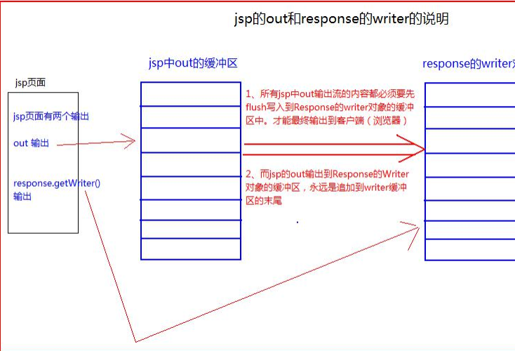

## 三人行-Java-Web复习-第三天


### 0. 今日目标


#### JSP 


1. 概述

   > jsp 的全称是 java server pages。 Java 的服务器页面。
   > jsp 的主要作用是代替 Servlet 程序回传 html 页面的数据。
   > 因为 Servlet 程序回传 html 页面数据是一件非常繁锁的事情。 开发成本和维护成本都极高。  


2. 通过Servlet输出html页面程序

   ```java
   
       @Override
       protected void doGet(HttpServletRequest req, HttpServletResponse resp) throws ServletException, IOException {
           // 设置响应编码格式
           resp.setContentType("text/html; charset=utf-8");
   
           PrintWriter writer = resp.getWriter();
           //输出页面内容！
           writer.write("<!DOCTYPE html PUBLIC \"-//W3C//DTD HTML 4.01 Transitional//EN\"\"http://www.w3.org/TR/html4/loose.dtd\">");
           writer.write("<html>");
           writer.write("<head>");
           writer.write("<meta http-equiv=\"Content-Type\" content=\"text/html; charset=UTF-8\">");
           writer.write("<title>Insert title here</title>");
           writer.write("</head>");
           writer.write("<body>");
           writer.write("这是由 Servlet 程序输出的 html 页面内容！ ");
           writer.write("</body></html>");
       }
   ```

3. JSP 的运行原理  

   > jsp 的本质 ， 其实是一个 Servlet 程序。  
   >
   > 那么 当我们访问 一个 xxx.jsp 文件后 翻译成 java 文件的全名是 xxx_jsp.java 文件
   > xxx_jsp.java 文件是一个 Servlet 程序。 原来 jsp 中的 html 内容都被翻译到 Servlet 类的 service 方法中原样输出。  


4. JSP 的语法

   > **jsp 文件头部声明介绍  :**
   >
   > ```java
   > <%@ page language="java" contentType="text/html; charset=UTF-8" pageEncoding="UTF-8" %>
   > 
   > // 这是 jsp 文件的头声明。 表示这是 jsp 页面。
   > language 属性 值只能是 java。 表示翻译的得到的是 java 语言的
   > contentType 属性 设置响应头 contentType 的内容
   > pageEncoding 属性 设置当前 jsp 页面的编码
   > import 属性 给当前 jsp 页面导入需要使用的类包
   > autoFlush 属性 设置是否自动刷新 out 的缓冲区， 默认为 true
   > buffer 属性 设置 out 的缓冲区大小。 默认为 8KB
   > errorPage 属性 设置当前 jsp 发生错误后， 需要跳转到哪个页面去显示错误信息
   > isErrorPage 属性 设置当前 jsp 页面是否是错误页面。 是的话， 就可以使用 exception 异常对象
   > session 属性 设置当前 jsp 页面是否获取 session 对象,默认为 true
   > extends 属性 给服务器厂商预留的 jsp 默认翻译的 servlet 继承于什么类
   > ```
   >
   > **jsp 中的三种脚本介绍:**  
   >
   > - **第一种， 声明脚本：**
   >   声明脚本格式如下：
   >   <%!
   >   java 代码
   >   %>
   >   在声明脚本块中， 我们可以干 4 件事情
   >   1.我们可以定义全局变量。
   >   2.定义 static 静态代码块
   >   3.定义方法
   >   4.定义内部类
   >   几乎可以写在类的内部写的代码， 都可以通过声明脚本来实现  
   > - **第二种， 表达式脚本（重点， 使用很多） ：**
   >   表达式脚本格式如下：
   >   <%=表达式 %>
   >   表达式脚本 用于向页面输出内容。
   >   表达式脚本 翻译到 Servlet 程序的 service 方法中 以 out.print() 打印输出
   >   out 是 jsp 的一个内置对象， 用于生成 html 的源代码
   >   注意： 表达式不要以分号结尾， 否则会报错
   >   表达式脚本可以输出任意类型。
   >   比如：
   >   1.输出整型
   >   2.输出浮点型
   >   3.输出字符串
   >   4.输出对象  
   > - **第三种， 代码脚本（*重点， 使用最多） ：**
   >   代码脚本如下：
   >   <% java 代码 %>
   >   代码脚本里可以书写任意的 java 语句。
   >   代码脚本的内容都会被翻译到 service 方法中。
   >   所以 service 方法中可以写的 java 代码， 都可以书写到代码脚本中  


5. JSP 中的注释：  

   > // 单行 java 注释
   > /*
   > 多行 java 代码注释
   > */
   > 单行注释和多行注释能在翻译后的 java 源代码中看见。
   > <%-- jsp 注释 --%>
   > jsp 注释在翻译的时候会直接被忽略掉
   > <!-- html 注释 -->
   > “玩转” Java 系列
   > html 的注释会被翻译到 java 代码中输出到 html 页面中查看  


6. JSP 九大内置对象  

   > jsp 中九大内置对象分别是：
   > request 对象 请求对象， 可以获取请求信息
   > response 对象 响应对象。 可以设置响应信息
   > pageContext 对象 当前页面上下文对象。 可以在当前上下文保存属性信息
   > session 对象 会话对象。 可以获取会话信息。
   > exception 对象 异常对象只有在 jsp 页面的 page 指令中设置 isErrorPage="true" 的时候才会存在
   > application 对象 ServletContext 对象实例， 可以获取整个工程的一些信息。
   > config 对象 ServletConfig 对象实例， 可以获取 Servlet 的配置信息
   > out 对象 输出流。
   > page 对象 表示当前 Servlet 对象实例（无用， 用它不如使用 this 对象） 。
   >
   > 
   >
   > 九大内置对象， 都是我们可以在【代码脚本】 中或【表达式脚本】 中直接使用的对
   > 象。  


7. JSP 四大域对象  

   > **JSP 九大内置对象和四大作用域复习**
   > 1.九大内置对象
   >
   > | 名称        | 类型                 | 含义               | 获取方式                                            |
   > | ----------- | -------------------- | ------------------ | --------------------------------------------------- |
   > | request     | HttpSevletRequ est   | 封装所有 请求 信息 | 方法参数                                            |
   > | response    | HttpServletResp onse | 封装所有 响应 信息 | 方法参数                                            |
   > | session     | HttpSession          | 封装所有 会话 信息 | req.getSession()                                    |
   > | application | ServletContext       | 所有信息           | getServletConte xt(); request.getServl etContext(); |
   >
   > | out         | PrintWriter   | 输出对象     | response.getWri ter() |
   > | ----------- | ------------- | ------------ | --------------------- |
   > | exception   | Exception     | 异常对象     |                       |
   > | page        | Object        | 当前页面对象 |                       |
   > | pageContext | PageContext   | 获取其他对象 |                       |
   > | config      | ServletConfig | 配置信息     |                       |
   >
   > 
   >
   > 2. **四大作用域**
   >    2.1  page
   >    	2.1.1 在当前页面不会重新实例化.
   >    2.2 request
   >    	2.2.1 在一次请求中同一个对象,下次请求重新实例化一个
   >    	request 对象.
   >    2.3 session
   >    	2.3.1 一次会话.
   >    	2.3.2 只要客户端 Cookie 中传递的 Jsessionid 不变,Session 不会
   >    	重新实例化(不超过默认时间.)
   >    	2.3.3 实际有效时间:
   >    		2.3.3.1 浏览器关闭.Cookie 失效.
   >    		2.3.3.2 默认时间.在时间范围内无任何交互.在 tomcat 的
   >    		web.xml 中配置
   >    		<session-config>
   >    		<session-timeout>30</session-timeout>
   >    		</session-config>
   >    2.4 application
   >    	2.4.1 只有在 tomcat 启动项目时菜实例化.关闭 tomcat 时销毁
   >    	application


8. jsp 中 out 输出流 和 response.getwriter() 输出流  

   > 图解 out 流和 writer 流的两个缓冲区如何工作  

   


9. JSP 的常用标签  

   > <%-- 静态包含 --%>
   > <%-- 动态包含 --%>
   > <%-- 转发 --%>  
   >
   > - 静态包含--很常用  
   >
   >   <%@ include file="" %>
   >   静态包含是把包含的页面内容原封装不动的输出到包含的位置。  
   >
   > - 动态包含--很少用  
   >
   >   <jsp:include page=""></jsp:include>
   >   动态包含会把包含的 jsp 页面单独翻译成 servlet 文件， 然后在执行到时候再调用翻译的 servlet 程序。 并把
   >   计算的结果返回。
   >   动态包含是在执行的时候， 才会加载。 所以叫动态包含。  
   >
   > - 页面转发--常用  
   >
   >   <jsp:forward page=""></jsp:forward>
   >   <jsp:forward 转发功能相当于
   >   request.getRequestDispatcher("/xxxx.jsp").forward(request, response); 的功能。  


10. 监听器  

    >  ServletContextListener 监听器  
    >
    > | 监听器的使用步骤。                                           |
    > | ------------------------------------------------------------ |
    > | 第一步： 我们需要定义一个类。 然后去继承生命周期的监听器接口。 |
    > | 第二步： 然后在 Web.xml 文件中配置                           |
    >
    > | <listener>                              |
    > | --------------------------------------- |
    > | <listener-class>全类名</listener-class> |
    > | </listener>                             |


```java
public class ServletContextListenerImpl implements ServletContextListener {
    @Override
    public void contextInitialized(ServletContextEvent sce) {
    	System.out.println("ServletContext 对象被创建了");
    } 
    
    @Override
    public void contextDestroyed(ServletContextEvent sce) {
    	System.out.println("ServletContext 对象被销毁了");
    }
}
```


