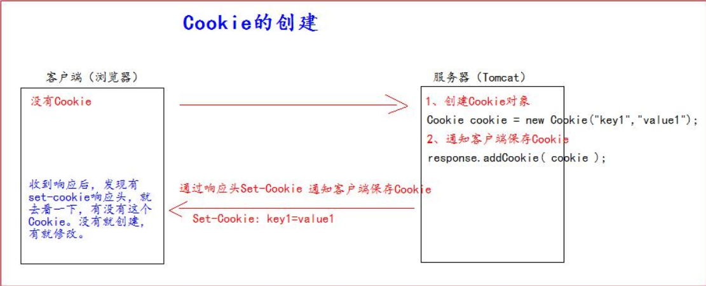
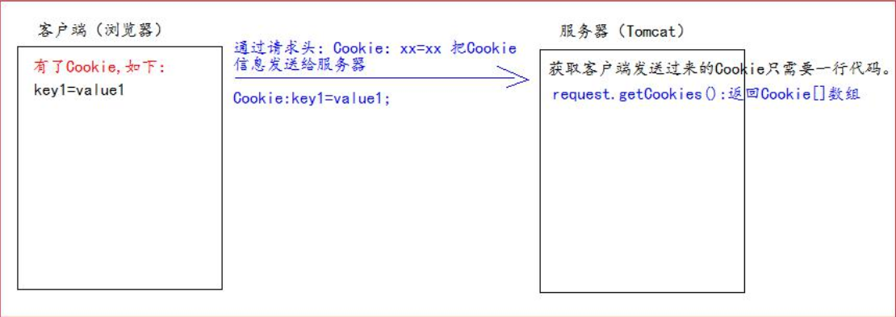
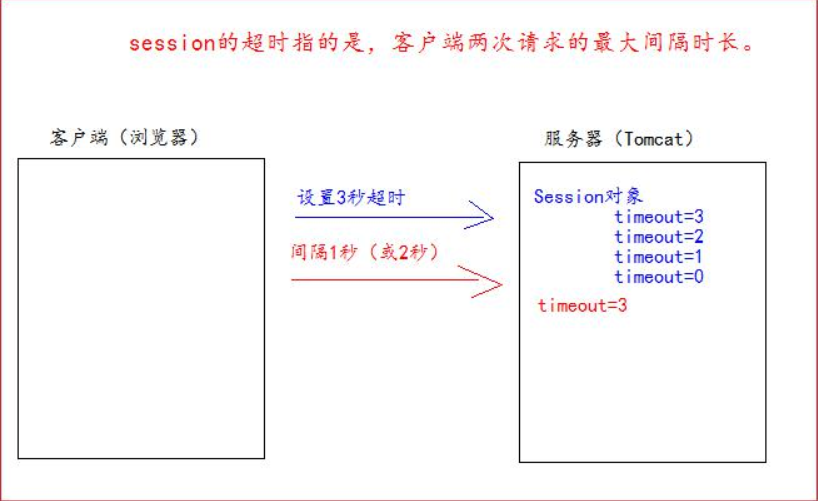
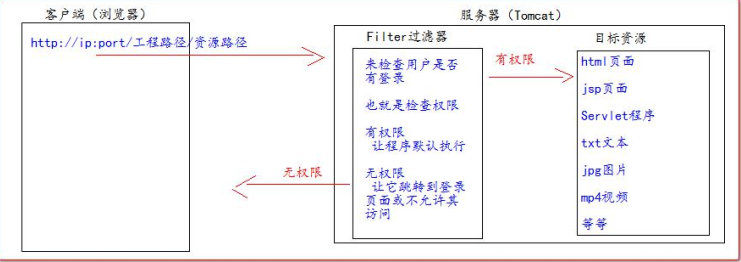

## 三人行-Java-Web复习-第四天


### 0. 今日目标


#### Cookie 与 Session


1. **Cookie**

   > **什么是 Cookie?**
   > 1、 Cookie 是服务器通知客户端保存键值对的一种技术。
   > 2、 客户端有了 Cookie 后， 每次请求都发送给服务器。
   > 3、 每个 Cookie 的大小不能超过 4kb  




服务器如何获取 Cookie  





Cookie 设置有效时间

```java
Cookie cookie = new Cookie("life3600", "life3600");
cookie.setMaxAge(60 * 60); // 设置 Cookie 一小时之后被删除。 无效
resp.addCookie(cookie);
```


Cookie 有效路径 Path 的设置  

```java
Cookie cookie = new Cookie("path1", "path1");
// getContextPath() ===>>>> 得到工程路径
cookie.setPath( req.getContextPath() + "/abc" ); // ===>>>> /工程路径/abc
resp.addCookie(cookie);
```


2. Session 会话  

> **什么是 Session 会话?**
>
> 1、 Session 就一个接口（HttpSession） 。
> 2、 Session 就是会话。 它是用来维护一个客户端和服务器之间关联的一种技术。
> 3、 每个客户端都有自己的一个 Session 会话。
> 4、 Session 会话中， 我们经常用来保存用户登录之后的信息。
>
> **如何创建 Session 和获取(id 号,是否为新)**
>
> 如何创建和获取 Session。 它们的 API 是一样的。
> request.getSession()
> 	第一次调用是： 创建 Session 会话
> 	之后调用都是： 获取前面创建好的 Session 会话对象。
> isNew(); 判断到底是不是刚创建出来的（新的）
> 	true 表示刚创建
> 	false 表示获取之前创建
> 每个会话都有一个身份证号。 也就是 ID 值。 而且这个 ID 是唯一的。
> getId() 得到 Session 的会话 id 值  


Session 域数据的存取  

```java
req.getSession().setAttribute("key1", "value1");
```

Session 生命周期控制  

```xml
<session-config>
	<session-timeout>30</session-timeout>
</session-config>
```





#### Filter 过滤器  


> **Filter 什么是过滤器 ?**
> 1、 Filter 过滤器它是 JavaWeb 的三大组件之一。 三大组件分别是： Servlet 程序、 Listener 监听器、 Filter 过滤器
> 2、 Filter 过滤器它是 JavaEE 的规范。 也就是接口
> 3、 Filter 过滤器它的作用是： 拦截请求， 过滤响应。  





> Filter 过滤器的使用步骤：
> 1、 编写一个类去实现 Filter 接口
> 2、 实现过滤方法 doFilter()
> 3、 到 web.xml 中去配置 Filter 的拦截路径  


```java
public class AdminFilter implements Filter {
/**
* doFilter 方法， 专门用于拦截请求。 可以做权限检查
*/
@Override
public void doFilter(ServletRequest servletRequest, ServletResponse servletResponse, FilterChainfilterChain) throws IOException, ServletException{
    HttpServletRequest httpServletRequest = (HttpServletRequest) servletRequest;
        HttpSession session = httpServletRequest.getSession();
        Object user = session.getAttribute("user");
        // 如果等于 null， 说明还没有登录
        if (user == null) {
        servletRequest.getRequestDispatcher("/login.jsp").forward(servletRequest,servletResponse);
        	return;
        } else {
            // 让程序继续往下访问用户的目标资源
            filterChain.doFilter(servletRequest,servletResponse);
        }
    }
} 
web.xml 中的配置：
<!--filter 标签用于配置一个 Filter 过滤器-->
<filter>
    <!--给 filter 起一个别名-->
    <filter-name>AdminFilter</filter-name>
    <!--配置 filter 的全类名-->
    <filter-class>com.atguigu.filter.AdminFilter</filter-class>
</filter>
	<!--filter-mapping 配置 Filter 过滤器的拦截路径-->
<filter-mapping>
<!--filter-name 表示当前的拦截路径给哪个 filter 使用-->
<filter-name>AdminFilter</filter-name>
<!--url-pattern 配置拦截路径/ 表示请求地址为： http://ip:port/工程路径/ 映射到 IDEA 的 web 目录/admin/* 表示请求地址为http://ip:port/工程路径/admin/*-->
	<url-pattern>/admin/*</url-pattern>
</filter-mapping>
```


**Filter 的生命周期**

>
> Filter 的生命周期包含几个方法
> 1、 构造器方法
> 2、 init 初始化方法
> 第 1， 2 步， 在 web 工程启动的时候执行（Filter 已经创建）
> 3、 doFilter 过滤方法
> 第 3 步， 每次拦截到请求， 就会执行
> 4、 destroy 销毁
> 第 4 步， 停止 web 工程的时候， 就会执行（停止 web 工程， 也会销毁 Filter 过滤器）  


**Filter 的拦截路径**  

> --精确匹配
> <url-pattern>/target.jsp</url-pattern>
> 以上配置的路径， 表示请求地址必须为： http://ip:port/工程路径/target.jsp
> --目录匹配
> <url-pattern>/admin/*</url-pattern>
> 以上配置的路径， 表示请求地址必须为： http://ip:port/工程路径/admin/*
> --后缀名匹配
> <url-pattern>*.html</url-pattern>
> 以上配置的路径， 表示请求地址必须以.html 结尾才会拦截到
> <url-pattern>*.do</url-pattern>
> 以上配置的路径， 表示请求地址必须以.do 结尾才会拦截到
> <url-pattern>*.action</url-pattern>
> 以上配置的路径， 表示请求地址必须以.action 结尾才会拦截到
> Filter 过滤器它只关心请求的地址是否匹配， 不关心请求的资源是否存在！ ！ ！  


**ThreadLocal 的使用**  


> ThreadLocal 的作用， 它可以解决多线程的数据安全问题。
> ThreadLocal 它可以给当前线程关联一个数据（可以是普通变量， 可以是对象， 也可以是数组， 集合）
> **ThreadLocal 的特点：**
> 1、 ThreadLocal 可以为当前线程关联一个数据。 （它可以像 Map 一样存取数据， key 为当前线程）
> 2、 每一个 ThreadLocal 对象， 只能为当前线程关联一个数据， 如果要为当前线程关联多个数据， 就需要使用多个
> ThreadLocal 对象实例。
> 3、 每个 ThreadLocal 对象实例定义的时候， 一般都是 static 类型
> 4、 ThreadLocal 中保存数据， 在线程销毁后。 会由 JVM 虚拟自动释放  


#### JSON  


> **什么是 JSON**
> JSON (JavaScript Object Notation) 是一种轻量级的数据交换格式。 易于人阅读和编写。 同时也易于机器解析
> 和生成。 它基于 JavaScript Programming Language, Standard ECMA-262 3rd Edition - December 1999 的一
> 个子集。 JSON 采用完全独立于语言的文本格式， 但是也使用了类似于 C 语言家族的习惯（包括 C, C++, C#, Java,
> JavaScript, Perl, Python 等） 。 这些特性使 JSON 成为理想的数据交换语言。  


> **JSON 对象定义和基本使用**
> 在标准的 json 格式中， json 对象由在括号括起来， 对象中的属性也就是 json 的 key 是一个字符串， 所以一定要使用
> 双引号引起来。 每组 key 之间使用逗号进行分隔。  


```js
var jsons = {
    "key1":"abc", // 字符串类型
    "key2":1234, // Number
    "key3":[1234,"21341","53"], // 数组
    "key4":{ // json 类型
    "key4_1" : 12,
    "key4_2" : "kkk"
    },
    "key5":[{ // json 数组
    "key5_1_1" : 12,
    "key5_1_2" : "abc"
    },{
    "key5_2_1" : 41,
    "key5_2_2" : "bbj"
    }]
};
```


#### Ajax  


> **什么是 Ajax？**
> AJAX 即“Asynchronous Javascript And XML”（异步 JavaScript 和 XML） ， 是指一种创建交互式网页应用的
> 网页开发技术。
> ajax 是一种浏览器异步发起请求。 局部更新页面的技术。  


**JQuery 的 Ajax 请求**  


> **四个 Ajax 请求方法**
> 	$.ajax 方法
> 	$.get 方法
> 	$.post 方法
> 	$.getJSON 方法
>
> 一个表单序列化方法： serialize()表单序列化方法
> 如何使用上面的五个方法：
> 在 JQuery 中和 Ajax 请求有关的方法有四个
>
> | $.ajax 请求参数 url： | 请求的地址     |                   |
> | --------------------- | -------------- | ----------------- |
> | type :                | 请求的方式     | get 或 post       |
> | data :                | 请求的参数     | string 或 json    |
> | success:              | 成功的回调函数 |                   |
> | dataType:             | 返回的数据类型 | 常用 json 或 text |
>
> **下面的方法必须遵守参数的顺序**
>
> $.get 请求和$.post 请求
>
> url:请求的 URL 地址
> data:待发送 Key/value 参数。
> callback:载入成功时回调函数。
> type:返回内容格式， xml, html, script, json, text。
> Jquery 的$.getJSON
> url:待载入页面的 URL 地址
> “玩转” Java 系列
> data:待发送 Key/value 参数。
> callback:载入成功时回调函数。
> 表单的序列化
> serialize() 方法可以把一个 form 表单中所有的表单项。 都以字符串 name=value&name=value 的形式进行拼接， 省去
> 我们很多不必要的工作。
> 由于$.get、 $.post 和 getJSON 这三个方法的底层都是直接或者间接地使用$.ajax()方法来实现的异步请求的调用。 所
> 以我们以$.ajax()方法的使用为示例进行展示：


示例：

```js
$.ajax({
    url : "ajaxServlet", // 请求地址
    error:function(){ // 请求失败回调
    alert("请求失败");
    },
    success:function(data){ // 请求成功回调
    alert( data );
    },
    type:"POST", // 请求的方式
    dataType:"json", // 返回的数据类型为 json 对象
    data:{ // 请求的参数
    action:"jqueryAjax",
    a:12,
    date: new Date()
    }
});	
```


```js
$.get(
"ajaxServlet",{
action:"jqueryGet",
a:12,
date:new Date()
},function(data){alert(data);},"json"
);
```


```js
$.post(
"ajaxServlet", // 请求路径
{ // 请求参数
    action:"jqueryPost",
    a:12,
    date:new Date()
    },
    function(data){ alert( data ) }, // 成功的回调函数
    "text" // 返回的数据类型
);
```


```js
// 调用
$.getJSON(
"ajaxServlet", // 请求路径
{ // 请求参数
    action:"jqueryGetJSON",
    a:12,
    date:new Date()
    },
    function(data){ alert( data ) } // 成功的回调函数
);
```


