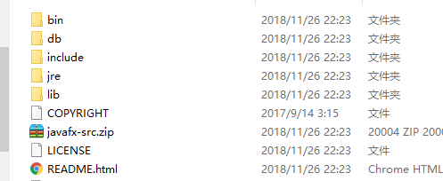
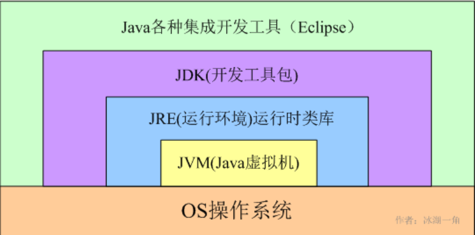
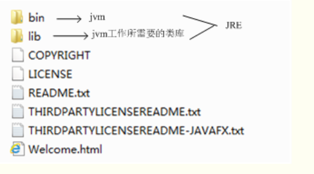
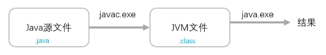
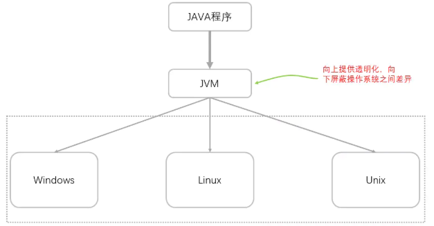
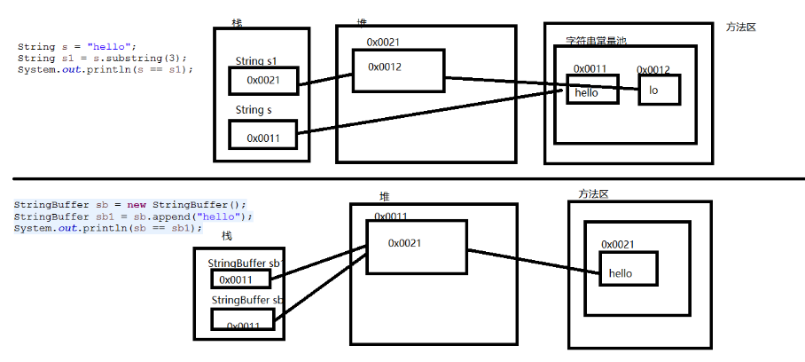
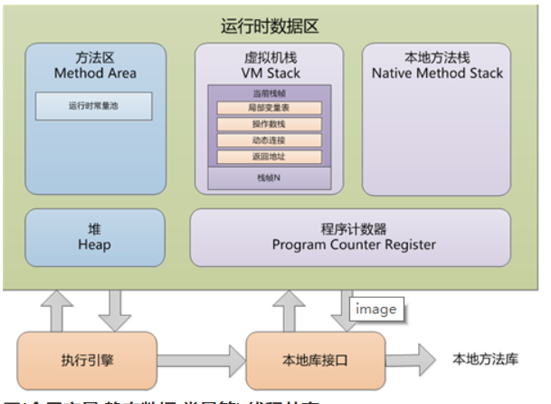

## 三人行-Java基础复习第一天

### 0. 今日目标

> **Java概述部分**  [可以参考菜鸟教程](https://www.runoob.com/java/java-intro.html)

- 了解Java主要特性：

  简单的、面向对象的、分布式的、健壮的、安全的、体系结构中立的、可移植的、

  解释型、高性能、多线程、多态

- 了解Java发展史
- 了解JDK目录

bin目录： Java工具的可执行文件

db目录: Java实现的数据库

include目录：.h结尾的文件，C语言开发的类库

jre目录：Java运行环境

lib目录：Java类库

- 了解JDK环境配置

  JAVA_HOME： 配置JDK路径： C:\Program Files\Java\jdk1.8.0_121

  PATH： 配置Java工具或命令： ";%JAVA_HOME%\bin;%JAVA_HOME%\jre\bin"

  CLASSPATH： 配置类库 %JAVA_HOME%\lib\dt.jar：运行环境类库 %JAVA_HOME%\lib\tools.jar：tools.jar时工具类库

为什么要配置环境变量 ？

配置环境变量的目的是为了方便在控制台编译和运行java程序，不必进入到java的程序目录（安装目录）里面去运行。这样你放在任何目录下（比如桌面）的java程序文件都可以编译运行，而不是必须把这个程序文件放在java.exe和javac.exe所在的目录下。

- 了解JVM、JDK和JRE

为什么Java可以跨平台？

当使用Java编译器编译Java程序时，生成的是与平台无关的字节码，这些字节码只面向JVM。不同平台的JVM都是不同的，但它们都提供了相同的接口。JVM是Java程序跨平台的关键部分，只要为不同平台实现了相应的虚拟机，编译后的Java字节码就可以在该平台上运行。

- 了解Java程序执行流程

  

  

  

  

  

  

> **Java基础语法部分**  [可以参照我的博客或者菜鸟教程](https://blog.csdn.net/qq_42380734/article/details/105341030)

- 熟悉Java标识符规则以及命名规范

  - 所有的标识符都应该以字母（A-Z 或者 a-z）,美元符（$）、或者下划线（_）开始
  - 首字符之后可以是字母（A-Z 或者 a-z）,美元符（$）、下划线（_）或数字的任何字符组合
  - 关键字不能用作标识符
  - 标识符是大小写敏感的

​	**命名规范;**

​	1、项目名全部小写.

​	2、包名全部小写.
​	3、类名首字母大写,其余组成词首字母依次大写.
​	4、变量名,方法名首字母小写,如果名称由多个单词组成,驼峰命名

- 熟悉变量相关知识：
  - 变量类型
  - 数据类型
  - 变量传递（值传递、引用传递）
  - 拆箱装箱
  - 了解基本类型缓存机制
    - 默认缓存 -128 ~ 127的数
  - 了解基本类型的储存方式
- 熟悉常见修饰符
  - 访问修饰符
  - 非访问修饰符
- 熟悉字符串的处理，以及熟悉String类、StringBuffer和StringBuider类及其方法

- 了解日期处理以及相关用法
- 熟悉Java中的运算符
  - 算数运算符
  - 关系运算符
  - 位运算符
  - 逻辑运算符
  - 三目运算符
  - 运算符优先级
- 熟悉数组的创建及相关使用

### 1. 常见问题（以下问题要求能够口述出来）

> **Java 语言有哪些特点?**

答：跨平台、健壮性、面向对象、分布式、可移植、解释型、多线程

> **请简要谈谈你对 JVM JDK 和 JRE的理解 **

答：JDK开发工具包、JRE运行时环境、JVM 虚拟机

> **Java 和 C++的区别?** 

答：

- java不直接操作内存；
- java有内存管理机制，不需要程序员手动释放内存
- Java中只存在单继承，但接口支持多继承
- java不使用指针直接操作内存

> **import java 和 javax 有什么区别？**

答：

> **为什么说 Java 语言“编译与解释并存”？**

答：Java程序执行流程是先将 .java文件编译为 .class文件，再通过解释器解释成机器指令

>  **字符型常量和字符串常量的区别?**

答：

- 字符型常量是通过单引号引起、字符串使用双引号引起
- 字符相当于一个ASCII值，可以参见表达式运算，字符串常量是字符储存的地址
- 字符大小为2个字节，字符串根据长度大小不固定

> **标识符和关键字的区别是什么？**

答：Java中所有成员都需要名字，而这些名字就是标识符，

​		Java中的一些本地的名字，及为关键字

> **continue、break、和return的区别是什么？**

答：continue 跳过本次循环

​		break 结束当前循环

​		return 无返回值，直接结束程序或方法 

​					有返回值，返回结果并结束程序或方法

>  **Java泛型了解么？什么是类型擦除？介绍一下常用的通配符？**

答：泛型是参数化类型；

​	类型擦除就是：在编译期间，类型会被擦除

​	通过反射可改变泛型中定义好的类型

> **==和equals的区别**

答：一般来说，== 比较的是对象是否相等，基本类型是比较值是否相等，

​	在Object中== 相当于equals，所以如果没有重写equals的话，equals比较的也是对象是否相等

​	如果重写了equals方法，则会根据重写的规则进行比较

> **hashCode()与 equals()相关问题**

- hashCode()是什么？ 散列码
- 为什么要有 hashCode？ 
- 为什么重写 `equals` 时必须重写 `hashCode` 方法？
- 为什么两个对象有相同的 hashcode 值，它们也不一定是相等的？

答：

>  **Java中的几种基本数据类型是什么？对应的包装类型是什么？各自占用多少字节呢？**

答：

>  **为什么说 Java 中只有值传递？**

答：

>  **谈谈 fload和double精度丢失问题**

答：

>  **谈谈Java中的封装**

答：