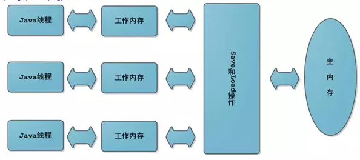

## 三人行-Java基础复习第八天


### 0. 今日目标


> **JMM内存模型**




- 什么是JMM？
  - JMM是指Java内存模型，而不是内存布局
  - 每个Java线程都有自己的工作内存。
  - 每个线程操作数据时，首先从主内存中读取，得到一份拷贝，操作完成后再将结果写会到主内存
- JMM内存模型带来的问题
  - 可见性：某个线程对主内存的内容更改，应该立刻通知其它线程
  - 原子性：指一个操作是不可分割的，必须是一个原子操作
  - 有序性：指令是有序的，禁止指令重排


> **volatile关键字**

- 是什么？

  - 是Java提供的一种轻量级同步机制，它可以保证可见性、有序性，但不能保证原子性

- 可见性测试

  ```java
  class MyData{
      int number=0;
      //volatile int number=0;
  
      AtomicInteger atomicInteger=new AtomicInteger();
      public void setTo60(){
          this.number=60;
      }
  
      //此时number前面已经加了volatile，但是不保证原子性
      public void addPlusPlus(){
          number++;
      }
  
      public void addAtomic(){
          atomicInteger.getAndIncrement();
      }
  }
  
  //volatile可以保证可见性，及时通知其它线程主物理内存的值已被修改
  private static void volatileVisibilityDemo() {
      System.out.println("可见性测试");
      MyData myData=new MyData();//资源类
      //启动一个线程操作共享数据
      new Thread(()->{
          System.out.println(Thread.currentThread().getName()+"\t come in");
          try {TimeUnit.SECONDS.sleep(3);myData.setTo60();
          System.out.println(Thread.currentThread().getName()+"\t update number value: "+myData.number);}catch (InterruptedException e){e.printStackTrace();}
      },"AAA").start();
      while (myData.number==0){
       //main线程持有共享数据的拷贝，一直为0
      }
      System.out.println(Thread.currentThread().getName()+"\t mission is over. main get number value: "+myData.number);
  }
  ```

  MyData`类是资源类，一开始number变量没有用volatile修饰，所以程序运行的结果是：

  ```java
  可见性测试
  AAA	 come in
  AAA	 update number value: 60
  ```

  虽然一个线程把number修改成了60，但是main线程持有的仍然是最开始的0，所以一直循环，程序不会结束。

  如果对number添加了volatile修饰，运行结果是：

  ```java
  AAA	 come in
  AAA	 update number value: 60
  main	 mission is over. main get number value: 60
  ```

  可见某个线程对number的修改，会立刻反映到主内存上。


- 原子性测试

  volatile并**不能保证操作的原子性**。这是因为，比如一条number++的操作，会形成3条指令。

  ```assembly
  getfield        //读
  iconst_1	//++常量1
  iadd		//加操作
  putfield	//写操作
  ```

  假设有3个线程，分别执行number++，都先从主内存中拿到最开始的值，number=0，然后三个线程分别进行操作。假设线程0执行完毕，number=1，也立刻通知到了其它线程，但是此时线程1、2已经拿到了number=0，所以结果就是写覆盖，线程1、2将number变成1。

  解决的方式就是：

  1. 对`addPlusPlus()`方法加锁。
  2. 使用`java.util.concurrent.AtomicInteger`类。

1. 使用`java.util.concurrent.AtomicInteger`类。

```java
private static void atomicDemo() {
    System.out.println("原子性测试");
    MyData myData=new MyData();
    for (int i = 1; i <= 20; i++) {
        new Thread(()->{
            for (int j = 0; j <1000 ; j++) {
                myData.addPlusPlus();
                myData.addAtomic();
            }
        },String.valueOf(i)).start();
    }
    while (Thread.activeCount()>2){
        Thread.yield();
    }
    System.out.println(Thread.currentThread().getName()+"\t int type finally number value: "+myData.number);
    System.out.println(Thread.currentThread().getName()+"\t AtomicInteger type finally number value: "+myData.atomicInteger);
}
```

结果：可见，由于`volatile`不能保证原子性，出现了线程重复写的问题，最终结果比20000小。而`AtomicInteger`可以保证原子性。

```java
原子性测试
main	 int type finally number value: 17542
main	 AtomicInteger type finally number value: 20000
```


- 有序性

  volatile可以保证**有序性**，也就是防止**指令重排序**。所谓指令重排序，就是出于优化考虑，CPU执行指令的顺序跟程序员自己编写的顺序不一致。

  volatile底层是用CPU的**内存屏障**（Memory Barrier）指令来实现的，有两个作用，一个是保证特定操作的顺序性，二是保证变量的可见性。在指令之间插入一条Memory Barrier指令，告诉编译器和CPU，在Memory Barrier指令之间的指令不能被重排序。


> **哪些地方用到过volatile?**

- 单例模式的安全问题

  常见的DCL（Double Check Lock）模式虽然加了同步，但是在多线程下依然会有线程安全问题。

  ```java
  public class SingletonDemo {
      private static SingletonDemo singletonDemo=null;
      private SingletonDemo(){
          System.out.println(Thread.currentThread().getName()+"\t 我是构造方法");
      }
      //DCL模式 Double Check Lock 双端检索机制：在加锁前后都进行判断
      public static SingletonDemo getInstance(){
          if (singletonDemo==null){
              synchronized (SingletonDemo.class){
                   if (singletonDemo==null){
                       singletonDemo=new SingletonDemo();
                   }
              }
          }
          return singletonDemo;
      }
  
      public static void main(String[] args) {
          for (int i = 0; i < 10; i++) {
              new Thread(()->{
                  SingletonDemo.getInstance();
              },String.valueOf(i+1)).start();
          }
      }
  }
  ```

  这个漏洞比较tricky，很难捕捉，但是是存在的。`instance=new SingletonDemo();`可以大致分为三步

  ```java
  memory = allocate();     //1.分配内存
  instance(memory);	 //2.初始化对象
  instance = memory;	 //3.设置引用地址
  ```

  其中2、3没有数据依赖关系，**可能发生重排**。如果发生，此时内存已经分配，那么`instance=memory`不为null。如果此时线程挂起，`instance(memory)`还未执行，对象还未初始化。由于`instance!=null`，所以两次判断都跳过，最后返回的`instance`没有任何内容，还没初始化。

  解决的方法就是对`singletondemo`对象添加上`volatile`关键字，禁止指令重排。


> **CAS**

- 是什么？
  - CAS是指**Compare And Swap**，**比较并交换**，是一种很重要的同步思想。如果主内存的值跟期望值一样，那么就进行修改，否则一直重试，直到一致为止。

```java
public class CASDemo {
    public static void main(String[] args) {
        AtomicInteger atomicInteger=new AtomicInteger(5);
        System.out.println(atomicInteger.compareAndSet(5, 2019)+"\t current data : "+ atomicInteger.get());
        //修改失败
        System.out.println(atomicInteger.compareAndSet(5, 1024)+"\t current data : "+ atomicInteger.get());
    }
}
```

第一次修改，期望值为5，主内存也为5，修改成功，为2019。第二次修改，期望值为5，主内存为2019，修改失败。

查看`AtomicInteger.getAndIncrement()`方法，发现其没有加`synchronized`**也实现了同步**。这是为什么？


- 底层原理

  `AtomicInteger`内部维护了`volatile int value`和`private  static final Unsafe unsafe`两个比较重要的参数。

  ```java
  public final int getAndIncrement(){
      return unsafe.getAndAddInt(this,valueOffset,1);
  }
  ```

  `AtomicInteger.getAndIncrement()`调用了`Unsafe.getAndAddInt()`方法。`Unsafe`类的大部分方法都是`native`的，用来像C语言一样从底层操作内存。

  ```java
  public final int getAnddAddInt(Object var1,long var2,int var4){
      int var5;
      do{
          var5 = this.getIntVolatile(var1, var2);
      } while(!this.compareAndSwapInt(var1, var2, var5, var5 + var4));
      return var5;
  }
  ```

  这个方法的var1和var2，就是根据**对象**和**偏移量**得到在**主内存的快照值**var5。然后`compareAndSwapInt`方法通过var1和var2得到当前**主内存的实际值**。如果这个**实际值**跟**快照值**相等，那么就更新主内存的值为var5+var4。如果不等，那么就一直循环，一直获取快照，一直对比，直到实际值和快照值相等为止。

  比如有A、B两个线程，一开始都从主内存中拷贝了原值为3，A线程执行到`var5=this.getIntVolatile`，即var5=3。此时A线程挂起，B修改原值为4，B线程执行完毕，由于加了volatile，所以这个修改是立即可见的。A线程被唤醒，执行`this.compareAndSwapInt()`方法，发现这个时候主内存的值不等于快照值3，所以继续循环，**重新**从主内存获取。

  

> **CAS缺点**


CAS实际上是一种自旋锁，

1. 一直循环，开销比较大。
2. 只能保证一个变量的原子操作，多个变量依然要加锁。
3. 引出了**ABA问题**。


> **ABA问题**

- 什么是ABA问题？

  - 所谓ABA问题，就是比较并交换的循环，存在一个**时间差**，而这个时间差可能带来意想不到的问题。

- 比如：

  线程T1将值从A改为B，然后又从B改为A。线程T2看到的就是A，但是**却不知道这个A发生了更改**。尽管线程T2 CAS操作成功，但不代表就没有问题。
  有的需求，比如CAS，**只注重头和尾**，只要首尾一致就接受。但是有的需求，还看重过程，中间不能发生任何修改，这就引出了`AtomicReference`原子引用。

- AtomicReference

`AtomicInteger`对整数进行原子操作，如果是一个POJO呢？可以用`AtomicReference`来包装这个POJO，使其操作原子化。

```java
User user1 = new User("Jack",25);
User user2 = new User("Lucy",21);
AtomicReference<User> atomicReference = new AtomicReference<>();
atomicReference.set(user1);
System.out.println(atomicReference.compareAndSet(user1,user2)); // true
System.out.println(atomicReference.compareAndSet(user1,user2)); //false
```


> **AtomicStampedReference和ABA问题的解决**

使用`AtomicStampedReference`类可以解决ABA问题。这个类维护了一个“**版本号**”Stamp，在进行CAS操作的时候，不仅要比较当前值，还要比较**版本号**。只有两者都相等，才执行更新操作。

```java
AtomicStampedReference.compareAndSet(expectedReference,newReference,oldStamp,newStamp);
```


> **集合类不安全问题**

`ArrayList`不是线程安全类，在多线程同时写的情况下，会抛出`java.util.ConcurrentModificationException`异常。

```java
private static void listNotSafe() {
    List<String> list=new ArrayList<>();
    for (int i = 1; i <= 30; i++) {
        new Thread(() -> {
            list.add(UUID.randomUUID().toString().substring(0, 8));
            System.out.println(Thread.currentThread().getName() + "\t" + list);
        }, String.valueOf(i)).start();
    }
}
```

**解决方法**：

1. 使用`Vector`（`ArrayList`所有方法加`synchronized`，太重）。
2. 使用`Collections.synchronizedList()`转换成线程安全类。
3. 使用`java.concurrent.CopyOnWriteArrayList`（推荐）。


> **CopyOnWriteArrayList**

这是JUC的类，通过**写时复制**来实现**读写分离**。比如其`add()`方法，就是先**复制**一个新数组，长度为原数组长度+1，然后将新数组最后一个元素设为添加的元素。

```java
public boolean add(E e) {
    final ReentrantLock lock = this.lock;
    lock.lock();
    try {
        //得到旧数组
        Object[] elements = getArray();
        int len = elements.length;
        //复制新数组
        Object[] newElements = Arrays.copyOf(elements, len + 1);
        //设置新元素
        newElements[len] = e;
        //设置新数组
        setArray(newElements);
        return true;
    } finally {
        lock.unlock();
    }
}
```


> **`CopyOnWriteSet`**

跟List类似，`HashSet`和`TreeSet`都不是线程安全的，与之对应的有`CopyOnWriteSet`这个线程安全类。这个类底层维护了一个`CopyOnWriteArrayList`数组。

```java
private final CopyOnWriteArrayList<E> al;
public CopyOnWriteArraySet() {
    al = new CopyOnWriteArrayList<E>();
}
```


> **HashSet和HashMap**

`HashSet`底层是用`HashMap`实现的。既然是用`HashMap`实现的，那`HashMap.put()`需要传**两个参数**，而`HashSet.add()`只**传一个参数**，这是为什么？实际上`HashSet.add()`就是调用的`HashMap.put()`，只不过**Value**被写死了，是一个`private static final Object`对象。


> **Map**

`HashMap`不是线程安全的，`Hashtable`是线程安全的，但是跟`Vector`类似，太重量级。所以也有类似CopyOnWriteMap，只不过叫`ConcurrentHashMap`。

