## 三人行-Java基础复习第十一天

### 0. 今日目标

> **GC Roots**

- 如何判断一个对象可被回收？
  - **引用计数法**：维护一个计数器，如果有对该对象的引用，计数器+1，反之-1。无法解决循环引用的问题
  - **可达性分析法**： 从一组名为“GC Roots”的根节点对象出发，向下遍历。那些没有被遍历到、与GC Roots形成通路的对象，会被标记为“回收”。

- 哪些对象可以作为GC Roots？
  1. 虚拟机栈（栈帧中的局部变量）中引用的对象。
  2. 本地方法栈（native）中引用的对象。
  3. 方法区中常量引用的对象。
  4. 方法区中类静态属性引用的对象。

> **Java 中四大引用**

- **强引用**

使用`new`方法创造出来的对象，默认都是强引用。GC的时候，就算**内存不够**，抛出`OutOfMemoryError`也不会回收对象，**死了也不回收**。

- **软引用**

需要用`Object.Reference.SoftReference`来显示创建。**如果内存够**，GC的时候**不回收**。**内存不够**，**则回收**。常用于内存敏感的应用，比如高速缓存。

- **弱引用**

需要用`Object.Reference.WeakReference`来显示创建。**无论内存够不够，GC的时候都回收**，也可以用在高速缓存上。

- **WeakHashMap**

传统的`HashMap`就算`key==null`了，也不会回收键值对。但是如果是`WeakHashMap`，一旦内存不够用时，且`key==null`时，会回收这个键值对。

软应用和弱引用可以通过`get()`方法获得对象，但是虚引用不行。虚引形同虚设，在任何时候都可能被GC，不能单独使用，必须配合**引用队列（ReferenceQueue）**来使用。设置虚引用的**唯一目的**，就是在这个对象被回收时，收到一个**通知**以便进行后续操作，有点像`Spring`的后置通知。

- **引用队列**

弱引用、虚引用被回收后，会被放到引用队列里面，通过`poll`方法可以得到。

> **JVM 的垃圾收集器**

- 四大垃圾收集算法

  ### 标记整理

  ​	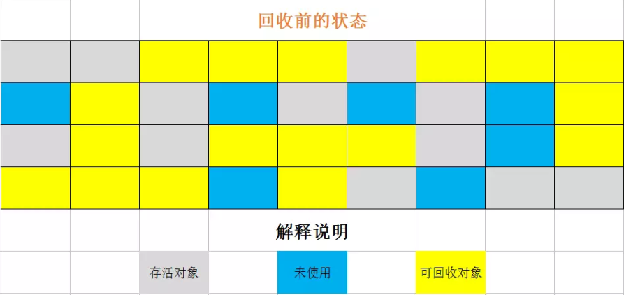

  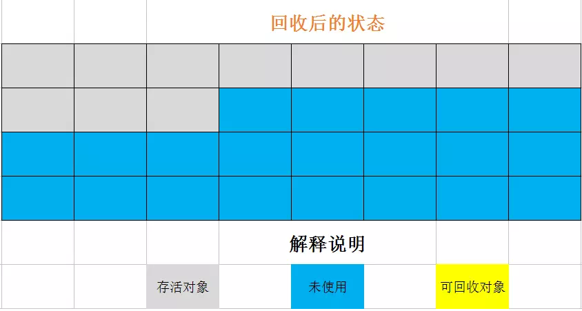

  ### 标记 清除

  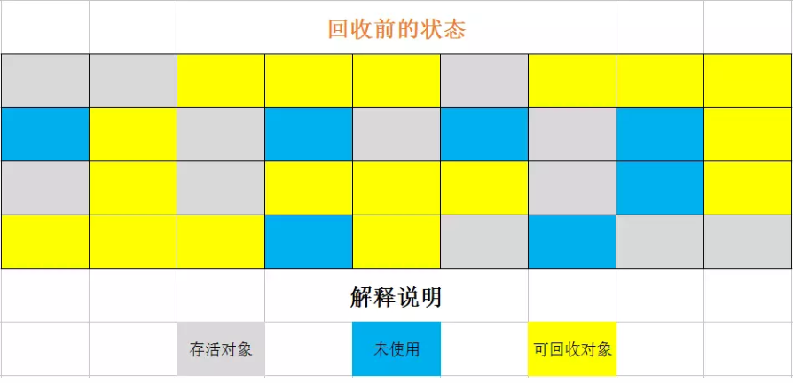

  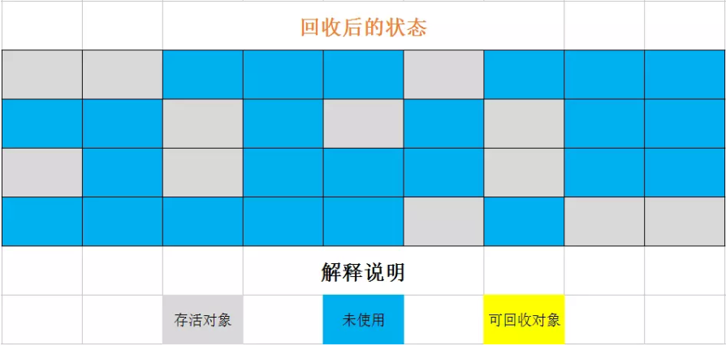

  

  ### 复制算法

  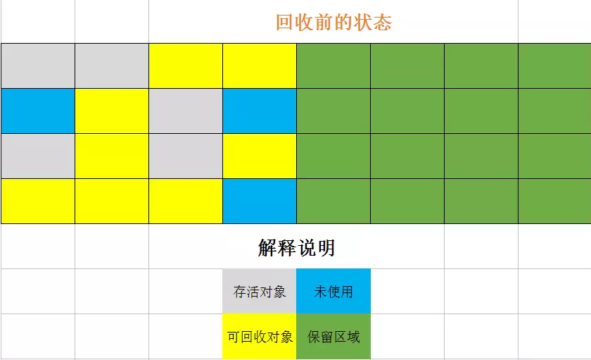

  ​		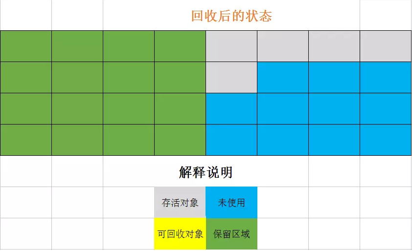

### 分代收集算法

准确来讲，跟前面三种算法有所区别。分代收集算法就是根据对象的年代，采用上述三种算法来收集。

1. 对于新生代：每次GC都有大量对象死去，存活的很少，常采用复制算法，只需要拷贝很少的对象。
2. 对于老年代：常采用标整或者标清算法。

> **Java 中四种垃圾收集器**

- 串行收集器Serial

为单线程环境设计且**只使用一个线程**进行GC，会暂停所有用户线程，不适用于服务器。就像去餐厅吃饭，只有一个清洁工在打扫。

- 并行收集器Parrallel

使用**多个线程**并行地进行GC，会暂停所有用户线程，适用于科学计算、大数据后台，交互性不敏感的场合。多个清洁工同时在打扫。

- 并发收集器CMS

用户线程和GC线程同时执行（不一定是并行，交替执行），GC时不需要停顿用户线程，互联网公司多用，适用对响应时间有要求的场合。清洁工打扫的时候，也可以就餐。

- G1收集器

对内存的划分与前面3种很大不同，将堆内存分割成不同的区域，然后并发地进行垃圾回收。

## 七大垃圾收集器

### 体系结构

`Serial`、`Parallel Scavenge`、`ParNew`用户回收新生代；`SerialOld`、`ParallelOld`、`CMS`用于回收老年代。而`G1`收集器，既可以回收新生代，也可以回收老年代。

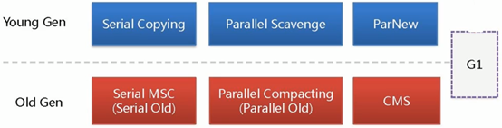

连线表示可以搭配使用，红叉表示不推荐一同使用，比如新生代用`Serial`，老年代用`CMS`。

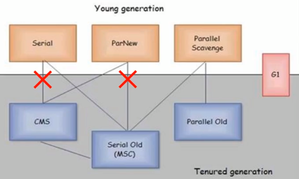

### Serial收集器

年代最久远，是`Client VM`模式下的默认新生代收集器，使用**复制算法**。**优点**：单个线程收集，没有线程切换开销，拥有最高的单线程GC效率。**缺点**：收集的时候会暂停用户线程。

使用`-XX:+UseSerialGC`可以显式开启，开启后默认使用`Serial`+`SerialOld`的组合。

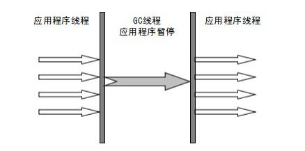

### ParNew收集器

也就是`Serial`的多线程版本，GC的时候不再是一个线程，而是多个，是`Server VM`模式下的默认新生代收集器，采用**复制算法**。

使用`-XX:+UseParNewGC`可以显式开启，开启后默认使用`ParNew`+`SerialOld`的组合。但是由于`SerialOld`已经过时，所以建议配合`CMS`使用。

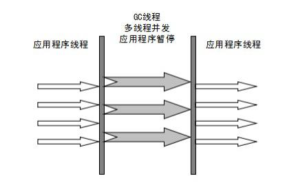

### Parallel Scavenge收集器

`ParNew`收集器仅在新生代使用多线程收集，老年代默认是`SerialOld`，所以是单线程收集。而`Parallel Scavenge`在新、老两代都采用多线程收集。`Parallel Scavenge`还有一个特点就是**吞吐量优先收集器**，可以通过自适应调节，保证最大吞吐量。采用**复制算法**。

使用`-XX:+UseParallelGC`可以开启， 同时也会使用`ParallelOld`收集老年代。其它参数，比如`-XX:ParallelGCThreads=N`可以选择N个线程进行GC，`-XX:+UseAdaptiveSizePolicy`使用自适应调节策略。

### SerialOld收集器

`Serial`的老年代版本，采用**标整算法**。JDK1.5之前跟`Parallel Scavenge`配合使用，现在已经不了，作为`CMS`的后备收集器。

### ParallelOld收集器

`Parallel`的老年代版本，JDK1.6之前，新生代用`Parallel`而老年代用`SerialOld`，只能保证新生代的吞吐量。JDK1.8后，老年代改用`ParallelOld`。

使用`-XX:+UseParallelOldGC`可以开启， 同时也会使用`Parallel`收集新生代。

### CMS收集器

并发标记清除收集器，是一种以获得**最短GC停顿为**目标的收集器。适用在互联网或者B/S系统的服务器上，这类应用尤其重视服务器的**响应速度**，希望停顿时间最短。是`G1`收集器出来之前的首选收集器。使用**标清算法**。在GC的时候，会与用户线程并发执行，不会停顿用户线程。但是在**标记**的时候，仍然会**STW**。

使用`-XX:+UseConcMarkSweepGC`开启。开启过后，新生代默认使用`ParNew`，同时老年代使用`SerialOld`作为备用。

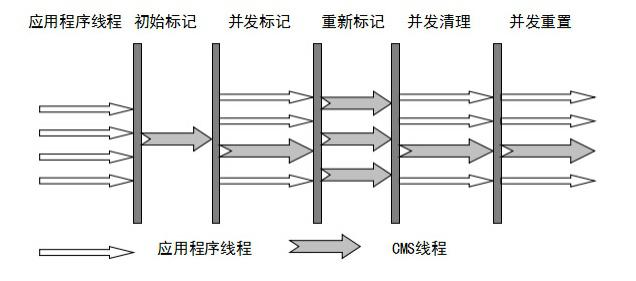

#### 过程

1. **初始标记**：只是标记一下GC Roots能直接关联的对象，速度很快，需要**STW**。
2. **并发标记**：主要标记过程，标记全部对象，和用户线程一起工作，不需要STW。
3. **重新标记**：修正在并发标记阶段出现的变动，需要**STW**。
4. **并发清除**：和用户线程一起，清除垃圾，不需要STW。

#### 优缺点

**优点**：停顿时间少，响应速度快，用户体验好。

**缺点**：

1. 对CPU资源非常敏感：由于需要并发工作，多少会占用系统线程资源。
2. 无法处理浮动垃圾：由于标记垃圾的时候，用户进程仍然在运行，无法有效处理新产生的垃圾。
3. 产生内存碎片：由于使用**标清算法**，会产生内存碎片。

### G1收集器

`G1`收集器与之前垃圾收集器的一个显著区别就是——之前收集器都有三个区域，新、老两代和元空间。而G1收集器只有G1区和元空间。而G1区，不像之前的收集器，分为新、老两代，而是一个一个Region，每个Region既可能包含新生代，也可能包含老年代。

`G1`收集器既可以提高吞吐量，又可以减少GC时间。最重要的是**STW可控**，增加了预测机制，让用户指定停顿时间。

使用`-XX:+UseG1GC`开启，还有`-XX:G1HeapRegionSize=n`、`-XX:MaxGCPauseMillis=n`等参数可调。

#### 特点

1. **并行和并发**：充分利用多核、多线程CPU，尽量缩短STW。
2. **分代收集**：虽然还保留着新、老两代的概念，但物理上不再隔离，而是融合在Region中。
3. **空间整合**：`G1`整体上看是**标整**算法，在局部看又是**复制算法**，不会产生内存碎片。
4. **可预测停顿**：用户可以指定一个GC停顿时间，`G1`收集器会尽量满足。

#### 过程

与`CMS`类似。

1. 初始标记。
2. 并发标记。
3. 最终标记。
4. 筛选回收。

# 