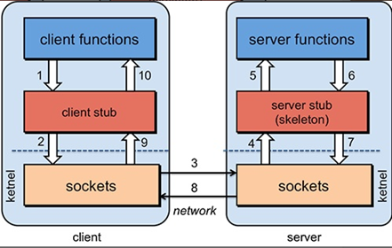

## Dubbo


### 基础知识


#### 分布式系统

分布式系统是若干独立计算机的集合，这些计算机对于用户来说就像单个相关系统


>  发展演变


- 单一应用架构

  

- 垂直应用架构

  

- 分布式服务架构

  

- 流动计算架构


#### SOA

- 面向服务架构:

> 有一个专门提供服务单元.
>
>  其他所有单元都调用这个服务.

- 优点

  > 专门访问数据库服务
  >
  > 开发时可以实现,数据访问控制和代码复用.


- 实现SOA架构时,常用服务.

>  Dubbo 做为服务.
>
>  WebService 做为服务.
>
>  Dubbox 做为服务.
>
>  服务方就是web项目,调用web项目的控制器.
>
>  使用HttpClient可以调用其他项目的控制器.


#### RPC

- 远程过程调用协议

- RPC解析: 客户端(A)通过互联网调用远程服务器,不知道远程服务器具体实现,只知道远程服务器提供了什么功能.


- 原理

  

  


- 优点

  数据安全性.

 

#### Dubbo简介


1.  Dubbo:一个分布式、高性能、透明化的RPC服务框架

2. 作用:提供服务自动注册、自动发现等高效服务治理方案.

3. Dubbo架构图

   3.1 Provider :提供者,服务发布方.

   3.2 Consumer:消费者, 调用服务方

   3.3 Container:Dubbo容器.依赖于Spring容器.

   3.4 Registry: 注册中心.当Container启动时把所有可以提供的服务列表上Registry中进行注册.

   ​	3.4.1 作用:告诉Consumer提供了什么服务和服务方在哪里.

   3.5 Monitor:监听器

   3.6 虚线都是异步访问,实线都是同步访问

   3.7 蓝色虚线:在启动时完成的功能

   3.8 红色虚线(实线)都是程序运行过程中执行的功能

   3.9 所有的角色都是可以在单独的服务器上.所以必须遵守特定的协议.


1. 运行原理:

   4.0 启动容器,相当于在启动Dubbo的Provider

   4.1 启动后会去注册中心进行注册.注册所有可以提供的服务列表

   4.2 在Consumer启动后会去Registry中获取服务列表和Provider的地址.进行订阅.

   4.3 当Provider有修改后,注册中心会把消息推送给Consummer

   ​	4.3.1 使用了观察者设计模式(又叫发布/订阅设计模式)

   4.4 根据获取到的Provider地址,真实调用Provider中功能.

   ​	4.4.1 在Consumer方使用了代理设计模式.创建一个Provider方类的一个代理对象.通过代理对象获取Provider中真实功能,起到保护Provider真实功能的作用.

   4.5 Consumer和Provider每隔1分钟向Monitor发送统计信息,统计信息包含,访问次数,频率等.

   

#### Dubbo支持的注册中心

1. Zookeeper

   1.1 优点:支持网络集群

   1.2 缺点:稳定性受限于Zookeeper

2. Redis 

   2.1 优点:性能高.

   2.2 缺点:对服务器环境要求较高.

3. Multicast

   3.1 优点:面中心化,不需要额外安装软件.

   3.2 缺点:建议同机房(局域网)内使用

4. Simple

   4.1 适用于测试环境.不支持集群.


#### 温习Zookeeper


1. Zookeeper 分布式协调组件.

   1.1 本质一个软件.

2. Zookeeper常用功能

   2.1 发布订阅功能.把zookeeper当作注册中心原因.

   2.2 分布式/集群管理功能.

3. 使用java语言编写的.


#### Dubbo支持的协议

1. Dubbo

   1.1 Dubbo官方推荐的协议.

   1.2 本质:使用NIO和线程池进行处理.

   1.3 缺点:大文件传输时可能出现文件传输失败问题.

2. RMI

   2.1 JDK提供的协议,远程方法调用协议.

   2.2 缺点:偶尔连接失败.

   2.3 优点:JDK原生,不需要进行额外配置(导入jar)

3. Hession

   3.1 优点:基于http协议,http请求支持.

   3.2 缺点:需要额外导入jar,并在短连接时性能低


### SSM整合Dubbo


#### Dubbo中Provider搭建

1. 新建Maven Project, 里面只有接口(dubbo-service)

   1.1 为什么这么做?

   RPC框架,不希望Consumer知道具体实现.如果实现类和接口在同一个项目中,Consumer依赖这个项目时,就会知道实现类具体实现.

2. 新建Maven Project, 写接口的实现类(dubbo-service-impl)

3. 在duboo-service-impl中配置pom.xml

   3.1 依赖接口

   3.2 依赖dubbo,去掉老版本spring

   3.3 依赖新版本spring

   3.4 依赖zookeeper客户端工具zkClient

   ```xml
   <dependencies>
   		<dependency>
   			<groupId>com.bjsxt</groupId>
   			<artifactId>dubbo-service</artifactId>
   			<version>0.0.1-SNAPSHOT</version>
   		</dependency>
   		<dependency>
   			<groupId>com.alibaba</groupId>
   			<artifactId>dubbo</artifactId>
   			<version>2.5.3</version>
   			<exclusions>
   				<exclusion>
   					<artifactId>spring</artifactId>
   					<groupId>org.springframework</groupId>
   				</exclusion>
   			</exclusions>
   		</dependency>
   		<dependency>
   			<groupId>org.springframework</groupId>
   			<artifactId>spring-webmvc</artifactId>
   			<version>4.1.6.RELEASE</version>
   		</dependency>
   		<!-- 访问zookeeper的客户端jar -->
   		<dependency>
   			<groupId>com.101tec</groupId>
   			<artifactId>zkclient</artifactId>
   			<version>0.10</version>
   		</dependency>
   	</dependencies>
   ```

   

4. 新建实现类,并实现接口方法.

5. 新建配置文件applicationContext-dubbo.xml,并配置

   5.1 \<dubbo:application/> 给provider起名,在monitor或管理工具中区别是哪个provider

   5.2 \<dubbo:registry/> 配置注册中心

   ​	5.2.1 address:注册中心的ip和端口.2

   ​	5.2.2 protocol使用哪种注册中心

   5.3 \<dubbo:protocol/> 配置协议

   ​	5.3.1 name 使用什么协议

   ​	5.3.2 port: consumer invoke provider时的端口号

   5.4 \<dubbo:service/> 注册接口

   ​	5.4.1 ref 引用接口实现类<bean>的id值

   ```xml
   <beans xmlns="http://www.springframework.org/schema/beans"
   	xmlns:xsi="http://www.w3.org/2001/XMLSchema-instance" 
   	xmlns:context="http://www.springframework.org/schema/context"
   	xmlns:dubbo="http://code.alibabatech.com/schema/dubbo"
   	xsi:schemaLocation="http://www.springframework.org/schema/beans 
   	http://www.springframework.org/schema/beans/spring-beans.xsd
   		http://www.springframework.org/schema/context 
   		http://www.springframework.org/schema/context/spring-context.xsd
   		http://code.alibabatech.com/schema/dubbo 
   		http://code.alibabatech.com/schema/dubbo/dubbo.xsd">
   	<!-- 给当前Provider自定义个名字 -->
   	<dubbo:application name="dubbo-service"/>
   	<!-- 配置注册中心  -->
   	<dubbo:registry address="192.168.139.130:2181" protocol="zookeeper"></dubbo:registry>
   	<!-- 配置端口 -->
   	<dubbo:protocol name="dubbo" port="20888"></dubbo:protocol>
   	<!-- 注册功能 -->
   	<dubbo:service interface="com.bjsxt.service.DemoService" ref="demoServiceImpl"></dubbo:service>
   	<bean id="demoServiceImpl" class="com.bjsxt.service.impl.DemoServiceImpl"></bean>
   </beans>
   ```

   

6.  启动容器

   6.1 通过spring方式启动

   ​	6.1.1 applicationContext-dubbo.xml位置没有要求

       ```java
   ClassPathXmlApplicationContext ac = new ClassPathXmlApplicationContext("applicationContext-dubbo.xml");
   		ac.start();
   		System.out.println("启动成功");
   		System.in.read();
       ```

   6.2 使用dubbo提供的方式启动(推荐使用这种方式)

   ​	6.2.1 要求applicationContext-dubbo.xml必须放入类路径下/META-INF/spring/*.xml

     ```java
   Main.main(args);
     ```


#### Admin管理界面

1. 本质就是一个web项目

2. 获取注册中心内Provider注册的信息.用页面呈现出来.

3. 实现步骤

   3.1 把dubbo-admin-2.5.3.war上传到服务器tomcat中.

   3.2 启动tomcat完成后关闭tomcat,删除上传的dubbo-admin-2.5.3.war

   ​	3.2.1 为什么要删除:需要修改解压后的文件夹,如果不删除.war文件,下次重启tomcat会还原成未修改状态

   3.3 进入dubbo-admin-2.5.3/WEB-INF/dubbo.properties,修改第一行为zookeeper的ip和端口

   ​	3.3.2 第二行和第三行为管理界面的用户名和密码


​	3.4 启动tomcat, 在浏览器地址栏访问tomcat中dubbo项目


#### Consumer搭建过程


1.在pom.xml中除了ssm的依赖添加dubbo相关3个依赖(接口,dubbo.jar,zkClient)

2.web.xml中修改

```xml
<context-param>
    <param-name>contextConfigLocation</param-name>
    <param-value>classpath:applicationContext-*.xml</param-value>
</context-param>
```


3. spring配置文件命名为applicationContext-spring.xml,配置dubbo的配置文件applicationContext-dubbo.xml

  ```xml
<!-- 给当前Provider自定义个名字 -->
<dubbo:application name="dubbo-consumer"/>
<!-- 配置注册中心  -->
<dubbo:registry address="192.168.139.130:2181" protocol="zookeeper"></dubbo:registry>
<!-- 配置注解扫描 -->
<dubbo:annotation package="com.bjsxt.service.impl"/>
  ```


4. 不需要编写mapper

5. 除了ServiceImpl中引用Provider中接口对象改变,其他代码都一样.

```java
@Service
public class TestServiceImpl implements TestService {
//	@Resource
//	private xxMapper xxxMapper;
	@Reference
	private DemoService demoService;
```


### SpringBoot 整合Dubbo


#### 基本整合步骤


- 引入spring-boot-starter以及dubbo和curator的依赖

```
<dependency>
    <groupId>com.alibaba.boot</groupId>
    <artifactId>dubbo-spring-boot-starter</artifactId>
    <version>0.2.0</version>
</dependency>
```

注意starter版本适配


- 配置application.properties

```properties
提供者配置：
dubbo.application.name=gmall-user
dubbo.registry.protocol=zookeeper
dubbo.registry.address=192.168.67.159:2181
dubbo.scan.base-package=com.atguigu.gmall
dubbo.protocol.name=dubbo
application.name就是服务名，不能跟别的dubbo提供端重复
registry.protocol 是指定注册中心协议
registry.address 是注册中心的地址加端口号
protocol.name 是分布式固定是dubbo,不要改。
base-package  注解方式要扫描的包

消费者配置：
dubbo.application.name=gmall-order-web
dubbo.registry.protocol=zookeeper
dubbo.registry.address=192.168.67.159:2181
dubbo.scan.base-package=com.atguigu.gmall
dubbo.protocol.name=dubbo
```

- 注解

  > dubbo注解  @Service、@Reference【如果没有在配置中写dubbo.scan.base-package,还需要使用@EnableDubbo注解

   


#### dubbo配置


- 配置原则

  

> JVM 启动 -D 参数优先，这样可以使用户在部署和启动时进行参数重写，比如在启动时需改变协议的端口。
>
> XML 次之，如果在 XML 中有配置，则 dubbo.properties 中的相应配置项无效。
>
> Properties 最后，相当于缺省值，只有 XML 没有配置时，dubbo.properties 的相应配置项才会生效，通常用于共享公共配置，比如应用名。


- 重试次数

>  失败自动切换，当出现失败，重试其它服务器，但重试会带来更长延迟。可通过 retries="2" 来设置重试次数(不含第一次)。

```xml
重试次数配置如下：
<dubbo:service retries="2" />
或
<dubbo:reference retries="2" />
或
<dubbo:reference>
    <dubbo:method name="findFoo" retries="2" />
</dubbo:reference>

```


#### 高可用


- zookeeper宕机与dubbo直连

  现象：zookeeper注册中心宕机，还可以消费dubbo暴露的服务。

  原因：

  >   健壮性  l 监控中心宕掉不影响使用，只是丢失部分采样数据  l 数据库宕掉后，注册中心仍能通过缓存提供服务列表查询，但不能注册新服务  l 注册中心对等集群，任意一台宕掉后，将自动切换到另一台  l **注册中心全部宕掉后，服务提供者和服务消费者仍能通过本地缓存通讯**  l 服务提供者无状态，任意一台宕掉后，不影响使用  l 服务提供者全部宕掉后，服务消费者应用将无法使用，并无限次重连等待服务提供者恢复     
  >
  > 高可用：通过设计，减少系统不能提供服务的时间；


- 集群下dubbo负载均衡配置

  在集群负载均衡时，Dubbo 提供了多种均衡策略，缺省为 random 随机调用。

  负载均衡策略

  >   **Random LoadBalance**  随机，按权重设置随机概率。  在一个截面上碰撞的概率高，但调用量越大分布越均匀，而且按概率使用权重后也比较均匀，有利于动态调整提供者权重。  
  >
  > **RoundRobin LoadBalance**  轮循，按公约后的权重设置轮循比率。  存在慢的提供者累积请求的问题，比如：第二台机器很慢，但没挂，当请求调到第二台时就卡在那，久而久之，所有请求都卡在调到第二台上。
  >
  > **LeastActive LoadBalance**  最少活跃调用数，相同活跃数的随机，活跃数指调用前后计数差。  使慢的提供者收到更少请求，因为越慢的提供者的调用前后计数差会越大。  
  >
  > **ConsistentHash LoadBalance**  一致性 Hash，相同参数的请求总是发到同一提供者。  当某一台提供者挂时，原本发往该提供者的请求，基于虚拟节点，平摊到其它提供者，不会引起剧烈变动。算法参见：http://en.wikipedia.org/wiki/Consistent_hashing  缺省只对第一个参数 Hash，如果要修改，请配置 <dubbo:parameter  key="hash.arguments" value="0,1" />  缺省用 160 份虚拟节点，如果要修改，请配置 <dubbo:parameter  key="hash.nodes" value="320" />  


- 整合hystrix，服务熔断与降级处理

  > ### 服务降级
  >
  > **什么是服务降级？**
  >
  > **当服务器压力剧增的情况下，根据实际业务情况及流量，对一些服务和页面有策略的不处理或换种简单的方式处理，从而释放服务器资源以保证核心交易正常运作或高效运作。**
  >
  > 可以通过服务降级功能临时屏蔽某个出错的非关键服务，并定义降级后的返回策略。
  >
  > 向注册中心写入动态配置覆盖规则：
  >
  > ```java
  > RegistryFactory registryFactory = ExtensionLoader.getExtensionLoader(RegistryFactory.class).getAdaptiveExtension();
  > Registry registry = registryFactory.getRegistry(URL.valueOf("zookeeper://10.20.153.10:2181"));
  > registry.register(URL.valueOf("override://0.0.0.0/com.foo.BarService?category=configurators&dynamic=false&application=foo&mock=force:return+null"));
  > 
  > ```
  >
  > 
  >
  >  
  >
  > 其中：
  >
  > l mock=force:return+null 表示消费方对该服务的方法调用都直接返回 null 值，不发起远程调用。用来屏蔽不重要服务不可用时对调用方的影响。
  >
  > l 还可以改为 mock=fail:return+null 表示消费方对该服务的方法调用在失败后，再返回 null 值，不抛异常。用来容忍不重要服务不稳定时对调用方的影响。
  >
  >  
  >
  >  
  >
  > ### 2、集群容错
  >
  > 在集群调用失败时，Dubbo 提供了多种容错方案，缺省为 failover 重试。
  >
  > **集群容错模式**
  >
  >   **Failover Cluster**  失败自动切换，当出现失败，重试其它服务器。通常用于读操作，但重试会带来更长延迟。可通过  retries="2" 来设置重试次数(不含第一次)。     重试次数配置如下：  <dubbo:service retries="2" />  或  <dubbo:reference retries="2" />  或  <dubbo:reference>      <dubbo:method name="findFoo" retries="2" />  </dubbo:reference>     **Failfast Cluster**  快速失败，只发起一次调用，失败立即报错。通常用于非幂等性的写操作，比如新增记录。     
  >
  > **Failsafe Cluster**  失败安全，出现异常时，直接忽略。通常用于写入审计日志等操作。     
  >
  > **Failback Cluster**  失败自动恢复，后台记录失败请求，定时重发。通常用于消息通知操作。   
  >
  > **Forking Cluster**  并行调用多个服务器，只要一个成功即返回。通常用于实时性要求较高的读操作，但需要浪费更多服务资源。可通过  forks="2" 来设置最大并行数。     
  >
  > **Broadcast Cluster**  广播调用所有提供者，逐个调用，任意一台报错则报错 [2]。通常用于通知所有提供者更新缓存或日志等本地资源信息。    
  >
  >  **集群模式配置**  按照以下示例在服务提供方和消费方配置集群模式  <dubbo:service cluster="failsafe"  />  或  <dubbo:reference cluster="failsafe"  />  
  >
  >  
  >
  > ### 3、整合hystrix
  >
  > Hystrix 旨在通过控制那些访问远程系统、服务和第三方库的节点，从而对延迟和故障提供更强大的容错能力。Hystrix具备拥有回退机制和断路器功能的线程和信号隔离，请求缓存和请求打包，以及监控和配置等功能
  >
  > #### 1、配置spring-cloud-starter-netflix-hystrix
  >
  > spring boot官方提供了对hystrix的集成，直接在pom.xml里加入依赖：
  >
  > ```xml
  > <dependency>
  >     <groupId>org.springframework.cloud</groupId>
  >     <artifactId>spring-cloud-starter-netflix-hystrix</artifactId>
  >     <version>1.4.4.RELEASE</version>
  > </dependency>
  > 
  > ```
  >
  > 
  >
  >  
  >
  > 然后在Application类上增加@EnableHystrix来启用hystrix starter：
  >
  >   ```java
  > @SpringBootApplication
  > @EnableHystrix
  > public class ProviderApplication {
  > 
  >   ```
  >
  > 
  >
  >  
  >
  > #### 2、配置Provider端
  >
  > 在Dubbo的Provider上增加@HystrixCommand配置，这样子调用就会经过Hystrix代理。
  >
  >  ```java
  > @Service(version = "1.0.0")
  > public class HelloServiceImpl implements HelloService {
  >     @HystrixCommand(commandProperties = {
  >      @HystrixProperty(name = "circuitBreaker.requestVolumeThreshold", value = "10"),
  >      @HystrixProperty(name = "execution.isolation.thread.timeoutInMilliseconds", value = "2000") })
  >     @Override
  >     public String sayHello(String name) {
  >         // System.out.println("async provider received: " + name);
  >         // return "annotation: hello, " + name;
  >         throw new RuntimeException("Exception to show hystrix enabled.");
  >     }
  > }
  > 
  >  ```
  >
  > 
  >
  >  
  >
  > #### 3、配置Consumer端
  >
  > 对于Consumer端，则可以增加一层method调用，并在method上配置@HystrixCommand。当调用出错时，会走到fallbackMethod = "reliable"的调用里。
  >
  >  ```java
  > @Reference(version = "1.0.0")
  >     private HelloService demoService;
  > 
  >     @HystrixCommand(fallbackMethod = "reliable")
  >     public String doSayHello(String name) {
  >         return demoService.sayHello(name);
  >     }
  >     public String reliable(String name) {
  >         return "hystrix fallback value";
  >     }
  > 
  >  ```
  >


### Dubbo 原理


#### RPC 原理


> > 一次完整的RPC调用流程（同步调用，异步另说）如下：
> >
> > **1**）服务消费方（client）调用以本地调用方式调用服务；
> >
> > 2）client stub接收到调用后负责将方法、参数等组装成能够进行网络传输的消息体； 
> >
> > 3）client stub找到服务地址，并将消息发送到服务端； 
> >
> > 4）server stub收到消息后进行解码； 
> >
> > 5）server stub根据解码结果调用本地的服务； 
> >
> > 6）本地服务执行并将结果返回给server stub； 
> >
> > 7）server stub将返回结果打包成消息并发送至消费方； 
> >
> > 8）client stub接收到消息，并进行解码； 
> >
> > **9**）服务消费方得到最终结果。
> >
> > RPC框架的目标就是要2~8这些步骤都封装起来，这些细节对用户来说是透明的，不可见的。


#### netty 通信原理

> Netty是一个异步事件驱动的网络应用程序框架， 用于快速开发可维护的高性能协议服务器和客户端。它极大地简化并简化了TCP和UDP套接字服务器等网络编程。


BIO（阻塞IO）：每来一个请求开一个线程


NIO （非阻塞IO）：通过选择器，选择准备好资源的请求，开启一个线程执行


#### Netty基本原理：通过NIO实现


#### Dubbo 框架设计


