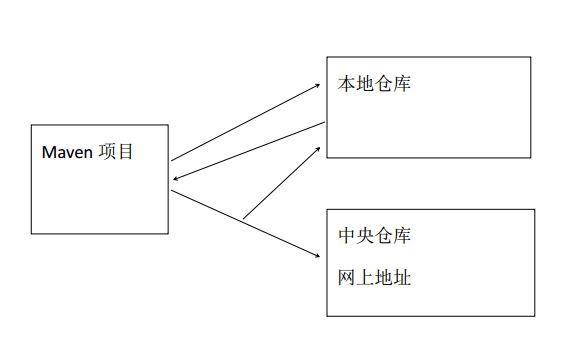

## Maven


#### 简介

1. 基于 Ant 的构建工具,Ant 有的功能 Maven 都有,额外添加了其他功能.
2. 运行原理图.
   2.1 本地仓库:计算机中一个文件夹,自己定义是哪个文件夹.
   2.2 中央仓库:网上地址 https://repo1.maven.org/maven2/
   2.2.1 下载速度慢--> 配置国内镜像
   2.3 保证 JDK 版本和开发环境一致,如果不配置 1.4 或 1.5
   
3. 坐标
   3.1 每一 jar 文件都有一个唯一坐标.通过坐标可以精确确定是哪个 jar
   3.2 坐标组成
   	3.2.1 Group ID : 公司名.公司网址倒写
   	3.2.2 Artifact ID : 项目名
   	3.2.3 Version : 版本
4. pom
   4.1 英文名称(Project Object Mode)
   4.2 项目对象模型
   	4.2.1 把 project 当作对象看待.
   	4.2.2 通过 maven 构建工具可以让对象(项目)和对象(项目)之间产生关系
5. 网址(查看坐标)
   http://mvnrepository.com/  


6. Packaging: 项目的类型,最终会被打包成什么类型.
   3.1 jar : java 项目
   3.2 war: web 项目
   3.3 pom:逻辑父项目
   	3.3.1 只要一个项目有子项目必须是 pom 类型.  


#### 相关标签作用

- <dependencyManagement> 写在父项目

> 作用:声明可能使用到的所有 jar
> 子项目中只需要有坐标的<groupid>和<artifactid>,<version>继承父项目
> 在父项目中<properties>把所有版本好进行统一管理
> 父项目 pom.xml
> <properties>子标签名称自定义
> ${名字} 引用标签的值  


- <scope>   

  jar 有效范围 provided 表示编译期生效,不会打包发布
  到 tomcat 中  


#### 资源拷贝插件  


如果希望 src/main/java 下的文件也被编辑到 classes 中,在 pom.xml
中配置  

```xml
<resources>
    <resource>
        <directory>src/main/java</directory>
        <includes>
            <include>**/*.xml</include>
        </includes>
    </resource>
    <resource>
        <directory>src/main/resources</directory>
        <includes>
            <include>**/*.xml</include>
        	<include>**/*.properties</include>
        </includes>
    </resource>
</resources>
```


