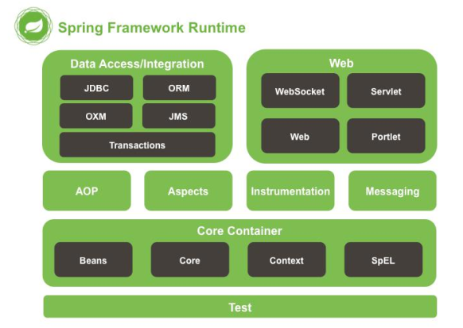
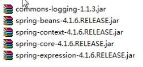
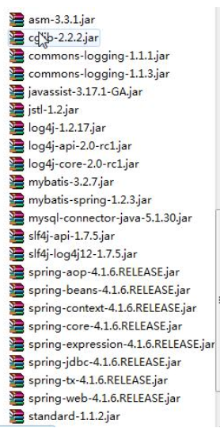
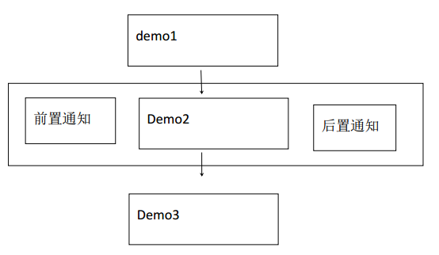
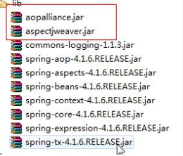
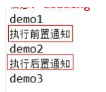
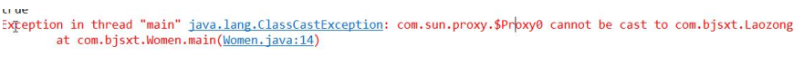
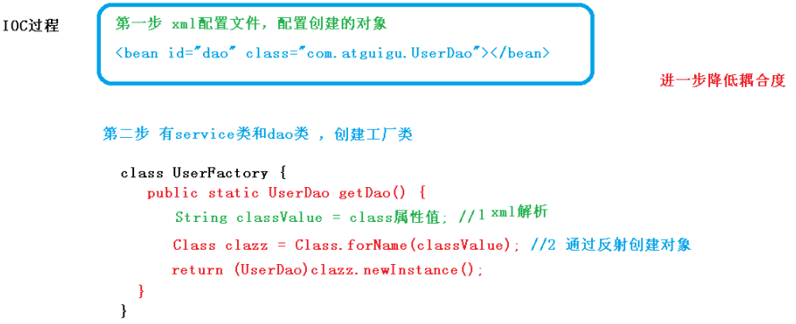
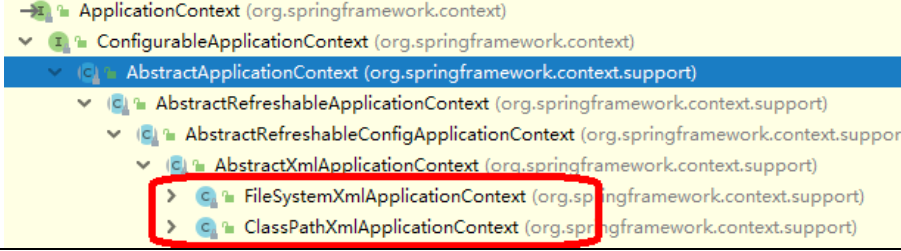

## Spring Review


[TOC]


### 一.Spring 框架简介及官方压缩包目录介绍  


1.主要发明者:Rod Johnson
2.轮子理论推崇者:
	2.1  轮子理论:不用重复发明轮子.
	2.2 IT 行业:直接使用写好的代码.
3.Spring 框架宗旨:不重新发明技术,让原有技术使用起来更加方便.
4.Spring 几大核心功能
	4.1 IoC/DI 控制反转/依赖注入
	4.2 AOP 面向切面编程
	4.3 声明式事务.
5.Spring 框架 runtime
	5.1 test: spring 提供测试功能
	5.2 Core Container:核心容器.Spring 启动最基本的条件.
		5.2.1 Beans : Spring 负责创建类对象并管理对象
		5.2.2 Core: 核心类
		5.2.3 Context: 上下文参数.获取外部资源或者管理注解等
		5.2.4 SpEl: expression.jar
	5.3 AOP: 实现 aop 功能需要依赖
	5.4 Aspects: 切面 AOP 依赖的包
	5.5 Data Access/Integration : spring 封装数据访问层相关内容
		5.5.1 JDBC : Spring 对 JDBC 封装后的代码.
		5.5.2 ORM: 封装了持久层框架的代码.例如 Hibernate
		5.5.3 transactions:对应 spring-tx.jar,声明式事务使用.
	5.6 WEB:需要 spring 完成 web 相关功能时需要.
		5.6.1 例如:由 tomcat 加载 spring 配置文件时需要有 spring-web包  




6. Spring 框架中重要概念
   	6.1 容器(Container): Spring 当作一个大容器.
      	6.2 BeanFactory 接口.老版本.
      		6.2.1 新版本中 ApplicationContext 接口,是 BeanFactory 子接口.BeanFactory 的功能在 ApplicationContext 中都有.
   7. 从 Spring3 开始把 Spring 框架的功能拆分成多个 jar.
      	7.1 Spring2 及以前就一个 j ar 


------

### 二. IoC


1 中文名称:控制反转
2.英文名称:(Inversion of Control)
3.IoC 是什么?
	3.1 IoC 完成的事情原先由程序员主动通过 new 实例化对象事情,转交给 Spring 负责.
	3.2 控制反转中控制指的是:控制类的对象.
	3.3 控制反转中反转指的是转交给 Spring 负责.
	3.4 IoC 最大的作用:解耦.
		3.4.1 程序员不需要管理对象.解除了对象管理和程序员之间的耦合. 


------

### 三.Spring 环境搭建

1. 导入 jar
   	1.1 四个核心包一个日志包(commons-logging )




2. 在 src 下新建 applicationContext.xml
   	2.1 文件名称和路径自定义.
      	2.2 记住 Spring 容器 ApplicationContext,applicationContext.xml 配置的信息最终存储到了 AppliationContext 容器中
      	2.3 spring 配置文件是基于 schema
      		2.3.1 schema 文件扩展名.xsd
      		2.3.2 把 schema 理解成 DTD 的升级版.
      		2.3.2.1 比 DTD 具备更好的扩展性.
      		2.3.3 每次引入一个 xsd 文件是一个 namespace(xmlns)
      	2.4 配置文件中只需要引入基本 schema
      		2.4.1 通过\<bean/> 创建对象.
      		2.4.2 默认配置文件被加载时创建对象.  

​	

```xml
<?xml version="1.0" encoding="UTF-8"?>
<beans
    xmlns="http://www.springframework.org/schema/beans"
    xmlns:xsi="http://www.w3.org/2001/XMLSchema-instance"
    xsi:schemaLocation="http://www.springframework.org/sc
    hema/beans
    http://www.springframework.org/schema/beans/spring-be
    ans.xsd">
    <!-- id 表示获取到对象标识
    class 创建哪个类的对象
    -->
    <bean id="peo" class="com.bjsxt.pojo.People"/>
</beans>
```


3. 编写测试方法
   	3.1 getBean(“\<bean>标签 id 值”,返回值类型);如果没有第二个参数,默认是 Object
      	3.2 getBeanDefinitionNames(),Spring 容器中目前所有管理的所有对象  

```java
ApplicationContext ac = new ClassPathXmlApplicationContext("applicationContext.xm
l");
People people = ac.getBean("peo",People.class);
System.out.println(people);
// String[] names = ac.getBeanDefinitionNames();
// for (String string : names) {
// 	System.out.println(string);
// }
```


### 四.Spring 创建对象的三种方式


1. 通过构造方法创建
   	1.1 无参构造创建:默认情况.
      	1.2 有参构造创建:需要明确配置
      		1.2.1 需要在类中提供有参构造方法
      		1.2.2 在 applicationContext.xml 中设置调用哪个构造方法创建对象
      			1.2.2.1 如果设定的条件匹配多个构造方法执行最后的构造方法
      			1.2.2.2 index : 参数的索引,从 0 开始
      			1.2.2.3 name: 参数名
      			1.2.2.4 type:类型(区分开关键字和封装类 int 和 Integer)  

```xml
<bean id="peo" class="com.bjsxt.pojo.People">
    <!-- ref 引用另一个 bean value 基本数据类型或
    String 等 -->
    <constructor-arg index="0" name="id" type="int" value="123"></constructor-arg>
    <constructor-arg index="1" name="name" type="java.lang.String" value="张三"></constructor-arg>
</bean>
```


2. 实例工厂
   	2.1 工厂设计模式:帮助创建类对象.一个工厂可以生产多个对象.
      	2.2 实例工厂:需要先创建工厂,才能生产对象
      	2.3 实现步骤:
      		2.3.1 必须要有一个实例工厂  

​		

```java
public class PeopleFactory {
	public People newInstance(){
		return new People(1,"测试");}
	}
}
```


​		2.3.2 在 applicationContext.xml 中配置工厂对象和需要创建的对象  

```xml
<bean id="factory" class="com.bjsxt.pojo.PeopleFactory"></bean>
<bean id="peo1" factory-bean="factory" factory-method="newInstance"></bean>
```


3. 静态工厂
   	3.1 不需要创建工厂,快速创建对象.
      	3.2 实现步骤
      		3.2.1 编写一个静态工厂(在方法上添加 static)  

​	

```java
public class PeopleFactory {
	public static People newInstance(){
		return new People(1,"测试");
	}
}
```


​		3.2.2 在 applicationContext.xml 中  

```xml
<bean id="peo2" class="com.bjsxt.pojo.PeopleFactory" factory-method="newInstance"></bean>
```


### 五.如何给 Bean 的属性赋值(注入)


1.通过构造方法设置值.
2.设置注入(通过 set 方法)
	2.1 如果属性是基本数据类型或 String 等简单  

```xml
<bean id="peo" class="com.bjsxt.pojo.People">
    <property name="id" value="222"></property>
    <property name="name" value="张三"></property>
</bean>
```

​		2.1.1 等效于  

```xml
<bean id="peo" class="com.bjsxt.pojo.People">
    <property name="id">
    	<value>456</value>
    </property>
    <property name="name">
    	<value>zhangsan</value>
    </property>
</bean>
```


​	2.2 如果属性是 Set<?>	  

```xml
<property name="sets">
    <set>
        <value>1</value>
        <value>2</value>
        <value>3</value>
        <value>4</value>
    </set>
</property>
```


​	2.3 如果属性是 List<?>  

```xml
<property name="list">
    <list>
        <value>1</value>
        <value>2</value>
        <value>3</value>
	</list>
</property>
 // 2.3.1 如果 list 中就只有一个值
<property name="list" value="1">
</property>
```

​	2.4 如果属性是数组
​		2.4.1 如果数组中就只有一个值,可以直接通过 value 属性赋值  

```xml
<property name="strs" >
    <array>
        <value>1</value>
        <value>2</value>
        <value>3</value>
    </array>
</property>
```

​	2.5 如果属性是 map  

```xml
<property name="map">
    <map>
        <entry key="a" value="b" >
        </entry>
        <entry key="c" value="d" >
        </entry>
    </map>
</property>
```


### 六. DI  


1. DI:中文名称:依赖注入
2. 英文名称((Dependency Injection)
3. DI 是什么?
   	3.1 DI 和 IoC 是一样的
      	3.2 当一个类(A)中需要依赖另一个类()对象时,把 B 赋值给 A 的过程就叫做依赖注入.
4. 代码体现:  

​	

```xml
<bean id="peo" class="com.bjsxt.pojo.People">
	<property name="desk" ref="desk"></property>
</bean>
<bean id="desk" class="com.bjsxt.pojo.Desk">
    <property name="id" value="1"></property>
    <property name="price" value="12"></property>
</bean>
```


### 七.使用 Spring 简化 MyBatis


1. 导 入 mybatis 所 有 jar 和 spring 基 本包,spring-jdbc,spring-tx,spring-aop,spring-web,spring 整合 mybatis 的包等  




2. 先配置 web.xml  

```xml
<?xml version="1.0" encoding="UTF-8"?>
<web-app version="3.0"
    xmlns="http://java.sun.com/xml/ns/javaee"
    xmlns:xsi="http://www.w3.org/2001/XMLSchema-instance"
    xsi:schemaLocation="http://java.sun.com/xml/ns/javaee
    http://java.sun.com/xml/ns/javaee/web-app_3_0.xsd">
    <!-- 上下文参数 -->
    <context-param>
    	<param-name>contextConfigLocation</param-name>
        <!-- spring 配置文件 -->
        <param-value>classpath:applicationContext.xml</param-value>
    </context-param>
    <!-- 封装了一个监听器,帮助加载 Spring 的配置文件爱 -->
    <listener>
        <listener-class>org.springframework.web.context.ContextLoaderListener</listener-class>
    </listener>
</web-app>
```


3. 编写 spring 配置文件 applicationContext.xml  


```xml
<?xml version="1.0" encoding="UTF-8"?>
<beans
        xmlns="http://www.springframework.org/schema/beans"
        xmlns:xsi="http://www.w3.org/2001/XMLSchema-instance" 
        xsi:schemaLocation="http://www.springframework.org/schema/beans
    		http://www.springframework.org/schema/beans/spring-beans.xsd">
    <!-- 数据源封装类 .数据源:获取数据库连接,spring-jdbc.jar 中-->
    <bean id="dataSouce" class="org.springframework.jdbc.datasource.DriverManagerDataSource">
        <property name="driverClassName"
                  value="com.mysql.jdbc.Driver"></property>
        <property name="url"
                  value="jdbc:mysql://localhost:3306/ssm"></property>
        <property name="username"
                  value="root"></property>
        <property name="password"
                  value="smallming"></property>
    </bean>
    <!-- 创建 SqlSessionFactory 对象 -->
    <bean id="factory" class="org.mybatis.spring.SqlSessionFactoryBean">
        <!-- 数据库连接信息来源于 dataSource -->
        <property name="dataSource"
                  ref="dataSouce"></property>
    </bean>
    <!-- 扫描器相当于 mybatis.xml 中 mappers 下 package 标
    签,扫描 com.bjsxt.mapper 包后会给对应接口创建对象-->
    <bean class="org.mybatis.spring.mapper.MapperScannerConfigurer">
        <!-- 要扫描哪个包 -->
        <property name="basePackage"
                  value="com.bjsxt.mapper"></property>
        <!-- 和 factory 产生关系 -->
        <property name="sqlSessionFactory"
                  ref="factory"></property>
    </bean>
    <!-- 由 spring 管理 service 实现类 -->
    <bean id="airportService" class="com.bjsxt.service.impl.AirportServiceImpl">
        <property name="airportMapper"
                  ref="airportMapper"></property>
    </bean>
</beans>
```


4. 编写代码
   	4.1 正常编写 pojo
      	4.2 编写 mapper 包下时必须使用接口绑定方案或注解方案(必须有接口)
      	4.3 正常编写 Service 接口和 Service 实现类
      		4.3.1 需要在 Service 实现类中声明 Mapper 接口对象,并生成get/set 方法
      	4.4 spring 无法管理 Servlet,在 service 中取出 Servie 对象  

```java
@WebServlet("/airport")
public class AirportServlet extends HttpServlet {
    private AirportService airportService;

    @Override
    public void init() throws ServletException {
        //对 service 实例化
        // ApplicationContext ac = newClassPathXmlApplicationContext("applicationContext.xm l");
        //spring 和 web 整合后所有信息都存放在 webApplicationContext
        ApplicationContext ac = WebApplicationContextUtils.getRequiredWebApplicationContext(getServletContext());
        airportService = ac.getBean("airportService", AirportServiceImpl.class);
    }

    @Override
    protected void service(HttpServletRequest req,
                           HttpServletResponse resp) throws ServletException, IOException {
        req.setAttribute("list", airportService.show());
        req.getRequestDispatcher("index.jsp").forward(req, resp);
    }
}
```


### 八. AOP


1. AOP:中文名称面向切面编程英文名称:(Aspect Oriented Programming)

   > 面向切面编程（方面）， 利用 AOP 可以对业务逻辑的各个部分进行隔离，从而使得
   > 业务逻辑各部分之间的耦合度降低，提高程序的可重用性，同时提高了开发的效率。

2. 正常程序执行流程都是纵向执行流程
   	2.1  又叫面向切面编程,在原有纵向执行流程中添加横切面
      	2.2 不需要修改原有程序代码
      		2.2.1 高扩展性
      		2.2.2 原有功能相当于释放了部分逻辑.让职责更加明确.  



4.面向切面编程是什么?
	4.1 在程序原有纵向执行流程中,针对某一个或某一些方法添加通知,形成横切面过程就叫做面向切面编程.
5.常用概念
	5.1 原有功能: 切点, pointcut
	5.2 前置通知: 在切点之前执行的功能. before advice
	5.3 后置通知: 在切点之后执行的功能,after advice
	5.4 如果切点执行过程中出现异常,会触发异常通知.throws advice
	5.5 所有功能总称叫做切面.
	5.6 织入: 把切面嵌入到原有功能的过程叫做织入
6.spring 提供了 2 种 AOP 实现方式
	6.1 Schema-based
		6.1.1 每个通知都需要实现接口或类
		6.1.2 配置 spring 配置文件时在\<aop:config>配置
	6.2 AspectJ
		6.2.1 每个通知不需要实现接口或类
		6.2.2 配置 spring 配置文件是在\<aop:config>的子标签\<aop:aspect>中配置  


#### 一. Schema-based 实现步骤  


1. 导入 jar  




2. 新建通知类
   	2.1 新建前置通知类
      		2.1.1 arg0: 切点方法对象 Method 对象
      		2.1.2 arg1: 切点方法参数
      		2.1.3 arg2:切点在哪个对象中  

```java
public class MyBeforeAdvice implements MethodBeforeAdvice {
    @Override
    public void before(Method arg0, Object[] arg1, Object arg2) throws Throwable {
    	System.out.println("执行前置通知");
    }
}
```


​	2.2 新建后置通知类
​		2.2.1 arg0: 切点方法返回值
​		2.2.2 arg1:切点方法对象
​		2.2.3 arg2:切点方法参数
​		2.2.4 arg3:切点方法所在类的对象  

```java
public class MyAfterAdvice implements AfterReturningAdvice {
    @Override
    public void afterReturning(Object arg0, Method arg1, Object[] arg2, Object arg3) throws Throwable {
    	System.out.println("执行后置通知");
    }
}
```


3. 配置 spring 配置文件
   3.1 引入 aop 命名空间
   3.2 配置通知类的\<bean>
   3.3 配置切面
   3.4 * 通配符,匹配任意方法名,任意类名,任意一级包名
   3.5 如果希望匹配任意方法参数 (..)  

```xml
<?xml version="1.0" encoding="UTF-8"?>
<beans
        xmlns="http://www.springframework.org/schema/beans"
        xmlns:xsi="http://www.w3.org/2001/XMLSchema-instance"
        xmlns:aop="http://www.springframework.org/schema/aop"
        xsi:schemaLocation="http://www.springframework.org/schema/beans
            http://www.springframework.org/schema/beans/spring-beans.xsd
            http://www.springframework.org/schema/aop
            http://www.springframework.org/schema/aop/spring-aop.xsd">
    <!-- 配置通知类对象,在切面中引入 -->
    <bean id="mybefore" class="com.bjsxt.advice.MyBeforeAdvice"></bean>
    <bean id="myafter" class="com.bjsxt.advice.MyAfterAdvice"></bean>
    <!-- 配置切面 -->
    <aop:config>
        <!-- 配置切点 -->
        <aop:pointcut expression="execution(*com.bjsxt.test.Demo.demo2())" id="mypoint"/>
        <!-- 通知 -->
        <aop:advisor advice-ref="mybefore" pointcut-ref="mypoint"/>
        <aop:advisor advice-ref="myafter" pointcut-ref="mypoint"/>
    </aop:config>
    <!-- 配置 Demo 类,测试使用 -->
    <bean id="demo" class="com.bjsxt.test.Demo"></bean>
</beans>
```


5.  运行结果:  




#### 二. 配置异常通知的步骤(AspectJ 方式)  


1. 只有当切点报异常才能触发异常通知

2. 在 spring 中有 AspectJ 方式提供了异常通知的办法.
   2.1 如果希望通 过 schema-base 实现需要按照特定的要求自己编写方法.

3. 实现步骤:
   3.1 新建类,在类写任意名称的方法  

   ```java
   public class MyThrowAdvice{
       public void myexception(Exception e1){
       	System.out.println("执行异常通知"+e1.getMessage());
       }
   }
   ```

   3.2 在 spring 配置文件中配置
   	3.2.1 \<aop:aspect>的 ref 属性表示:方法在哪个类中.
   	3.2.2 <aop: xxxx/> 表示什么通知
   	3.2.3 method: 当触发这个通知时,调用哪个方法
   	3.2.4 throwing: 异常对象名,必须和通知中方法参数名相同(可以不在通知中声明异常对象)  


```xml
<bean id="mythrow" class="com.bjsxt.advice.MyThrowAdvice"></bean>
<aop:config>
    <aop:aspect ref="mythrow">
        <aop:pointcut expression="execution(*com.bjsxt.test.Demo.demo1())" id="mypoint"/>
        <aop:after-throwing method="myexception" pointcut-ref="mypoint" throwing="e1"/>
    </aop:aspect>
</aop:config>
<bean id="demo" class="com.bjsxt.test.Demo"></bean>
```


#### 三. 异常通知(Schema-based 方式)


1. 新建一个类实现 throwsAdvice 接口
   1.1 必须自己写方法,且必须叫 afterThrowing
   1.2 有两种参数方式
   	1.2.1 必须是 1 个或 4 个
   1.3 异常类型要与切点报的异常类型一致  

   ```java
   public class MyThrow implements ThrowsAdvice{
   // public void afterThrowing(Method m, Object[] args,Object target, Exception ex) {
   // 	System.out.println("执行异常通知");
   // }
       public void afterThrowing(Exception ex) throws Throwable {
           System.out.println("执行异常通过-schema-base 方式");
       }
   }
   ```

   

2. 在 ApplicationContext.xml 配置

   ```xml
   <bean id="mythrow" class="com.bjsxt.advice.MyThrow"></bean>
   <aop:config>
       <aop:pointcut expression="execution(*com.bjsxt.test.Demo.demo1())" id="mypoint"/>
       <aop:advisor advice-ref="mythrow" pointcut-ref="mypoint"/>
   </aop:config>
   <bean id="demo" class="com.bjsxt.test.Demo"></bean>
   ```

   


#### 四.环绕通知(Schema-based 方式)  


1. 把前置通知和后置通知都写到一个通知中,组成了环绕通知

2. 实现步骤
   2.1 新建一个类实现 MethodInterceptor  

   ```java
   public class MyArround implements MethodInterceptor {
       @Override
       public Object invoke(MethodInvocation arg0) throws Throwable {
           System.out.println("环绕-前置");
           Object result = arg0.proceed();//放行,调用切点方式
           System.out.println("环绕-后置");
           return result;
       }
   }
   ```

   

   2.2 配置 applicationContext.xml  

   ```xml
   <bean id="myarround" class="com.bjsxt.advice.MyArround"></bean>
   <aop:config>
       <aop:pointcut expression="execution(*com.bjsxt.test.Demo.demo1())" id="mypoint"/>
       <aop:advisor advice-ref="myarround" pointcut-ref="mypoint" />
   </aop:config>
   <bean id="demo" class="com.bjsxt.test.Demo"></bean>
   ```

   

#### 五.使用 AspectJ 方式实现(环绕通知)


1. 新建类,不用实现
   1.1 类中方法名任意  

   ```java
   public class MyAdvice {
       public void mybefore(String name1, int age1) {
           System.out.println("前置" + name1);
       }
   
       public void mybefore1(String name1) {
           System.out.println("前置:" + name1);
       }
   
       public void myaftering() {
           System.out.println("后置 2");
       }
   
       public void myafter() {
           System.out.println("后置 1");
       }
   
       public void mythrow() {
           System.out.println("异常");
       }
   
       public Object myarround(ProceedingJoinPoint p) throws Throwable {
           System.out.println("执行环绕");
           System.out.println("环绕-前置");
           Object result = p.proceed();
           System.out.println("环绕后置");
           return result;
       }
   }
   ```

   

   1.2 配置 spring 配置文件
   	1.2.1 \<aop:after/> 后置通知,是否出现异常都执行
   	1.2.2 \<aop:after-returing/> 后置通知,只有当切点正确执行时执行
   	1.2.3 \<aop:after/> 和 \<aop:after-returing/> 和\<aop:after-throwing/>执行顺序和配置顺序有关
   	1.2.4 execution() 括号不能扩上 args
   	1.2.5 中间使用 and 不能使用&& 由 spring 把 and 解析成&&
   	1.2.6 args(名称) 名称自定义的.顺序和 demo1(参数,参数)对应
   	1.2.7 \<aop:before/> arg-names=” 名 称 ” 名 称 来 源 于expression=”” 中 args(),名称必须一样
   		1.2.7.1 args() 有几个参数,arg-names 里面必须有几个参数
   		1.2.7.2 arg-names=”” 里面名称必须和通知方法参数名对应  

   ​		

   ```xml
   <aop:config>
       <aop:aspect ref="myadvice">
           <aop:pointcut expression="execution(*com.bjsxt.test.Demo.demo1(String,int)) and args(name1,age1)" id="mypoint"/>
           <aop:pointcut expression="execution(*com.bjsxt.test.Demo.demo1(String)) and args(name1)" id="mypoint1"/>
           <aop:before method="mybefore" pointcut-ref="mypoint" arg-names="name1, age1"/>
           <aop:before method="mybefore1" pointcut-ref="mypoint1" arg-names="name1"/>
   
   
          <!-- <aop:after method="myafter" pointcut-ref="mypoint"/>
           <aop:after-returning method="myaftering" pointcut-ref="mypoint"/>
           <aop:after-throwing method="mythrow" pointcut-ref="mypoint"/>
           <aop:around method="myarround" pointcut-ref="mypoint"/>-->
       </aop:aspect>
   </aop:config>
   ```

   


#### 六. 使用注解(基于 Aspect)


1. spring 不会自动去寻找注解,必须告诉 spring 哪些包下的类中可能有注解
   1.1 引入 xmlns:context  

   ```xml
   <context:component-scan base-package="com.bjsxt.advice"></context:component-scan>
   ```

2. @Component
   2.1 相当于\<bean/>
   2.2 如果没有参数,把类名首字母变小写,相当于\<bean id=""/>
   2.3 @Component(“自定义名称”)

3. 实现步骤:
   3.1 在 spring 配置文件中设置注解在哪些包中  

   ```xml
   <context:component-scan base-package="com.bjsxt.advice,com.bjsxt.test"></context:component-scan>
   ```

   3.2 在 Demo 类中添加@Componet
   	3.2.1 在方法上添加@Pointcut(“”) 定义切点  

   ```java
   @Component
   public class Demo {
       @Pointcut("execution(*com.bjsxt.test.Demo.demo1())")
       public void demo1() throws Exception{
           // int i = 5/0;
           System.out.println("demo1");
       }
   }
   ```

   3.3 在通知类中配置  

   ​	3.3.1 @Component 类被 spring 管理
   ​	3.3.2 @Aspect 相当于\<aop:aspect/>表示通知方法在当前类中  

   ```java
   @Component
   @Aspect
   public class MyAdvice {
       @Before("com.bjsxt.test.Demo.demo1()")
       public void mybefore() {
           System.out.println("前置");
       }
   
       @After("com.bjsxt.test.Demo.demo1()")
       public void myafter() {
           System.out.println("后置通知");
       }
   
       @AfterThrowing("com.bjsxt.test.Demo.demo1()")
       public void mythrow() {
           System.out.println("异常通知");
       }
   
       @Around("com.bjsxt.test.Demo.demo1()")
       public Object myarround(ProceedingJoinPoint p) throws Throwable {
           System.out.println("环绕-前置");
           Object result = p.proceed();
           System.out.println("环绕-后置");
           return result;
       }
   }
   ```

   

### 九.代理设计模式


1. 设计模式:前人总结的一套解决特定问题的代码.

2. 代理设计模式优点:
   2.1 保护真实对象
   2.2 让真实对象职责更明确.
   2.3 扩展

3. 代理设计模式
   3.1 真实对象.(老总)
   3.2 代理对象(秘书)
   3.3 抽象对象(抽象功能),谈小目标

   

####  静态代理设计模式

1. 由代理对象代理所有真实对象的功能.
   1.1 自己编写代理类
   1.2 每个代理的功能需要单独编写

2. 静态代理设计模式的缺点:
   2.1 当代理功能比较多时,代理类中方法需要写很多.

   

   

####  动态代理


1. 为了解决静态代理频繁编写代理功能缺点.

2. 分类:
   2.1 JDK 提供的
   2.2 cglib 动态代理

   

##### JDK 动态代理

1. 和 cglib 动态代理对比
   1.1 优点:jdk 自带,不需要额外导入 jar
   1.2 缺点:
   	1.2.1 真实对象必须实现接口
   	1.2.2 利用反射机制.效率不高.

2. 使用 JDK 动态代理时可能出现下面异常
   2.1 出现原因:希望把接口对象转换为具体真实对象  

   

实例：

1. 定义一个接口：

```java
/**
 * 接口 IHello.java
 */
public interface IHello {
    void hello();
}
```


2. 实现接口：

```java
/**
 * 实现类 Hello.java
 */
public class Hello implements IHello {
    @Override
    public void hello() {
        System.out.println("我是Hello.");
    }
}
```


3. 利用JDK动态代理

   ```java
   import java.lang.reflect.InvocationHandler;
   import java.lang.reflect.Method;
   import java.lang.reflect.Proxy;
   
   import org.junit.Test;
   
   public class HelloTest {
       @Test
       public void testProxy() throws Exception {
           final IHello hello = new Hello();
   
           /*
            * proxyHello    : 代理主题角色，代理类的实例 
            * IHello        : 抽象主题角色，代理类和被代理类都需要实现的接口，JDK中的动态代理必须针对接口
            * hello         : 真实主题角色，被代理类的实例
            */
           IHello proxyHello = (IHello) Proxy.newProxyInstance(Thread.currentThread().getContextClassLoader(),
                   new Class[] { IHello.class }, new InvocationHandler() {
   
                       /*
                        * @param proxy : 当前代理类的一个实例； 若在invoke()方法中调用proxy的非final方法，将造成无限循环调用.
                        */
                       @Override
                       public Object invoke(Object proxy, Method method, Object[] args) throws Throwable {
   
                           // 前置的业务逻辑操作
                           System.out.println("---开始");
   
                           // 调用被代理类的方法，传入参数args，得到返回
                           Object object = method.invoke(hello, args);
   
                           // 后置的业务逻辑操作
                           System.out.println("---结束");
   
                           return object;
                       }
                   });
   
           proxyHello.hello();
       }
   }
   ```

   


##### cglib 动态代理


1. cglib 优点:
   1.1 基于字节码,生成真实对象的子类.
   	1.1.1 运行效率高于 JDK 动态代理.
   1.2 不需要实现接口

2. cglib 缺点:
   2.1 非 JDK 功能,需要额外导入 jar

3. 使用 spring aop 时,只要出现 Proxy 和真实对象转换异常
   3.1 设置为 true 使用 cglib
   3.2 设置为 false 使用 jdk(默认值)  

   ```xml
   <aop:aspectj-autoproxy proxy-target-class="true"></aop:aspectj-autoproxy>
   ```

   


实例：

CGLIB是一个强大的高性能的代码生成包,在运行时动态生成字节码并生成新类。
CGLIB提供了MethodInterceptor接口，当调用目标方法时被回调，类似于InvocationHandler.

```java
public class RequestInterceptor implements MethodInterceptor{

    public void before(String param) throws Throwable{
        if(!param.equals("magicalwolf"))
            throw new IllegalArgumentException();
    }
    @Override
    public Object intercept(Object obj, Method method, Object[] args,
            MethodProxy proxy) throws Throwable {
        before((String)args[0]);
        return proxy.invokeSuper(obj, args);//调用父类的方法
    }
}
```

生成代理类:

​	

```java
public class Main {
    public static void main(String[] args) {
        Enhancer enhancer = new Enhancer(); //字节码增强器
        enhancer.setSuperclass(RealSubject.class);  //代理类
        enhancer.setCallback(new RequestInterceptor());//回掉方法  
        Subject proxy=(Subject) enhancer.create();
        proxy.request("magicalwolf");
        proxy.request("hello");
    }
}
```


------

### 十 .自动注入


1. 在 Spring 配置文件中对象名和 ref=”id”id 名相同使用自动注入,可以不配置\<property/>

2. 两种配置办法
   2.1 在\<bean>中通过 autowire=”” 配置,只对这个\<bean>生效
   2.2 在\<beans>中通过 default-autowire=””配置,表当当前文件中所有\<bean>都是全局配置内容

3. autowire=”” 可取值
   3.1 default: 默认值,根据全局 default-autowire=””值.默认全局和局部都没有配置情况下,相当于 no
   3.2 no: 不自动注入
   3.3 byName: 通过名称自动注入.在 Spring 容器中找类的 Id
   3.4 byType: 根据类型注入.

   ​	3.4.1 spring 容器中不可以出现两个相同类型的\<bean>
   3.5 constructor: 根据构造方法注入.

   ​	3.5.1 提供对应参数的构造方法(构造方法参数中包含注入对戏那个)
   ​	3.5.2 底层使用 byName, 构造方法参数名和其他\<bean>的 id相同.


###  十一.Spring 中加载 properties 文件


1. 在 src 下新建 xxx.properties 文件

2. 在 spring 配置文件中先引入 xmlns:context,在下面添加
   2.1 如果需要记载多个配置文件逗号分割  

   ```xml
   <context:property-placeholder location="classpath:db.properties"/>
   ```

   

3. 添加了属性文件记载,并且在\<beans>中开启自动注入注意的地方
   3.1 SqlSessionFactoryBean 的 id 不能叫做 sqlSessionFactory
   3.2 修改

   ​	3.2.1 把原来通过 ref引用替换成 value赋值,自动注入只能影响ref,不会影响 value 赋值  

   ​	

   ```xml
   <bean class="org.mybatis.spring.mapper.MapperScannerConfigurer">
       <property name="basePackage" value="com.bjsxt.mapper"></property>
       <property name="sqlSessionFactoryBeanName" value="factory"></property>
   </bean>
   ```

4. 在被 Spring管理的类中通过@Value(“${key}”)取出 properties中内容
   4.1 添加注解扫描  

   ```xml
   <context:component-scan base-package="com.bjsxt.service.impl"></context:component-scan>
   ```

   4.2 在类中添加
   	4.2.1 key 和变量名可以不相同
   	4.2.2 变量类型任意,只要保证 key 对应的 value 能转换成这个类型就可以  

   ​	

   ```java
   @Value("${my.demo}")
   private String test;
   ```

   

### 十二. scope 属性（Bean的作用域）


1. \<bean>的属性,

2. 作用:控制对象有效范围(单例,多例等)

3. \<bean/>标签对应的对象默认是单例的.
   3.1 无论获取多少次,都是同一个对象

4. scope 可取值
   4.1 singleton 默认值,单例
   4.2 prototype 多例,每次获取重新实例化
   4.3 request 每次请求重新实例化
   4.4 session 每个会话对象内,对象是单例的.
   4.5 application 在 application 对象内是单例
   4.6 global session spring 推 出 的 一个对象 , 依赖于spring-webmvc-portlet ,类似于 session  

   

### 十三. 单例设计模式


1. 作用: 在应用程序有保证最多只能有一个实例.

2. 好处:
   2.1 提升运行效率.
   2.2 实现数据共享. 案例:application 对象

   

关于设计模式：[https://blog.csdn.net/qq_42380734/article/details/105573778](https://blog.csdn.net/qq_42380734/article/details/105573778)


### 十四. 声明式事务


1. 编程式事务:
   1.1 由程序员编程事务控制代码.
   1.2 OpenSessionInView 编程式事务

2. 声明式事务:
   2.1 事务控制代码已经由 spring 写好.程序员只需要声明出哪些方法需要进行事务控制和如何进行事务控制.

3. 声明式事务都是针对于 ServiceImpl 类下方法的.

4. 事务管理器基于通知(advice)的.

5. 在 spring 配置文件中配置声明式事务  

   ```xml
   <context:property-placeholder location="classpath:db.properties,classpath:second.properties"/>
   
   <bean id="dataSource"class="org.springframework.jdbc.datasource.DriverManagerDataSource">
       <property name="driverClassName" value="${jdbc.driver}"></property>
       <property name="url" value="${jdbc.url}"></property>
       <property name="username" value="${jdbc.username}"></property>
       <property name="password" value="${jdbc.password}"></property>
   </bean>
   <!-- spring-jdbc.jar 中 -->
   <bean id="txManager" class="org.springframework.jdbc.datasource.DataSourceTransactionManager">
       <property name="dataSource" ref="dataSource"></property>
   </bean>
   <!-- 配置声明式事务 -->
   <tx:advice id="txAdvice" transaction-manager="txManager">
       <tx:attributes>
           <!-- 哪些方法需要有事务控制 -->
           <!-- 方法以 ins 开头事务管理 -->
           <tx:method name="ins*" />
           <tx:method name="del*" />
           <tx:method name="upd*" />
           <tx:method name="*" />
       </tx:attributes>
   </tx:advice>
   <aop:config>
       <!-- 切点范围设置大一些 -->
       <aop:pointcut expression="execution(*com.bjsxt.service.impl.*.*(..))" id="mypoint" />
       <aop:advisor advice-ref="txAdvice" pointcut-ref="mypoint" />
   </aop:config>
   ```


#### 声明式事务中属性解释


1. name=”” 哪些方法需要有事务控制
   1.1 支持*通配符

2. readonly=”boolean” 是否是只读事务.
   2.1 如果为 true,告诉数据库此事务为只读事务.数据化优化,会对性能有一定提升,所以只要是查询的方法,建议使用此数据.
   2.2 如果为 false(默认值),事务需要提交的事务.建议新增,删除,修改.

3. propagation 控制事务传播行为.
   3.1 当一个具有事务控制的方法被另一个有事务控制的方法调用后,需要如何管理事务(新建事务?在事务中执行?把事务挂起?报异常?)
   3.2 REQUIRED (默认值): 如果当前有事务,就在事务中执行,如果当前没有事务,新建一个事务.
   3.3 SUPPORTS:如果当前有事务就在事务中执行,如果当前没有事务,就在非事务状态下执行.
   3.4 MANDATORY:必须在事务内部执行,如果当前有事务,就在事务中执行,如果没有事务,报错.
   3.5 REQUIRES_NEW:必须在事务中执行,如果当前没有事务,新建事务,如果当前有事务,把当前事务挂起.
   3.6 NOT_SUPPORTED:必须在非事务下执行,如果当前没有事务,正常执行,如果当前有事务,把当前事务挂起.
   3.7 NEVER:必须在非事务状态下执行,如果当前没有事务,正常执行,如果当前有事务,报错.
   3.8 NESTED:必须在事务状态下执行.如果没有事务,新建事务,如果当前有事务,创建一个嵌套事务.

4. isolation=”” 事务隔离级别
   4.1 在多线程或并发访问下如何保证访问到的数据具有完整性的.
   4.2 脏读:

   ​	4.2.1 一个事务(A)读取到另一个事务(B)中未提交的数据,另一个事务中数据可能进行了改变,此时 A事务读取的数据可能和数据库中数据是不一致的,此时认为数据是脏数据,读取脏数据过程叫做脏读.
   4.3 不可重复读:
   ​	4.3.1 主要针对的是某行数据.(或行中某列)
   ​	4.3.2 主要针对的操作是修改操作.
   ​	4.3.3 两次读取在同一个事务内
   ​	4.3.4 当事务 A 第一次读取事务后,事务 B 对事务 A 读取的数据进行修改,事务 A 中再次读取的数据和之前读取的数据不一致,过程不可重复读.
   4.4 幻读:
   ​	4.4.1 主要针对的操作是新增或删除
   ​	4.4.2 两次事务的结果.
   ​	4.4.3 事务 A 按照特定条件查询出结果,事务 B 新增了一条符合条件的数据.事务 A 中查询的数据和数据库中的数据不一致的,事务 A 好像出现了幻觉,这种情况称为幻读.
   4.5 DEFAULT: 默认值,由底层数据库自动判断应该使用什么隔离界别
   4.6 READ_UNCOMMITTED: 可以读取未提交数据,可能出现脏读,不重复读,幻读.
   ​	4.6.1 效率最高.
   4.7 READ_COMMITTED:只能读取其他事务已提交数据.可以防止脏读,可能出现不可重复读和幻读.
   4.8 REPEATABLE_READ: 读取的数据被添加锁,防止其他事务修改此数据,可以防止不可重复读.脏读,可能出现幻读.
   4.9 SERIALIZABLE: 排队操作,对整个表添加锁.一个事务在操作数据时,另一个事务等待事务操作完成后才能操作这个表.
   ​	4.9.1 最安全的
   ​	4.9.2 效率最低的.

5. rollback-for=”异常类型全限定路径”
   5.1 当出现什么异常时需要进行回滚
   5.2 建议:给定该属性值.

   ​	5.2.1 手动抛异常一定要给该属性值.

6. no-rollback-for=””
   6.1 当出现什么异常时不滚回事务.

   

   

### 十五. Spring 中常用注解.


1. @Component 创建类对象,相当于配置\<bean/>

2. @Service 与@Component 功能相同.
   2.1 写在 ServiceImpl 类上.

3. @Repository 与@Component 功能相同.
   3.1 写在数据访问层类上.

4. @Controller 与@Component 功能相同.
   4.1 写在控制器类上.

5. @Resource(不需要写对象的 get/set)
   5.1 java 中的注解
   5.2 默认按照 byName 注入,如果没有名称对象,按照 byType 注入

   ​	5.2.1 建议把对象名称和 spring 容器中对象名相同

6. @Autowired(不需要写对象的 get/set)
   6.1 spring 的注解
   6.2 默认按照 byType 注入.

7. @Value() 获取 properties 文件中内容

8. @Pointcut() 定义切点

9. @Aspect() 定义切面类

10. @Before() 前置通知

11. @After 后置通知

12. @AfterReturning 后置通知,必须切点正确执行

13. @AfterThrowing 异常通知

14. @Arround 环绕通知  


### 十六. Ajax


1. 标准请求响应时浏览器的动作(同步操作)
   1.1 浏览器请求什么资源,跟随显示什么资源

2. ajax:异步请求.
   2.1 局部刷新,通过异步请求,请求到服务器资源数据后,通过脚本修改页面中部分内容.

3. ajax 由 javascript 推出的.
   3.1 由 jquery 对 js 中 ajax 代码进行的封装,达到使用方便的效果.

4. jquery 中 ajax 分类
   4.1 第一层 $.ajax({ 属性名:值,属性名:值})

   ​	4.1.1 是 jquery 中功能最全的.代码写起来相对最麻烦的.
   ​	4.1.2 示例代码  

   ​	

   ```js
   /*
   url: 请求服务器地址
   data:请求参数
   dataType:服务器返回数据类型
   error 请求出错执行的功能
   success 请求成功执行的功能,function(data) data 服务器返
   回的数据.type:请求方式
   */
   $("a").click(function(){
       $.ajax({
           url:'demo',
           data:{
               "name":"张三"
           },
           dataType:'html',
           error:function(){
           	alert("请求出错.")
           },
           success:function(data){
           	alert("请求成功"+data)
           },
           type:'POST'
       });
       return false;
   })
   ```

   

   4.2 第二层(简化$.ajax)
   	4.2.1 $.get(url,data,success,dataType))
   	4.2.2 $.post(url,data,success,dataType)
   4.3 第三层(简化$.get())
   	4.3.1 $.getJSON(url,data,success). 相 当 于 设 置 $.get 中dataType=”json”
   	4.3.2 $.getScript(url,data,success) 相 当 于 设 置 $.get 中dataType=”script”

5. 如果服务器返回数据是从表中取出.为了方便客户端操作返回的数据,服务器端返回的数据设置成 json
   5.1 客户端把 json 当作对象或数组操作.

6. json:数据格式.
   6.1 JsonObject : json 对象,理解成 java 中对象

   ​	6.1.1 {“key”:value,”key”:value}
   6.2 JsonArray:json 数组
   ​	6.2.1 [{“key”:value,”key”:value},{}]  


### Spring 底层原理


#### IOC（概念和原理）  

1、什么是 IOC
（1）控制反转，把对象创建和对象之间的调用过程，交给 Spring 进行管理
（2）使用 IOC 目的：为了耦合度降低
（3）做入门案例就是 IOC 实现
2、 IOC 底层原理
（1） xml 解析、工厂模式、反射


3、画图讲解 IOC 底层原理





#### IOC（BeanFactory 接口）  

1、 IOC 思想基于 IOC 容器完成， IOC 容器底层就是对象工厂
2、 Spring 提供 IOC 容器实现两种方式：（两个接口）
（1） BeanFactory： IOC 容器基本实现，是 Spring 内部的使用接口，不提供开发人员进行使用

**加载配置文件时候不会创建对象，在获取对象（使用）才去创建对象**
（2） ApplicationContext： BeanFactory 接口的子接口，提供更多更强大的功能，一般由开发人
员进行使用

**加载配置文件时候就会把在配置文件对象进行创建**

3、 ApplicationContext 接口有实现类




#### IOC 操作 Bean 管理（概念）  \


  1、什么是 Bean 管理

（0） Bean 管理指的是两个操作
（1） Spring 创建对象
（2） Spirng 注入属性

 2、 Bean 管理操作有两种方式
（1）基于 xml 配置文件方式实现
（2）基于注解方式实现   

  **测试：**

```java
1、基于 xml 方式创建对象
（1）在 spring 配置文件中，使用 bean 标签，标签里面添加对应属性，就可以实现对象创建
（2）在 bean 标签有很多属性，介绍常用的属性
* id 属性：唯一标识
* class 属性：类全路径（包类路径）
（3）创建对象时候，默认也是执行无参数构造方法完成对象创建
2、基于 xml 方式注入属性
（1） DI：依赖注入，就是注入属性
3、 第一种注入方式：使用 set 方法进行注入
（1）创建类，定义属性和对应的 set 方法
/**
* 演示使用 set 方法进行注入属性
*/
public class Book {
    //创建属性
    private String bname;
    private String bauthor;
    //创建属性对应的 set 方法
    public void setBname(String bname) {
    	this.bname = bname;
    }
    public void setBauthor(String bauthor) {
   		this.bauthor = bauthor;
    }
}
（2）在 spring 配置文件配置对象创建，配置属性注入
<!--2 set 方法注入属性-->
<bean id="book" class="com.atguigu.spring5.Book">
	<!--使用 property 完成属性注入	
		name：类里面属性名称
		value：向属性注入的值
    -->
    <property name="bname" value="易筋经"></property>
    <property name="bauthor" value="达摩老祖"></property>
</bean>
    
4、 第二种注入方式：使用有参数构造进行注入
    
（1）创建类，定义属性，创建属性对应有参数构造方法
/**
* 使用有参数构造注入*/
public class Orders {
//属性
private String oname;
private String address;
//有参数构造
public Orders(String oname,String address) {
this.oname = oname;
this.address = address;
}
}
（2）在 spring 配置文件中进行配置
<!--3 有参数构造注入属性-->
<bean id="orders" class="com.atguigu.spring5.Orders">
	<constructor-arg name="oname" value="电脑"></constructor-arg>
	<constructor-arg name="address" value="China"></constructor-arg>
</bean>
5、 p 名称空间注入（了解）
（1）使用 p 名称空间注入，可以简化基于 xml 配置方式
第一步 添加 p 名称空间在配置文件中
第二步 进行属性注入，在 bean 标签里面进行操作
<!--2 set 方法注入属性-->
<bean id="book" class="com.atguigu.spring5.Book" p:bname="九阳神功" p:bauthor="无名氏"></bean>
```


#### IOC 操作 Bean 管理（FactoryBean）  


1、 Spring 有两种类型 bean，一种普通 bean，另外一种工厂 bean（FactoryBean）

- 普通 bean：在配置文件中定义 bean 类型就是返回类型
- 工厂 bean：在配置文件定义 bean 类型可以和返回类型不一样


#### IOC 操作 Bean 管理（bean 生命周期）  


1、生命周期
（1）从对象创建到对象销毁的过程
2、 bean 生命周期
（1）通过构造器创建 bean 实例（无参数构造）
（2）为 bean 的属性设置值和对其他 bean 引用（调用 set 方法）
（3）调用 bean 的初始化的方法（需要进行配置初始化的方法）
（4） bean 可以使用了（对象获取到了）
（5）当容器关闭时候，调用 bean 的销毁的方法（需要进行配置销毁的方法）


