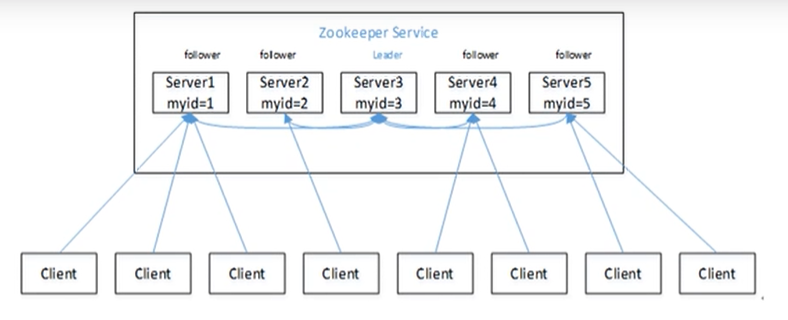
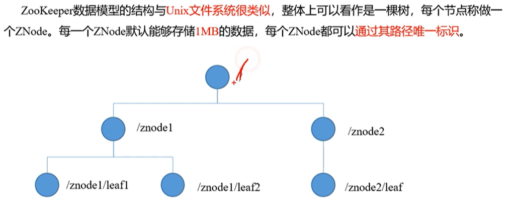
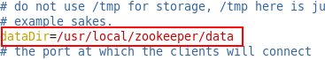
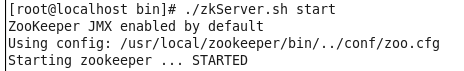
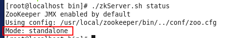

## Zookeeper

#### 简介

- 概述：zookeeper 是一个为分布式应用提供协调服务的框架。

- 作用： 存储注册，通知观察者，即起到协调作用。

#### 工作机制

- 负责储存和管理大家关心的数据，接收观察者的注册，一旦数据发生变化，zookeeper 将通知已经注册的观察者。

#### 特点

- 一个主服务，多个从服务组成的集群
- 集群中只要有半数以上的几点存活，zookeeper 就能正常服务
- 全局数据一致，每个Server都保存着一份相同的数据副本
- 更新请求顺序进行，按照发送顺序执行
- 数据更新原子性，一次更新请求，要么所有服务都成功，要么更新失败
- 实时性，在一定范围内，客户端能读到的最新的数据

#### 数据结构

**zookeeper 没有文件夹概念！**

#### zookeeper 单击安装步骤

前提: 已经配置好JDK环境变量

 

1.  上传zookeeper 安装包到linux中/usr/local/temp 中(目录随意,对安装无影响)

2.  解压zookeeper压缩包

\# tar zxvf /usr/local/temp/zookeeper-3.4.8.tar.gz

3.  复制zookeeper解压后的文件夹到/usr/local下并起名为zookpper(复制后名称任意,对安装无影响)

\# cp -r /usr/local/temp/zookeeper-3.4.8 /usr/local/zookeeper

4.  进入到zookeeper文件夹中

\# cd /usr/local/zookeeper

5. 在zookeeper中新建data文件夹,做为zookeeper数据存储文件夹

\# mkdir data

6. 进入到conf文件夹

\# cd conf

7. 复制zoo_sample.cfg,并给新起名的zoo.cfg

\#cp zoo_sample.cfg zoo.cfg

8. 修改zoo.cfg中dataDir属性值为新建data文件夹的路径

\# vim zoo.cfg

修改后的效果

9. 进入到zookeeper/bin文件夹,使用zkServer.sh启动zookeeper

\# cd ../bin

\# ./zkServer.sh start

启动成功效果图

10. 查看状态,其中Mode: standalone表示单机版

\# ./zkServer.sh status

 

 

11. 为了外部能访问,需要在防火墙中放行2181端口