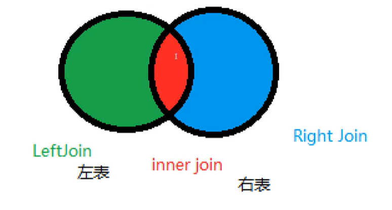

## 三人行-MySQL数据库复习-第一天


### 0. 今日目标


> **任务一：了解MySQL基本概念**

​	

- **官网介绍：**

  - **MySQL是一个数据库管理系统：** 数据库是数据的结构化集合。
  - **MySQL数据库是关系型的：**关系数据库将数据存储在单独的表中，而不是将所有数据放在一个大仓库中。数据库结构被组织成针对速度进行了优化的物理文件。具有对象（例如数据库，表，视图，行和列）的逻辑模型提供了灵活的编程环境。您可以设置规则来管理不同数据字段之间的关系
  - **MySQL软件是开源的**

  - **MySQL数据库服务器非常快速，可靠，可扩展且易于使用**


> **任务二：了解MySQL安装、卸载、配置基本步骤**


- **安装和卸载**

  安装和卸载的话，可以参考官方 提供的各种平台的[安装手册](https://dev.mysql.com/doc/refman/8.0/en/linux-installation.html)

  

- **配置**

[官方参考连接](https://dev.mysql.com/doc/refman/8.0/en/postinstallation.html)


> **任务三：MySQL 基本用法**


- **操作数据库**

  ```mysql
  -- 创建数据库, if not exists 用于判断是否已经存在
  create database [if not exists] basename
  
  -- 删除数据库
  drop database if exists basename
  
  -- 使用数据库
  use basename
  
  -- 查看所有数据库
  show databases
  ```

- **数据库的列类型**

  

  

> 数值类型


- tinyint	很小的数据类型	1个字节
- smalint 较小	2个字节
- mediumint	中等大小 3个字节
- int    标准的整数     4个字节
- bigint      较大的数据    8个字节
- float   单精度浮点数    4个字节
- double    双精度浮点数    8个字节
- decimal     字符串形式的浮点数    金融计算的时候


>  字符串

- char     固定大小的字符串	0~255
- varchar     可变长度字符串类型    0 ~ 65535
- tinytext     微型文本类型    2^8 - 1  
- text     文本串    2^16 - 1


> 时间日期


- date    YYYY-MM-DD   日期格式
- time   HH:mm:ss    时间格式
- datetime   YYYY-MM-DD  HH:mm:ss    最常用的时间格式
- timestamp   时间戳     毫秒数
- year   年份


> NULL


- 空值


- **数据库的字段属性**


> 无符号整数	Unsigned

- 无符号整数，即保存的字段不能为负数


> 0填充	zerofill

- 0填充，即不足的位数，会自动用 0 补齐


> 自增	auto_increment

- 即该列的值会自动设为上一列的值加一（默认）
- 通常用来设置主键


> 空、非空	null/ not null

- null:	即默认为空

- not null:  即不能存储空值


> **MYISAM 与 INNODB**

区别：


特点：

- MYISAM	节约空间， 速度快
- INNODB   安全性高， 支持事务处理，支持多表操作


重启数据库现象：

INNODB	自增列会从1开始 （存在内存中，断点 即失）

MYISAM	继续从上一次自增量开始（存在文件中，不会丢失）


- **表操作**

  ```mysql
  ## 显示数据库
  show databases;
  
  ## 创建数据库
  # utf-8
    CREATE DATABASE database_name DEFAULT CHARSET utf8 COLLATE utf8_general_ci;
   
    # gbk
    CREATE DATABASE database_name DEFAULT CHARACTER SET gbk COLLATE gbk_chinese_ci;
  
  
  ## 打开数据库
  use test;
  
  ## 用户管理
  	# 创建用户
      create user '用户名'@'IP地址' identified by '密码';
  	# 删除用户
      drop user '用户名'@'IP地址'; 
  	# 修改用户
      rename user '用户名'@'IP地址'; to '新用户名'@'IP地址';;
    # 修改密码
      set password for '用户名'@'IP地址' = Password('新密码')
    
  	# PS：用户权限相关数据保存在mysql数据库的user表中，所以也可以直接对其进行操作（不建议）
  
  
  show grants for '用户'@'IP地址'                  -- 查看权限
  grant  权限 on 数据库.表 to   '用户'@'IP地址'      -- 授权
  revoke 权限 on 数据库.表 from '用户'@'IP地址'      -- 取消权限
  
  
  ## 数据表的创建
  	# 显示数据表
  		show tables;
  	# 创建数据表
  		# 设置可以为空
  		# 设置默认值 not null
  		# 设置自增 auto_increment
  		# 设置主键 primary key
  		# 设置外键 constraint fk_cc foreign key (color_id) references color(nid)
  		# 设置注释 comment 'id'
  
  
  create table color (
  	nid int not null auto_increment primary key comment 'id',
  	username varchar(16) not null default '张三' comment '名称'
  ); 
  
  create table fruit (
  	fid int not null primary key,
  	smt char(32) null,
  	color_id int not null,
  	constraint fk_cc foreign key (color_id) references color(nid)
  );
  
  
  ## 删除表
  drop table fruit;
  
  ## 清空表
  delete from color;
  truncate table color;
  
  ## 修改表
   # 修改表名
   alter table color rename as color2
  
   # 添加列：
  		alter table color add create_time date;
  
   # 删除列：
  		alter table color drop column create_time;
  
   # 修改列：
      alter table color modify column username varchar(3);  -- modify 只能用来修改类型
      alter table color change username usernames varchar(6);  -- change 可以用来修改类型和字段名 
  
   # 添加主键：
      alter table color add primary key(nid);
  
   # 删除主键：
      alter table color drop primary key;
      alter table color  modify nid int, drop primary key;
  
   # 添加外键：
  		alter table fruit add constraint fk_cc_fr foreign key fruit(color_id) references color(nid);
   
   # 删除外键：
  		alter table color drop foreign key fk_cc_fr;
  
   # 修改默认值：
  		alter table color alter username set default '李四';
  
   # 删除默认值：
  		alter table color alter username drop default;
  
  ```

  


- **MySQL 数据管理**


> 外键


> DML语言

即数据库操作语言

 **数据库意义：** 数据存储、数据管理


- 新增、修改、删除

```mysql
# 新增
		insert into color(nid, username) values(default, '王五');
		insert into color(nid, username) values(default, '王五'),(default, '李四');
		insert into color(username) select username from color;

# 删除
		delete from color;
		delete from color where nid = 2;
		
# 清空表, truncate 会将自增列归 0， 不会影响事务
truncate color

# 修改
		update color set username = '小明' WHERE nid = 3;
```


> DQL 语言

**数据查询语言**


```mysql

	# 查询
		
		# 普通查询
			select * from color; -- 查询所有
			select * from color where nid > 3; -- 条件查询
			select nid, username as name from color where nid > 2; -- as 设置别名
			select concat('用户名：', username) from color -- 在结果前拼接字符串
			select distinct * from color -- 去重复

		# 排序查询
			# 根据 ‘nid’ 从大到小排列
			select * from color order by nid desc;
			# 根据 ‘nid’ 从小到大排列
			select * from color order by nid asc;
			# 先根据 ‘nid’ 排序， 如果相同， 再根据 ‘usernam’ 排序
			select * from color order by nid desc, username asc;

		# 模糊查询
			# ‘%’ 表示匹配多个字符
			select * from color where username like '王%';
			# '_' 表示匹配一个字符
			select * from color where username like '王_';
 
		# 分组查询
			select username from color group by username;
			select nid, username from color group by nid, username;
			select nid, username from color where nid > 2 group by username order by nid desc;
			select nid, username, count(*), sum(nid), max(nid) from color group by username;
			select nid, username from color group by username having max(nid) > 5;

		# 多表查询
			# 表连接
				# 无对应关系不显示
					select C.nid, C.username, F.smt from color C, fruit F where C.nid = F.color_id;
				# 无对应关系不显示
					select C.username, F.smt from color C inner join fruit F on C.nid = F.color_id; 
				# C表所有显示，如果F表中无对应关系， 则为null
					select C.username, F.smt from color C left join fruit F on C.nid = F.color_id;
				# F表所有显示，如果F表中无对应关系，则值为null
					select C.username, F.smt from color C right join fruit F on C.nid = F.color_id;
				
			# 组合
				# 组合，自动处理重合
					select username from color union select smt from fruit;

				# 组合，不处理重合
					select username from color union all select smt from fruit;
					
        # 常用函数
        	ABS(-8) -- 绝对值
        	CEILING(9,4) -- 向上取整
        	FLOOR(9,4) -- 向下取整
        	RAND() -- 返回0~1之间的随机数
        	
        	CHAR_LENGTH('奋斗奋斗') -- 字符串长度
        	CONCAT('l', 'ds') -- 字符串拼接
        	CURRENT_DATE() -- 获取当前日期
        	CURDATE() -- 获取当前日期
        	NOW() -- 获取当前时间
        
```


注意：




- 聚合函数


> **事务**

即 完成一组原子操作的 SQL

要么成功，要么失败


> 事物原则 ： ACID


- **原子性**
- **一致性**
- **隔离性**
- **持久性**


> 隔离所导致的一些问题

- 脏读（读未提交）

  指一个事物读取到另一个事物未提交的数据

- 不可重复读

  一个事物重复读取某一行数据，结果不相同（这不一定是错误，只是某些场景不允许）

- 幻读

  一个事物读取到了其他事务插入的数据


> **索引**
>
> MySQL 官方对索引的定义： 索引（index） 是帮助MySQL高效获取数据的数据结构。


**索引的分类**


- 主键索引： （PRIMARY  KEY）
  - 唯一标识、不可重复

- 唯一索引： （UNIQUE  KEY）
  - 避免重复的列出现

- 常规索引： （KEY、INDEX）
- 全文索引： （FullText）


> **规范数据库设计**


- 三大范式

  