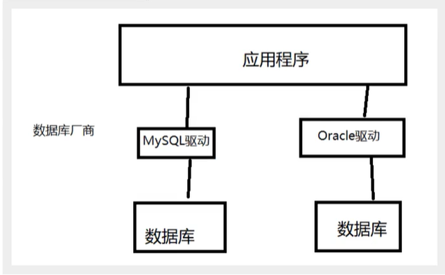
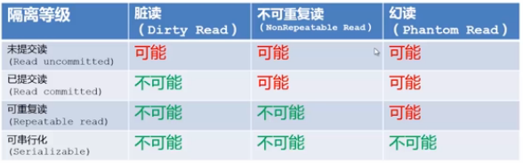
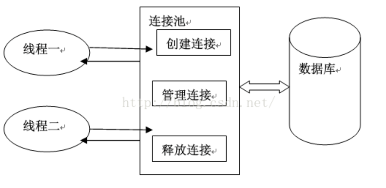

## 三人行-MySQL数据库复习-第二天


### 0. 今日目标


#### 数据库驱动：

​	


我们直接导入数据库驱动包就行！


#### JDBC


Java 对数据库的操作


> 第一个JDBC程序：

```java
public class FirstJDBCDemo {

    public static void main(String[] args) {
        // 定义变量
        Connection connection = null;
        Statement statement = null;
        ResultSet resultSet = null;
        try {
            // 加载驱动
            Class.forName("com.mysql.jdbc.Driver");
            // 定义用户信息和url
            String url = "jdbc:mysql://localhost:3306/test?useUnicode=true&characterEncoding=utf8&useSSL=true";
            String username = "root";
            String password = "121891";
            // 建立连接
            connection = DriverManager.getConnection(url, username, password);
            // 创建SQL的对象
            statement = connection.createStatement();
            // 定义SQL
            String sql = "select * from student";
            // 执行SQL
            resultSet = statement.executeQuery(sql);
            // 获取结果
            while (resultSet.next()) {
                System.out.println("id:" + resultSet.getObject("id"));
                System.out.println("name:" + resultSet.getObject("name"));
                System.out.println("pwd:" + resultSet.getObject("pwd"));
                System.out.println("sex:" + resultSet.getObject("sex"));
                System.out.println("birthday:" + resultSet.getObject("birthday"));
                System.out.println("address:" + resultSet.getObject("address"));
                System.out.println("email:" + resultSet.getObject("email"));
            }
        } catch (ClassNotFoundException | SQLException e) {
            e.printStackTrace();
        }
    }
}
```


#### 步骤总结

1. 加载驱动
2. 连接数据库 DriverManager
3. 获得执行SQL的对象 Statement
4. 获得返回的结果集
5. 释放连接


> DriverManager

```java
 // 等价 DriverManager.registerDriver(new Driver())
Class.forName("com.mysql.jdbc.Driver");

```


> URL 

```java
 // 定义用户信息和url
String url = "jdbc:mysql://localhost:3306/test?useUnicode=true&characterEncoding=utf8&useSSL=true";
// MySQL
String url = "jdbc:mysql://主机地址:端口号/数据库名?useUnicode=true&characterEncoding=utf8&useSSL=true";


// Oracle中
"jdbc:oracle:thin:@localhost:1521:sid"

```


> Connection

```java
// 建立连接
connection = DriverManager.getConnection(url, username, password);
 
// connection 代表数据库
// 数据库设置自动提交
connection.setAutoCommit(true);
// 事物提交
connection.commit();
// 事务回滚
connection.rollback();
```


> Statement 	/	PrepareStatement 执行SQL的对象

```java
// 执行查询SQL
statement.executeQuery();
// 执行任何SQL
statement.execute();
// 执行新增、修改。删除
statement.executeUpdate();
```


> ResultSet

```java
// 判断是否还有数据
resultSet.next()
// 获取值
resultSet.getObject("id")
```


> 释放资源

- 与对象的创建顺序相反


#### 封装工具类，并进行增删改测试


> db.propertis

```java
driver=com.mysql.jdbc.Driver
url=jdbc:mysql://localhost:3306/test?useUnicode=true&characterEncoding=utf8&useSSL=true
username=root
password=121891
```


> JDBCUtis.class

```java
public class JDBCUtis {

    private static String driver = null;
    private static String url = null;
    private static String username = null;
    private static String password = null;
    
    static {
        try {
            InputStream in = JDBCUtis.class.getClassLoader().getResourceAsStream("db.properties");
            Properties pro = new Properties();
            pro.load(in);
            driver = pro.getProperty("driver");
            url = pro.getProperty("url");
            username = pro.getProperty("username");
            password = pro.getProperty("password");

            // 驱动只需要加载一次，所以可以在这里加载
            Class.forName(driver);

        } catch (IOException | ClassNotFoundException e) {
            e.printStackTrace();
        }
    }

    // 获取连接
    public static Connection getConnection() throws SQLException {
        return DriverManager.getConnection(url, username, password);
    }

    // 释放资源
    public static void close(Connection cn, Statement st, ResultSet rs) {
        if (rs != null) {
            try {
                rs.close();
            } catch (SQLException e) {
                e.printStackTrace();
            }
        }

        if (st != null) {
            try {
                st.close();
            } catch (SQLException e) {
                e.printStackTrace();
            }
        }

        if (cn != null) {
            try {
                cn.close();
            } catch (SQLException e) {
                e.printStackTrace();
            }
        }
    }
}
```


> TestCRUD.class

```java
public class TestCRUD {
    public static void main(String[] args) {
        Connection conn = null;
        Statement stat = null;
        ResultSet re = null;

        try {
            // 获取连接
            conn = JDBCUtis.getConnection();
            // 获得执行SQL的对象
            stat = conn.createStatement();
            // 定义SQL
            // 新增
            String sql = "insert into student (name, pwd, sex, birthday, address, email) values ('小明', '123', '男', now(), '中国', '123@qq.com' )";
            // 删除
//            String sql = "delete from student where id = 3";
            // 修改
//            String sql = "update student set name = '小刚' where id = 2";
                // 查询
//            String sql = "select * from student where id = 2";
            // 执行SQL
            int index = stat.executeUpdate(sql);
            //            int index = stat.executeUpdate(sql);

            if (index > 0) {
                System.out.println("插入成功");
            }
            
//            while (resultSet.next()) {
//                System.out.println("id:" + resultSet.getObject("id"));
//                System.out.println("name:" + resultSet.getObject("name"));
//                System.out.println("pwd:" + resultSet.getObject("pwd"));
//                System.out.println("sex:" + resultSet.getObject("sex"));
//                System.out.println("birthday:" + resultSet.getObject("birthday"));
//                System.out.println("address:" + resultSet.getObject("address"));
//                System.out.println("email:" + resultSet.getObject("email"));
//            }
        } catch (SQLException e) {
            e.printStackTrace();
        } finally {
            JDBCUtis.close(conn, stat, re);
        }
    }
}

```


#### SQL注入问题


即 SQL存在漏洞，会被攻击导致数据泄露， `SQL会被恶意拼接关键字，盗取数据`


用 PrepareStatement 可以避免SQL注入问题


> PrepareStatement 

可以防止SQL注入，比Statement更安全

本质： 使用占位符，将传进来的变量当作字符串来处理，忽略其中的转义字符，这样就可以避免传入关键字，造成数据泄漏


```java
public class PrepareStatementDemo {

    public static void main(String[] args) {
        Connection conn = null;
        PreparedStatement prep = null;
        ResultSet rs = null;

        try {
            // 获取链接
            conn = JDBCUtis.getConnection();
            // 定义sql
            String sql = "insert into student (name, pwd, sex, birthday, address, email) values (?, ?, ?, ?, ?, ?)";
            // 先预编译
            prep = conn.prepareStatement(sql);
            // 手动给占位符赋值
            prep.setString(1, "小王");
            prep.setString(2, "123");
            prep.setString(3, "男");
            prep.setDate(4, new Date(System.currentTimeMillis()));
            prep.setString(5, "中国");
            prep.setString(6, "123@qq.com");

            // 执行
            int index = prep.executeUpdate();
            if (index > 0) {
                System.out.println("插入成功");
            }

        } catch (SQLException e) {
            e.printStackTrace();
        } finally {
            JDBCUtis.close(conn, prep, rs);
        }
    }
}
```


#### 事务

即 完成一组原子操作的 SQL

要么成功，要么失败


> 事务原则 ： ACID


- **原子性**
- **一致性**
- **隔离性**
- **持久性**


> 隔离所导致的一些问题

- 脏读（读未提交）

  指一个事物读取到另一个事物未提交的数据

- 不可重复读

  一个事物重复读取某一行数据，结果不相同（这不一定是错误，只是某些场景不允许）

- 幻读

  一个事物读取到了其他事务插入的数据





#### 数据库连接池


- **概念**： 数据库连接池负责分配、管理和释放数据库连接，它允许应用程序重复使用一个现有的数据库连接，而不是再重新建立一个；释放空闲时间超过最大空闲时间的数据库连接来避免因为没有释放数据库连接而引起的数据库连接遗漏。这项技术能明显提高对数据库操作的性能。


- 最小连接数
- 最大连接数
- 超时时间





