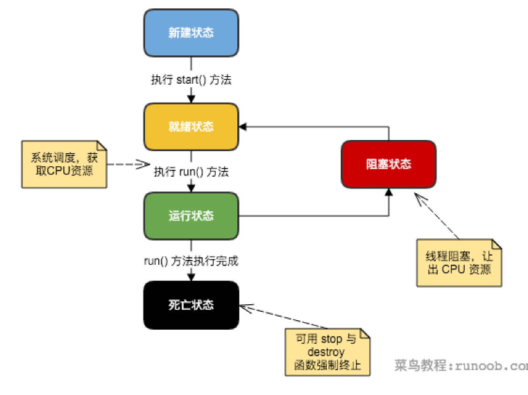
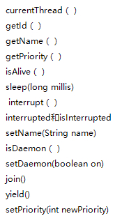

## 三人行-Java基础复习第七天


***<u>多线程和锁部分我一共分四天来复习，所以先完成今天的部分，其余的先不要看</u>***

**资料的话暂时没找到，自己百度一下**

### 0. 今日目标


> **了解线程基本概念**

- 主要区分进程和线程

  

进程：指在系统中正在运行的一个应用程序；程序一旦运行就是进程；进程——资源分配的最小单位。

线程：系统分配处理器时间资源的基本单元，或者说进程之内独立执行的一个单元执行流。线程——程序执行的最小单位。


一个进程包括由操作系统分配的内存空间，包含一个或多个线程。一个线程不能独立的存在，它必须是进程的一部分。一个进程一直运行，直到所有的非守护线程都结束运行后才能结束。


- 线程的生命周期

  


> **线程的分类**

- 普通线程
- 守护线程
  - 例如：GC


> **熟练多线程的创建**

- 实现Runnable接口

  ```java
  // 实现Runnable
  class MyRunnable implements Runnable {
  
      @Override
      public void run() {
          System.out.println("我是实现Runnable接口方式！");
      }
  }
  
  // 调用
   new Thread(new MyRunnable(), "Runnable").start();
  ```

- 继承Thread类

  ```java
  // 继承Thread
  class MyThread3 extends Thread {
  
      @Override
      public void run() {
          System.out.println("我是继承Thread方式！");
      }
  }
  
  // 调用
  MyThread3 thread3 = new MyThread3();
          thread3.setName("Thread");
          thread3.start();
  ```

  

- 实现Callable接口

  ```java
  // 实现Callable接口
  class MyCallable implements Callable<Integer> {
  
  
      @Override
      public Integer call() throws Exception {
          System.out.println("我是实现Callable接口方式！");
          return 100;
      }
  }
  
  // 调用
  // 第三种继承Callable接口
  // 由于Threa类不能直接传Callable实例，所以利用FutureTask作为中间类
  FutureTask<Integer> futureTask = new FutureTask<>(new MyCallable());
  Thread thread = new Thread(futureTask);
  thread.setName("Callable");
  thread.start();
  Integer index = null;
  try {
      index = futureTask.get();
  } catch (InterruptedException e) {
      e.printStackTrace();
  } catch (ExecutionException e) {
      e.printStackTrace();
  }
  System.out.println(index);
  ```

  - 匿名内部类

    ```java
     // 匿名内部类方式
    new Thread(new Runnable() {
        @Override
        public void run() {
            System.out.println("我是匿名内部类方式！");
        }
    }).start();
    ```

  - Lambda表达式方式

    ```java
    // lambda表达式方式
    new Thread(() -> {
        System.out.println("我是lambda方式1");
    }).start();
    ```

    


> **线程安全问题**

- 实例变量线程安全问题

  - 不共享数据的情况

    ```java
    public class MyThread extends Thread{
        private int count = 5;
    
    public MyThread(String name){
        super();
        this.setName(name);
    }
    
    @Override
        public void run(){
        super.run();
        while (count > 0)
        {
            count--;
            System.out.println("由 " + MyThread.currentThread().getName() + " 计算，count=" + count);
        }
    }
    
    public static void main(String[] args){
        MyThread a = new MyThread("A");
        MyThread b = new MyThread("B");
        MyThread c = new MyThread("C");
        a.start();
        b.start();
        c.start();
    }
    }
    
    ```

    

  - 共享数据的情况

    ```java
    public class SharedVariableThread extends Thread{
        private int count = 5;
    
    @Override
        public void run(){
        super.run();
        count--;
        System.out.println("由 " + SharedVariableThread.currentThread().getName() + " 计算，count=" + count);
    }
    
    public static void main(String[] args){
        SharedVariableThread mythread = new SharedVariableThread();
        // 下列线程都是通过mythread对象创建的
        Thread a = new Thread(mythread, "A");
        Thread b = new Thread(mythread, "B");
        Thread c = new Thread(mythread, "C");
        Thread d = new Thread(mythread, "D");
        Thread e = new Thread(mythread, "E");
        a.start();
        b.start();
        c.start();
        d.start();
        e.start();
    }
    }
    
    ```

    

- 集合线程安全问题

  

>  一些常用的方法




- Thread.currentThread()
  - 获取当前正在运行的线程
- thread.getId() 和 Thread.getName()
  - 分别是获取线程的ID和名称
- thread.getPriority()
  - 获取线程的优先级
- setPriority()
  - 设置线程优先级
- thread.isAlive()
  - 判断线程的否存活
- thread.sleep()
  - 使线程休眠，阻塞线程
- thread.interrupt()
  - 唤醒正在睡眠的程序
- interrupted()和isInterrupted()
  - interrupted()是静态方法：内部实现是调用的当前线程的isInterrupted()，并且会重置当前线程的中断状态
  - isInterrupted()是实例方法，是调用该方法的对象所表示的那个线程的isInterrupted()，不会重置当前线程的中断状态
- setName()
  - 设置线程名称
- isDaemon()
  - 是否是守护线程
- setDaemon()
  - 设置是否为守护线程
- join()
  - 让当前线程加入父线程，加入后父线程会一直wait，直到子线程执行完毕后父线程才能执行。
- yield()
  - 交出CPU的执行时间，不会释放锁，让线程进入就绪状态


> **方法的比较**

- ##### sleep() 与 interrupt()

  - 睡眠指定时间，即让程序暂停指定时间运行，时间到了会继续执行代码，如果时间未到就要醒需要使用interrupt()来随时唤醒
  -  唤醒正在睡眠的程序，调用interrupt()方法，会使得sleep()方法抛出InterruptedException异常，当sleep()方法抛出异常就中断了sleep的方法，从而让程序继续运行下去

- ##### wait() 与 notify()

  - wait(): 导致线程进入等待阻塞状态，会一直等待直到它被其他线程通过notify()或者notifyAll唤醒。该方法只能在同步方法中调用。如果当前线程不是锁的持有者，该方法抛出一个IllegalMonitorStateException异常。
  - notify(): 该方法只能在同步方法或同步块内部调用， 随机选择一个(注意：只会通知一个)在该对象上调用wait方法的线程，解除其阻塞状态
  - notifyAll(): 唤醒所有的wait对象

- ##### sleep() 与 wait()

  -  Thread.sleep(long millis): 睡眠时不会释放锁
  - wait(): 方法的作用是释放锁，加入到等待队列
  - sleep在Thread类中，wait在Object类中\
  - sleep使用interrupt()来唤醒，wait需要notify或者notifyAll来通知

- ##### wait() 与 interrupt()

  - wait(): 方法的作用是释放锁，加入到等待队列，当调用interrupt()方法后，线程必须先获取到锁后，然后才抛出异常InterruptedException 。注意： 在获取锁之前是不会抛出异常的，只有在获取锁之后才会抛异常

- **notify()和interrupt()**

  - notify/notifyAll是java.lang.Object类的方法，唤醒的是该实例的等待队列中的线程，而不能直接指定某个具体的线程。notify/notifyAll唤醒的线程会继续执行wait的下一条语句，另外执行notify/notifyAll时线程必须要获取实例的锁
  - interrupte方法是java.lang.Thread类的方法，可以直接指定线程并唤醒，当被interrupt的线程处于sleep或者wait中时会抛出InterruptedException异常。执行interrupt()并不需要获取取消线程的锁。
  - 总之notify/notifyAll和interrupt的区别在于是否能直接让某个指定的线程唤醒、执行唤醒是否需要锁、方法属于的类不同

- **interrupt()与interrupted()**

  - interrupt()：打断线程，将中断状态修改为true
  - interrupted(): 不打断线程，获取线程的中断状态，并将中断状态设置为false


> **对线程的相关操作**

- 如何停止一个线程

- 如何阻塞一个线程

- 如何恢复一个线程

- 如何实现同一线程中数据共享

  

> **线程的优先级**

