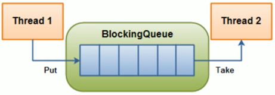
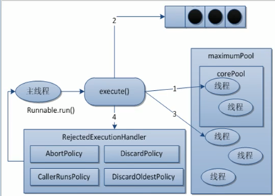
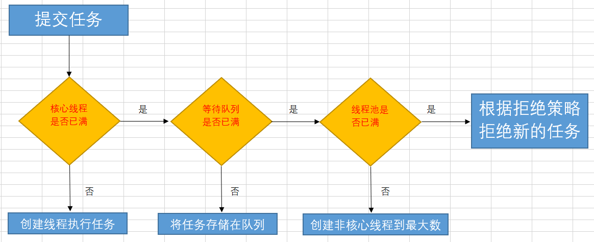

## 三人行-Java基础复习第十天


### 0. 今日目标


> **CountDownLatch/CyclicBarrier/Semaphore**

- CountDownLatch

  `CountDownLatch`内部维护了一个**计数器**，只有当**计数器==0**时，某些线程才会停止阻塞，开始执行。

  `CountDownLatch`主要有两个方法，`countDown()`来让计数器-1，`await()`来让线程阻塞。当`count==0`时，阻塞线程自动唤醒。

  **案例一班长关门**：main线程是班长，6个线程是学生。只有6个线程运行完毕，都离开教室后，main线程班长才会关教室门。

  **案例二秦灭六国**：只有6国都被灭亡后（执行完毕），main线程才会显示“秦国一统天下”。

  - 枚举类的使用

    枚举类就像一个**简化的数据库**，枚举类名就像数据库名，枚举的项目就像数据表，枚举的属性就像表的字段。

- CyclicBarrier

  ​	`CountDownLatch`是减，而`CyclicBarrier`是加，理解了`CountDownLatch`，`CyclicBarrier`就很容易。

- Semaphore

  `CountDownLatch`的问题是**不能复用**。比如`count=3`，那么加到3，就不能继续操作了。而`Semaphore`可以解决这个问题，比如6辆车3个停车位，对于`CountDownLatch`**只能停3辆车**，而`Semaphore`可以停6辆车，车位空出来后，其它车可以占有，这就涉及到了`Semaphore.accquire()`和`Semaphore.release()`方法。

  ```java
  Semaphore semaphore=new Semaphore(3);
  for (int i = 1; i <=6 ; i++) {
      new Thread(()->{
          try {
              //占有资源
              semaphore.acquire();
              System.out.println(Thread.currentThread().getName()+"\t抢到车位");
              try{ TimeUnit.SECONDS.sleep(3);} catch (Exception e){e.printStackTrace(); }
  	    System.out.println(Thread.currentThread().getName()+"\t停车3秒后离开车位");
  	    } 
  	    catch (InterruptedException e) {e.printStackTrace();} 
  	    //释放资源
  	    finally {semaphore.release();}
      },String.valueOf(i)).start();
  }
  ```


> **并发编程中的一些常见问题**


- 多线程一定快吗？

  CPU通过给每个线程分配时间片来实现伪同步运行，并发编程不一定快,因为线程有创建和上下文切换的开销

- 上下文切换是什么？

  当前任务在执行完 CPU 时间片切换到另一个任务之前会先保存自己的状态，以便下次再切换回这个任务时，可以再加载这个任务的状态。**任务从保存到再加载的过程就是一次上下文切换**。

  

- 如何减少上下文切换？

  上下文切换又分为2种：让步式上下文切换和抢占式上下文切换。前者是指执行线程主动释放CPU，与锁竞争严重程度成正比，可通过**减少锁竞争来避免**；后者是指线程因分配的时间片用尽而被迫放弃CPU或者被其他优先级更高的线程所抢占，一般由于线程数大于CPU可用核心数引起，**可通过调整线程数，适当减少线程数来避免**。


- 什么是死锁？

  ​	是指多个进程在运行过程中因争夺资源而造成的一种僵局，当进程处于这种僵持状态时，若无外力作用，它们都将无法再向前推进。 因此我们举个例子来描述，如果        此时有一个线程A，按照先锁a再获得锁b的的顺序获得锁，而在此同时又有另外一个线程B，按照先锁b再锁a的顺序获得锁。


- 死锁产生的必要条件
  - 互斥条件：进程要求对所分配的资源进行排它性控制，即在一段时间内某资源仅为一进程所占用。
  - 请求和保持条件：当进程因请求资源而阻塞时，对已获得的资源保持不放。
  - 不剥夺条件：进程已获得的资源在未使用完之前，不能剥夺，只能在使用完时由自己释放。
  - 环路等待条件：在发生死锁时，必然存在一个进程--资源的环形链。
    


- 如何避免死锁？

  - 资源一次性分配：一次性分配所有资源，这样就不会再有请求了：（破坏请求条件）
  - 只要有一个资源得不到分配，也不给这个进程分配其他的资源：（破坏请保持条件）
  - 可剥夺资源：即当某进程获得了部分资源，但得不到其它资源，则释放已占有的资源（破坏不可剥夺条件）
  - 资源有序分配法：系统给每类资源赋予一个编号，每一个进程按编号递增的顺序请求资源，释放则相反（破坏环路等待条件）
    

  1、以确定的顺序获得锁

  如果必须获取多个锁，那么在设计的时候需要充分考虑不同线程之前获得锁的顺序。按照上面的例子，两个线程获得锁的时序图如下：

  

   如果此时把获得锁的时序改成：

  

   那么死锁就永远不会发生。 针对两个特定的锁，开发者可以尝试按照锁对象的hashCode值大小的顺序，分别获得两个锁，这样锁总是会以特定的顺序获得锁，那么死锁也不会发生。问题变得更加复杂一些，如果此时有多个线程，都在竞争不同的锁，简单按照锁对象的hashCode进行排序（单纯按照hashCode顺序排序会出现“环路等待”），可能就无法满足要求了，这个时候开发者可以使用银行家算法，所有的锁都按照特定的顺序获取，同样可以防止死锁的发生，该算法在这里就不再赘述了，有兴趣的可以自行了解一下。

  2、超时放弃

  当使用synchronized关键词提供的内置锁时，只要线程没有获得锁，那么就会永远等待下去，然而Lock接口提供了boolean tryLock(long time, TimeUnit unit) throws InterruptedException方法，该方法可以按照固定时长等待锁，因此线程可以在获取锁超时以后，主动释放之前已经获得的所有的锁。通过这种方式，也可以很有效地避免死锁。 还是按照之前的例子，时序图如下：

  

  

  - 避免死锁:
    - 预防死锁的几种策略，会严重地损害系统性能。因此在避免死锁时，要施加较弱的限制，从而获得 较满意的系统性能。由于在避免死锁的策略中，允许进程动态地申请资源。因而，系统在进行资源分配之前预先计算资源分配的安全性。若此次分配不会导致系统进入不安全的状态，则将资源分配给进程；否则，进程等待。其中最具有代表性的避免死锁算法是银行家算法。
      - 银行家算法：首先需要定义状态和安全状态的概念。系统的状态是当前给进程分配的资源情况。因此，状态包含两个向量Resource（系统中每种资源的总量）和Available（未分配给进程的每种资源的总量）及两个矩阵Claim（表示进程对资源的需求）和Allocation（表示当前分配给进程的资源）。安全状态是指至少有一个资源分配序列不会导致死锁。当进程请求一组资源时，假设同意该请求，从而改变了系统的状态，然后确定其结果是否还处于安全状态。如果是，同意这个请求；如果不是，阻塞该进程知道同意该请求后系统状态仍然是安全的。
        


> **阻塞队列**

**概念**：当阻塞队列为空时，获取（take）操作是阻塞的；当阻塞队列为满时，添加（put）操作是阻塞的。



**好处**：阻塞队列不用手动控制什么时候该被阻塞，什么时候该被唤醒，简化了操作。

**体系**：`Collection`→`Queue`→`BlockingQueue`→七个阻塞队列实现类。

| 类名                    | 作用                             |
| ----------------------- | -------------------------------- |
| **ArrayBlockingQueue**  | 由**数组**构成的**有界**阻塞队列 |
| **LinkedBlockingQueue** | 由**链表**构成的**有界**阻塞队列 |
| PriorityBlockingQueue   | 支持优先级排序的无界阻塞队列     |
| DelayQueue              | 支持优先级的延迟无界阻塞队列     |
| **SynchronousQueue**    | 单个元素的阻塞队列               |
| LinkedTransferQueue     | 由链表构成的无界阻塞队列         |
| LinkedBlockingDeque     | 由链表构成的双向阻塞队列         |

粗体标记的三个用得比较多，许多消息中间件底层就是用它们实现的。

需要注意的是`LinkedBlockingQueue`虽然是有界的，但有个巨坑，其默认大小是`Integer.MAX_VALUE`，高达21亿，一般情况下内存早爆了（在线程池的`ThreadPoolExecutor`有体现）。

**API**：抛出异常是指当队列满时，再次插入会抛出异常；返回布尔是指当队列满时，再次插入会返回false；阻塞是指当队列满时，再次插入会被阻塞，直到队列取出一个元素，才能插入。超时是指当一个时限过后，才会插入或者取出。

| 方法类型 | 抛出异常  | 返回布尔   | 阻塞     | 超时                     |
| -------- | --------- | ---------- | -------- | ------------------------ |
| 插入     | add(E e)  | offer(E e) | put(E e) | offer(E e,Time,TimeUnit) |
| 取出     | remove()  | poll()     | take()   | poll(Time,TimeUnit)      |
| 队首     | element() | peek()     | 无       | 无                       |


- ArrayBlockingQueue

  ```java
  public class BlockingQueueDemo {
      public static void main(String[] args) throws InterruptedException {
          BlockingQueue<String> blockingQueue = new ArrayBlockingQueue<String>(3);
          addAndRemove(blockingQueue);
          offerAndPoll(blockingQueue);
          putAndTake(blockingQueue);
          outOfTime(blockingQueue);
      }
  
      private static void outOfTime(BlockingQueue<String> blockingQueue) throws InterruptedException {
          System.out.println(blockingQueue.offer("a",2L, TimeUnit.SECONDS));
          System.out.println(blockingQueue.offer("a",2L, TimeUnit.SECONDS));
          System.out.println(blockingQueue.offer("a",2L, TimeUnit.SECONDS));
          System.out.println(blockingQueue.offer("a",2L, TimeUnit.SECONDS));
      }
  
      private static void putAndTake(BlockingQueue<String> blockingQueue) throws InterruptedException {
          blockingQueue.put("a");
          blockingQueue.put("b");
          blockingQueue.put("c");
          blockingQueue.put("d");
          System.out.println(blockingQueue.take());
          System.out.println(blockingQueue.take());
          System.out.println(blockingQueue.take());
          System.out.println(blockingQueue.take());
      }
  
      private static void offerAndPoll(BlockingQueue<String> blockingQueue) {
          System.out.println(blockingQueue.offer("a"));
          System.out.println(blockingQueue.offer("b"));
          System.out.println(blockingQueue.offer("c"));
          System.out.println(blockingQueue.offer("e"));
          System.out.println(blockingQueue.peek());
          System.out.println(blockingQueue.poll());
          System.out.println(blockingQueue.poll());
          System.out.println(blockingQueue.poll());
          System.out.println(blockingQueue.poll());
      }
  
      private static void addAndRemove(BlockingQueue<String> blockingQueue) {
          System.out.println(blockingQueue.add("a"));
          System.out.println(blockingQueue.add("b"));
          System.out.println(blockingQueue.add("c"));
          System.out.println(blockingQueue.add("e"));
          System.out.println(blockingQueue.element());
          System.out.println(blockingQueue.remove());
          System.out.println(blockingQueue.remove());
          System.out.println(blockingQueue.remove());
          System.out.println(blockingQueue.remove());
      }
  }
  
  ```

  


- SynchronousQueue

队列只有一个元素，如果想插入多个，必须等队列元素取出后，才能插入，只能有一个“坑位”，用一个插一个

```java
public class SynchronousQueueDemo {
    public static void main(String[] args) {
        BlockingQueue<String> blockingQueue=new SynchronousQueue<String>();
        new Thread(()->{
            try {
                System.out.println(Thread.currentThread().getName()+"\t put 1");
                blockingQueue.put("1");
                System.out.println(Thread.currentThread().getName()+"\t put 2");
                blockingQueue.put("2");
                System.out.println(Thread.currentThread().getName()+"\t put 3");
                blockingQueue.put("3");
            } catch (InterruptedException e) {
                e.printStackTrace();
            }
        },"AAA").start();

        new Thread(()->{
            try {
                try{ TimeUnit.SECONDS.sleep(5); }catch (InterruptedException e){ e.printStackTrace(); }
                System.out.println(Thread.currentThread().getName()+"\t take "+blockingQueue.take());
                try{ TimeUnit.SECONDS.sleep(5); }catch (InterruptedException e){ e.printStackTrace(); }
                System.out.println(Thread.currentThread().getName()+"\t take "+blockingQueue.take());
                try{ TimeUnit.SECONDS.sleep(5); }catch (InterruptedException e){ e.printStackTrace(); }
                System.out.println(Thread.currentThread().getName()+"\t take"+blockingQueue.take());
            } catch (Exception e) {
                e.printStackTrace();
            }
        },"BBB").start();
    }
}

```


- 手写生产者和消费者模式

  ```java
  public class ProdConsBlockQueueDemo {
      public static void main(String[] args) {
          MyResource myResource = new MyResource(new ArrayBlockingQueue<>(10));
          new Thread(() -> {
              System.out.println(Thread.currentThread().getName() + "\t生产线程启动");
              try {
                  myResource.myProd();
              } catch (Exception e) {
                  e.printStackTrace();
              }
          }, "prod").start();
  
          new Thread(() -> {
              System.out.println(Thread.currentThread().getName() + "\t消费线程启动");
              try {
                  myResource.myCons();
              } catch (Exception e) {
                  e.printStackTrace();
              }
          }, "cons").start();
  
          try {
              TimeUnit.SECONDS.sleep(5);
          } catch (Exception e) {
              e.printStackTrace();
          }
  
          System.out.println("5秒钟后，叫停");
          myResource.stop();
      }
  }
  
  class MyResource {
      private volatile boolean FLAG = true; //默认开启，进行生产+消费
      private AtomicInteger atomicInteger = new AtomicInteger();
  
      private BlockingQueue<String> blockingQueue;
  
      public MyResource(BlockingQueue<String> blockingQueue) {
          this.blockingQueue = blockingQueue;
      }
  
      public void myProd() throws Exception {
          String data = null;
          boolean retValue;
          while (FLAG) {
              data = atomicInteger.incrementAndGet() + "";//++i
              retValue = blockingQueue.offer(data, 2L, TimeUnit.SECONDS);
              if (retValue) {
                  System.out.println(Thread.currentThread().getName() + "\t" + "插入队列" + data + "成功");
              } else {
                  System.out.println(Thread.currentThread().getName() + "\t" + "插入队列" + data + "失败");
              }
              TimeUnit.SECONDS.sleep(1);
          }
          System.out.println(Thread.currentThread().getName() + "\tFLAG==false，停止生产");
      }
  
      public void myCons() throws Exception {
          String res;
          while (FLAG) {
              res = blockingQueue.poll(2L, TimeUnit.SECONDS);
              if (null == res || res.equalsIgnoreCase("")) {
                  FLAG = false;
                  System.out.println(Thread.currentThread().getName() + "\t超过2秒钟没有消费，退出消费");
                  return;
              }
              System.out.println(Thread.currentThread().getName() + "\t消费队列" + res + "成功");
          }
      }
  
      public void stop() {
          this.FLAG = false;
      }
  }
  ```

  


> **阻塞队列的应用——线程池**


- 线程池基本概念

  **概念**：线程池主要是控制运行线程的数量，将待处理任务放到等待队列，然后创建线程执行这些任务。如果超过了最大线程数，则等待。

  **优点**：

  1. 线程复用：不用一直new新线程，重复利用已经创建的线程来降低线程的创建和销毁开销，节省系统资源。
  2. 提高响应速度：当任务达到时，不用创建新的线程，直接利用线程池的线程。
  3. 管理线程：可以控制最大并发数，控制线程的创建等。

  **体系**：`Executor`→`ExecutorService`→`AbstractExecutorService`→`ThreadPoolExecutor`。`ThreadPoolExecutor`是线程池创建的核心类。类似`Arrays`、`Collections`工具类，`Executor`也有自己的工具类`Executors`。 


- 线程池三种常用创建方式


​	**newFixedThreadPool**：使用`LinkedBlockingQueue`实现，定长线程池。

```java
public static ExecutorService newFixedThreadPool(int nThreads) {
    return new ThreadPoolExecutor(nThreads, nThreads,
                                  0L, TimeUnit.MILLISECONDS,
                                  new LinkedBlockingQueue<Runnable>());
}
```

**newSingleThreadExecutor**：使用`LinkedBlockingQueue`实现，一池只有一个线程。

```java
public static ExecutorService newSingleThreadExecutor() {
    return new FinalizableDelegatedExecutorService(new ThreadPoolExecutor(1, 1,
                                    0L, TimeUnit.MILLISECONDS,
                                    new LinkedBlockingQueue<Runnable>()));
}
```

**newCachedThreadPool**：使用`SynchronousQueue`实现，变长线程池。

```java
public static ExecutorService newCachedThreadPool() {
    return new ThreadPoolExecutor(0, Integer.MAX_VALUE,
                                 60L, TimeUnit.SECONDS,
                                 new SynchronousQueue<Runnable>());
}
```


- 测试

```java

public class ThreadPoolTest {

    public static void main(String[] args) {
//        defaultThreadPoolCreate();
        // 手动创建线程池
        ExecutorService executor = new ThreadPoolExecutor(
                2,
                5,
                1,
                TimeUnit.SECONDS,
                new LinkedBlockingQueue<>(3),
                Executors.defaultThreadFactory(),
//                new ThreadPoolExecutor.AbortPolicy()
//                new ThreadPoolExecutor.CallerRunsPolicy()
                new ThreadPoolExecutor.DiscardPolicy()
                );

        try {
            for (int i = 0; i <= 9; i++) {
                executor.execute(() -> System.out.println(Thread.currentThread().getName() + "\t 办理业务") );
            }
        } catch (Exception e) {
            e.printStackTrace();
        } finally {
            executor.shutdown();
        }
    }


    // JDK提供的创建线程池的方法
    private static void defaultThreadPoolCreate() {
        // 一池固定多个线程
        ExecutorService executor = Executors.newFixedThreadPool(5);
        // 一池一个线程
        ExecutorService executor1 = Executors.newSingleThreadExecutor();
        // 一池多个线程
        ExecutorService executor2 = Executors.newCachedThreadPool();

        try {
            for (int i = 0; i <= 10; i++) {
                executor2.execute(() -> System.out.println(Thread.currentThread().getName() + "\t 办理业务") );
            }
        } catch (Exception e) {
            e.printStackTrace();
        } finally {
            executor.shutdown();
        }
    }

}
```


- 线程池创建的七个参数

| 参数            | 意义                       |
| --------------- | -------------------------- |
| corePoolSize    | 线程池常驻核心线程数       |
| maximumPoolSize | 能够容纳的最大线程数       |
| keepAliveTime   | 空闲线程存活时间           |
| unit            | 存活时间单位               |
| workQueue       | 存放提交但未执行任务的队列 |
| threadFactory   | 创建线程的工厂类           |
| handler         | 等待队列满后的拒绝策略     |

**理解**：线程池的创建参数，就像一个**银行**。

`corePoolSize`就像银行的“**当值窗口**“，比如今天有**2位柜员**在受理**客户请求**（任务）。如果超过2个客户，那么新的客户就会在**等候区**（等待队列`workQueue`）等待。当**等候区**也满了，这个时候就要开启“**加班窗口**”，让其它3位柜员来加班，此时达到**最大窗口**`maximumPoolSize`，为5个。如果开启了所有窗口，等候区依然满员，此时就应该启动”**拒绝策略**“`handler`，告诉不断涌入的客户，叫他们不要进入，已经爆满了。由于不再涌入新客户，办完事的客户增多，窗口开始空闲，这个时候就通过`keepAlivetTime`将多余的3个”加班窗口“取消，恢复到2个”当值窗口“。


- 线程池底层原理

**原理图**：上面银行的例子，实际上就是线程池的工作原理。



**流程图**：



新任务到达→

如果正在运行的线程数小于`corePoolSize`，创建核心线程；大于等于`corePoolSize`，放入等待队列。

如果等待队列已满，但正在运行的线程数小于`maximumPoolSize`，创建非核心线程；大于等于`maximumPoolSize`，启动拒绝策略。

当一个线程无事可做一段时间`keepAliveTime`后，如果正在运行的线程数大于`corePoolSize`，则关闭非核心线程。


- 线程池的拒绝策略

当等待队列满时，且达到最大线程数，再有新任务到来，就需要启动拒绝策略。JDK提供了四种拒绝策略，分别是。

1. **AbortPolicy**：默认的策略，直接抛出`RejectedExecutionException`异常，阻止系统正常运行。
2. **CallerRunsPolicy**：既不会抛出异常，也不会终止任务，而是将任务返回给调用者。
3. **DiscardOldestPolicy**：抛弃队列中等待最久的任务，然后把当前任务加入队列中尝试再次提交任务。
4. **DiscardPolicy**：直接丢弃任务，不做任何处理。


- 实际生产使用哪一个线程池？

**单一、可变、定长都不用**！原因就是`FixedThreadPool`和`SingleThreadExecutor`底层都是用`LinkedBlockingQueue`实现的，这个队列最大长度为`Integer.MAX_VALUE`，显然会导致OOM。所以实际生产一般自己通过`ThreadPoolExecutor`的7个参数，自定义线程池。

```java
ExecutorService threadPool=new ThreadPoolExecutor(2,5,
                        1L,TimeUnit.SECONDS,
                        new LinkedBlockingQueue<>(3),
                        Executors.defaultThreadFactory(),
                        new ThreadPoolExecutor.AbortPolicy());
```

### 自定义线程池参数选择

对于CPU密集型任务，最大线程数是CPU线程数+1。对于IO密集型任务，尽量多配点，可以是CPU线程数*2，或者CPU线程数/(1-阻塞系数)。


- 死锁编码和定位

主要是两个命令配合起来使用，定位死锁。

**jps**指令：`jps -l`可以查看运行的Java进程。

```java
9688 thread.DeadLockDemo
12177 sun.tools.jps.Jps
```

**jstack**指令：`jstack pid`可以查看某个Java进程的堆栈信息，同时分析出死锁。

```java
=====================
"Thread AAA":
	at xxxxx
	- waiting to lock <0x000111>
	- locked <0x000222>
	at java.lang.Thread.run
"Thread BBB":
	at xxxxx
	- waiting to lock <0x000222>
	- locked <0x000111>
	at java.lang.Thread.run
Found 1 deadlock.
```


