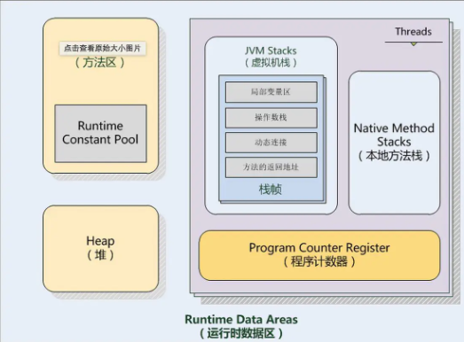
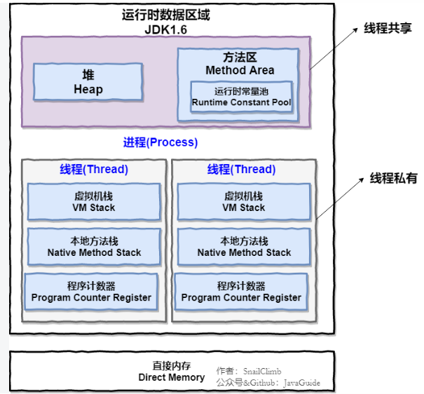
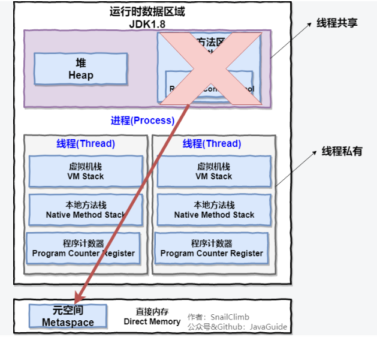

## 三人行-Java基础复习第十一天

### 0. 今日目标

> **Java 内存结构**

- Java 8 之前

  

- Java 8 

  

**线程私有的：**

- 程序计数器
- 虚拟机栈
- 本地方法栈

**线程共享的：**

- 堆
- 方法区
- 直接内存 (非运行时数据区的一部分)

> **程序计数器**

1. 字节码解释器通过改变程序计数器来依次读取指令，从而实现代码的流程控制，如：顺序执行、选择、循环、异常处理。
2. 在多线程的情况下，程序计数器用于记录当前线程执行的位置，从而当线程被切换回来的时候能够知道该线程上次运行到哪儿了。

**注意：程序计数器是唯一一个不会出现 OutOfMemoryError 的内存区域，它的生命周期随着线程的创建而创建，随着线程的结束而死亡。**

> **Java 虚拟机栈**

- **生命周期和线程相同，描述的是 Java 方法执行的内存模型，每次方法调用的数据都是通过栈传递的。**
- **Java 内存可以粗糙的区分为堆内存（Heap）和栈内存 (Stack),其中栈就是现在说的虚拟机栈，或者说是虚拟机栈中局部变量表部分。**
- **局部变量表主要存放了编译期可知的各种数据类型**（boolean、byte、char、short、int、float、long、double）、**对象引用**
- **Java 虚拟机栈会出现两种错误：StackOverFlowError 和 OutOfMemoryError。**

> **本地方法栈**

- **虚拟机栈为虚拟机执行 Java 方法 （也就是字节码）服务，而本地方法栈则为虚拟机使用到的 Native 方法服务。**

> **堆**

- **此内存区域的唯一目的就是存放对象实例，几乎所有的对象实例以及数组都在这里分配内存。**

- **Java世界中“几乎”所有的对象都在堆中分配，从jdk 1.7开始已经默认开启逃逸分析，如果某些方法中的对象引用没有被返回或者未被外面使用（也就是未逃逸出去），那么对象可以直接在栈上分配内存。**

> **在 JDK 7 版本及JDK 7 版本之前，堆内存被通常被分为下面三部分：**

1. 新生代内存(Young Generation)
2. 老生代(Old Generation)
3. 永生代(Permanent Generation)

> **JDK 8 版本之后方法区（HotSpot 的永久代）被彻底移除了（JDK1.7 就已经开始了），取而代之是元空间，元空间使用的是直接内存。**

**上图所示的 Eden 区、两个 Survivor 区都属于新生代（为了区分，这两个 Survivor 区域按照顺序被命名为 from 和 to），中间一层属于老年代。**

- 大部分情况，对象都会首先在 Eden 区域分配，在一次新生代垃圾回收后，如果对象还存活，则会进入 s0 或者 s1，并且对象的年龄还会加  1(Eden 区->Survivor 区后对象的初始年龄变为 1)，当它的年龄增加到一定程度（默认为 15 岁），就会被晋升到老年代中。对象晋升到老年代的年龄阈值，可以通过参数 `-XX:MaxTenuringThreshold` 来设置。

> **方法区**

方法区与 Java 堆一样，是各个线程共享的内存区域，它用于存储已被虚拟机加载的类信息、常量、静态变量、即时编译器编译后的代码等数据。虽然 **Java 虚拟机规范把方法区描述为堆的一个逻辑部分**，但是它却有一个别名叫做 **Non-Heap（非堆）**，目的应该是与 Java 堆区分开来。

- **方法区和永久代的关系**

  **方法区和永久代的关系很像 Java 中接口和类的关系，类实现了接口，而永久代就是 HotSpot 虚拟机对虚拟机规范中方法区的一种实现方式。** 也就是说，永久代是 HotSpot 的概念，方法区是 Java 虚拟机规范中的定义，是一种规范，而永久代是一种实现，一个是标准一个是实现，其他的虚拟机实现并没有永久代这一说法。

- **为什么要将永久代 (PermGen) 替换为元空间 (MetaSpace) 呢?**

  1. 整个永久代有一个 JVM 本身设置固定大小上限，无法进行调整，而元空间使用的是直接内存，受本机可用内存的限制，虽然元空间仍旧可能溢出，但是比原来出现的几率会更小。

  2. 元空间里面存放的是类的元数据，这样加载多少类的元数据就不由 `MaxPermSize` 控制了, 而由系统的实际可用空间来控制，这样能加载的类就更多了。  

  3. 在 JDK8，合并 HotSpot 和 JRockit 的代码时, JRockit 从来没有一个叫永久代的东西, 合并之后就没有必要额外的设置这么一个永久代的地方了。

> **运行时常量池**

1. **JDK1.7之前运行时常量池逻辑包含字符串常量池存放在方法区, 此时hotspot虚拟机对方法区的实现为永久代**
2. **JDK1.7 字符串常量池被从方法区拿到了堆中, 这里没有提到运行时常量池,也就是说字符串常量池被单独拿到堆,运行时常量池剩下的东西还在方法区, 也就是hotspot中的永久代** 。
3. **JDK1.8 hotspot移除了永久代用元空间(Metaspace)取而代之, 这时候字符串常量池还在堆, 运行时常量池还在方法区, 只不过方法区的实现从永久代变成了元空间(Metaspace)**

> **直接内存**

**直接内存并不是虚拟机运行时数据区的一部分，也不是虚拟机规范中定义的内存区域，但是这部分内存也被频繁地使用。而且也可能导致 OutOfMemoryError 错误出现。**

JDK1.4 中新加入的 **NIO(New Input/Output) 类**，引入了一种基于**通道（Channel）** 与**缓存区（Buffer）** 的 I/O 方式，它可以直接使用 Native 函数库直接分配堆外内存，然后通过一个存储在 Java 堆中的 DirectByteBuffer 对象作为这块内存的引用进行操作。这样就能在一些场景中显著提高性能，因为**避免了在 Java 堆和 Native 堆之间来回复制数据**。

