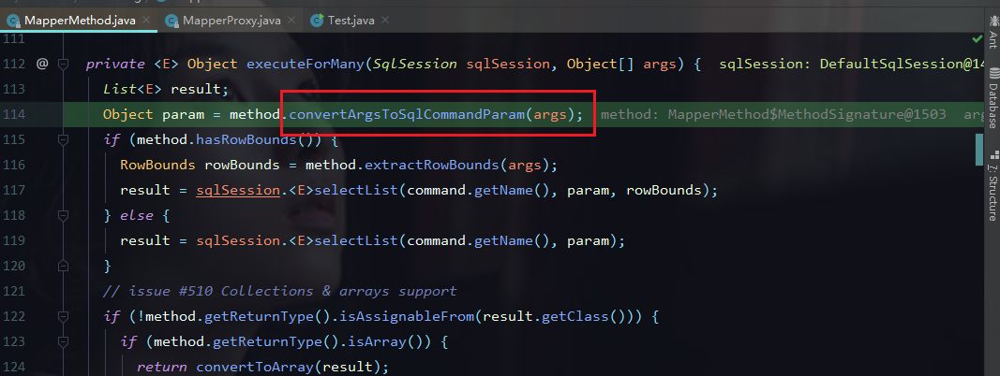
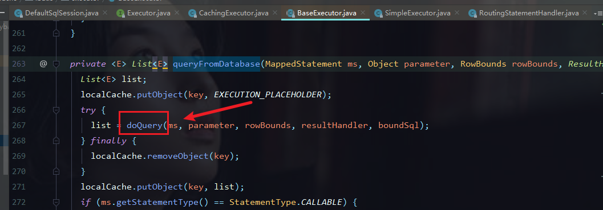

## Mybatis 源码


### JDBC


#### 示例：

```java
	public class JDBCTest {
 12     
 13     public static void jdbcDemoSelect(String driver,String url,String user,String password) throws Exception {
 14         
 15         //1.加载类驱动
 16         Class.forName(driver);
 17         Connection con = DriverManager.getConnection(url,user,password);
 18     
 19 //        if(!con.isClosed())
 20 //            System.out.println("succeeded connection to the database");
 21         
 22         //2.创建statement类对象，用来执行SQL语句
 23         Statement statement = con.createStatement();
 24         
 25         //SQL语句
 26         String sql = "select * from emp";    
 27         
 28         //3.ResultSet类，用来存放获取的结果集
 29         ResultSet set = statement.executeQuery(sql);
 30         
 31         String eid=null,ename=null,price=null;
 32         
 33         while(set.next()) {
 34             eid = set.getString("eid");
 35             ename = set.getString("ename");
 36             price = set.getString("price");
 37             
 38             System.out.println(eid+"\t"+ename+"\t"+price);
 39         }
 40         
 41     }
```


在这里获取driver


### Mybatis 源码跟进


以build方法为入口


进入parse方法


进入parseConfiguration方法


对应的mybatis.xml

```xml
<?xml version="1.0" encoding="UTF-8"?>
<!DOCTYPE configuration
        PUBLIC "-//mybatis.org//DTD Config 3.0//EN"
        "http://mybatis.org/dtd/mybatis-3-config.dtd">
<configuration>
    <settings>
        <setting name="logImpl" value="LOG4J"/>
    </settings>
    <!-- 别名 -->
    <typeAliases>
        <!-- <typeAlias type="com.test.pojo.People" alias="po" /> -->
        <package name="com.lmy.pojo" />
    </typeAliases>

    <environments default="default">
        <environment id="default">
            <transactionManager type="JDBC"></transactionManager>
            <dataSource type="POOLED">
                <property name="driver" value="com.mysql.jdbc.Driver"/>
                <property name="url" value="jdbc:mysql://localhost:3306/usermanager?autoReconnect=true&amp;useSSL=false"/>
                <property name="username" value="root"/>
                <property name="password" value="121891"/>
            </dataSource>
        </environment>
    </environments>
    <mappers>
        <!-- <mapper resource="com/test/mapper/StudentMapper.xml" />
        <mapper resource="com/test/mapper/TeacherMapper.xml" /> -->
        <!--<mapper class="com.test.mapper.TeacherMapper" />-->
        <package name="com.lmy.mapper"/>
    </mappers>

</configuration>


```


进入mapperElement方法


假设我们xml中配置的事pachage


假设我们xml中配置的事mapper 的resource


进入configurationElement方法


进入parseStatementNode方法，在这里获取节点的一些信息，包括一些属性

```java
public void parseStatementNode() {
    String id = context.getStringAttribute("id");
    String databaseId = context.getStringAttribute("databaseId");

    if (!databaseIdMatchesCurrent(id, databaseId, this.requiredDatabaseId)) return;

    Integer fetchSize = context.getIntAttribute("fetchSize");
    Integer timeout = context.getIntAttribute("timeout");
    String parameterMap = context.getStringAttribute("parameterMap");
    String parameterType = context.getStringAttribute("parameterType");
    Class<?> parameterTypeClass = resolveClass(parameterType);
    String resultMap = context.getStringAttribute("resultMap");
    String resultType = context.getStringAttribute("resultType");
    String lang = context.getStringAttribute("lang");
    LanguageDriver langDriver = getLanguageDriver(lang);

    Class<?> resultTypeClass = resolveClass(resultType);
    String resultSetType = context.getStringAttribute("resultSetType");
    StatementType statementType = StatementType.valueOf(context.getStringAttribute("statementType", StatementType.PREPARED.toString()));
    ResultSetType resultSetTypeEnum = resolveResultSetType(resultSetType);

    String nodeName = context.getNode().getNodeName();
    SqlCommandType sqlCommandType = SqlCommandType.valueOf(nodeName.toUpperCase(Locale.ENGLISH));
    boolean isSelect = sqlCommandType == SqlCommandType.SELECT;
    boolean flushCache = context.getBooleanAttribute("flushCache", !isSelect);
    boolean useCache = context.getBooleanAttribute("useCache", isSelect);
    boolean resultOrdered = context.getBooleanAttribute("resultOrdered", false);

    // Include Fragments before parsing
    XMLIncludeTransformer includeParser = new XMLIncludeTransformer(configuration, builderAssistant);
    includeParser.applyIncludes(context.getNode());

    // Parse selectKey after includes and remove them.
    processSelectKeyNodes(id, parameterTypeClass, langDriver);
    
    // Parse the SQL (pre: <selectKey> and <include> were parsed and removed)
    SqlSource sqlSource = langDriver.createSqlSource(configuration, context, parameterTypeClass);
    String resultSets = context.getStringAttribute("resultSets");
    String keyProperty = context.getStringAttribute("keyProperty");
    String keyColumn = context.getStringAttribute("keyColumn");
    KeyGenerator keyGenerator;
    String keyStatementId = id + SelectKeyGenerator.SELECT_KEY_SUFFIX;
    keyStatementId = builderAssistant.applyCurrentNamespace(keyStatementId, true);
    if (configuration.hasKeyGenerator(keyStatementId)) {
      keyGenerator = configuration.getKeyGenerator(keyStatementId);
    } else {
      keyGenerator = context.getBooleanAttribute("useGeneratedKeys",
          configuration.isUseGeneratedKeys() && SqlCommandType.INSERT.equals(sqlCommandType))
          ? new Jdbc3KeyGenerator() : new NoKeyGenerator();
    }

    builderAssistant.addMappedStatement(id, sqlSource, statementType, sqlCommandType,
        fetchSize, timeout, parameterMap, parameterTypeClass, resultMap, resultTypeClass,
        resultSetTypeEnum, flushCache, useCache, resultOrdered, 
        keyGenerator, keyProperty, keyColumn, databaseId, langDriver, resultSets);
  }
```


最终构造一个MappedStatement


进入addMappedStatement方法


```
public MappedStatement addMappedStatement(
    String id,
    SqlSource sqlSource,
    StatementType statementType,
    SqlCommandType sqlCommandType,
    Integer fetchSize,
    Integer timeout,
    String parameterMap,
    Class<?> parameterType,
    String resultMap,
    Class<?> resultType,
    ResultSetType resultSetType,
    boolean flushCache,
    boolean useCache,
    boolean resultOrdered,
    KeyGenerator keyGenerator,
    String keyProperty,
    String keyColumn,
    String databaseId,
    LanguageDriver lang,
    String resultSets) {
  
  if (unresolvedCacheRef) throw new IncompleteElementException("Cache-ref not yet resolved");
  
  id = applyCurrentNamespace(id, false);
  boolean isSelect = sqlCommandType == SqlCommandType.SELECT;

  MappedStatement.Builder statementBuilder = new MappedStatement.Builder(configuration, id, sqlSource, sqlCommandType);
  statementBuilder.resource(resource);
  statementBuilder.fetchSize(fetchSize);
  statementBuilder.statementType(statementType);
  statementBuilder.keyGenerator(keyGenerator);
  statementBuilder.keyProperty(keyProperty);
  statementBuilder.keyColumn(keyColumn);
  statementBuilder.databaseId(databaseId);
  statementBuilder.lang(lang);
  statementBuilder.resultOrdered(resultOrdered);
  statementBuilder.resulSets(resultSets);
  setStatementTimeout(timeout, statementBuilder);

  setStatementParameterMap(parameterMap, parameterType, statementBuilder);
  setStatementResultMap(resultMap, resultType, resultSetType, statementBuilder);
  setStatementCache(isSelect, flushCache, useCache, currentCache, statementBuilder);

  MappedStatement statement = statementBuilder.build();
  configuration.addMappedStatement(statement);
  return statement;
}
```


在这里我们可以看到最终封装的MappedStatement对象，被添加到了一个集合中


这个是一个mapper集合


大家都知道，Map集合的key如果相同是会覆盖的，但这里如果我们以多钟方式配置统一个mapper中的方法的话会报错，原因就在这个put方法，这里进行了重写


#### 解析执行SQL

进入getMapper


它继承了InvocationHandler接口


所以我们看一下他的 invoke方法


进入这个execute方法


根据sql不同进行处理


我这里使用的是select,首先判断返回值的类型，我这里是list集合，所以是多个





配置如下


由于我们使用的是#{} 为静态SQL，这里的SQL仍然使用的是占位符？,后面通过set赋值





到这里设值完成