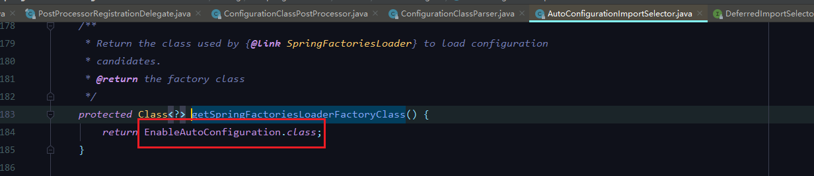

## SpringBoot自动自动装配

### SpringBoot启动流程

#### 启动准备

1. 启动类为入口

2. 进入run方法

   

3. 创建了一个SpringBoot程序

   

4. SpringApplication构造器

   

5. 进入getSpringFactoriesInstances方法

   

6. 进入loadFactoryNames方法

   

7. 进入loadSpringFactories

   

   这里加载的资源路径正是spring.factories的路径！

   回到getSpringFactoriesInstances方法

   

​	通过反射实例化

8. 加载完spring.factories 中ApplicationContextInitializer下的类后，一共加载了七个类

   

​	这七个类分别是：

​	

9. 将获取的类集合设置到initializers属性

   

 10. ApplicationListener和上面类似

     

#### 运行的核心步骤

1. 环境准备

   

​	

2. 进入prepareContext方法

   

3. 在prepareContext方法末尾加载主启动类

   

4. 进入load()方法

   

   

   

​	

在@SpringBootApplication  =》 @SpringBootConfiguration  =》 @Configuration中

5. 进入AbstractApplicationContext.refresh()方法

​	

看这个类，使用全局搜索发现没有这个类

搜索AnnotationConfigUtils类，发现里面有个属性，他的值和刚才的类一样

找到这个属性的使用方法，发现实际是操作了一个ConfigurationClassPostProcessor类

这个类刚好是BeanFactoryPostProcessor的扩展类

继续往下执行，并进入这个方法

此时程序就进入前面说的ConfigurationClassPostProcessor类了

如果没有被@Configuration修饰则直接返回，显然这里主启动类是被修饰的，所以继续往下执行

这里对主启动类进行排序

解析被@Configuration修饰的类

直到进入到

找到这个方法才是真正解析的逻辑

重点说一下@Import

主要有一下两个

继续执行，返回到parse方法

找到最下面的的process方法

 

这里的EnableAutoConfiguration类和spring.factories中的对应

