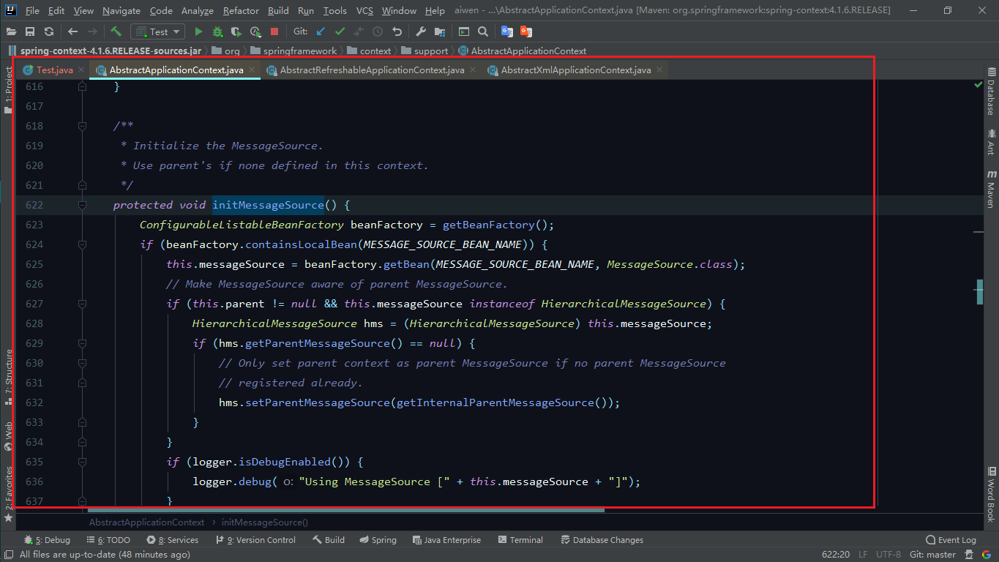
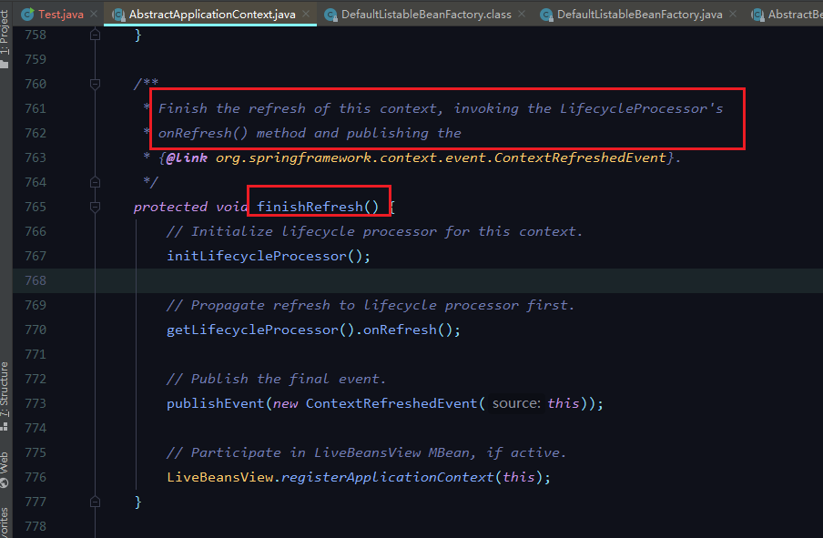

## SpringIOC


大致图解：


1. 加载xml文件

   


​	


> setConfigLocations方法


2. 调用Refresh方法

   


>  Refresh方法


prepare*方法都是准备工作！

```java
@Override
	public void refresh() throws BeansException, IllegalStateException {
		synchronized (this.startupShutdownMonitor) {
			// Prepare this context for refreshing.
         	// 准备工作
			prepareRefresh();

			// Tell the subclass to refresh the internal bean factory.
            // 实例化BeanFactory
			ConfigurableListableBeanFactory beanFactory = obtainFreshBeanFactory();

			// Prepare the bean factory for use in this context.
            // 准备工作，设置或忽略Factory中的一些
			prepareBeanFactory(beanFactory);

			try {
				// Allows post-processing of the bean factory in context subclasses.
                // 做扩展
				postProcessBeanFactory(beanFactory);

				// Invoke factory processors registered as beans in the context.
                // 实例化并执行BeanFactoryPostProcessors
				invokeBeanFactoryPostProcessors(beanFactory);

				// Register bean processors that intercept bean creation.
                // 注册BeanPostProcessors
				registerBeanPostProcessors(beanFactory);

				// Initialize message source for this context.
                // 国际化处理
				initMessageSource();

				// Initialize event multicaster for this context.
                // 初始化一个广播器
				initApplicationEventMulticaster();

				// Initialize other special beans in specific context subclasses.
                // 扩展
				onRefresh();

				// Check for listener beans and register them.
                // 注册监听器
				registerListeners();

				// Instantiate all remaining (non-lazy-init) singletons.
                // 实例化Bean
				finishBeanFactoryInitialization(beanFactory);

				// Last step: publish corresponding event.
                // 刷新
				finishRefresh();
			}

			catch (BeansException ex) {
				logger.warn("Exception encountered during context initialization - cancelling refresh attempt", ex);

				// Destroy already created singletons to avoid dangling resources.
				destroyBeans();

				// Reset 'active' flag.
				cancelRefresh(ex);

				// Propagate exception to caller.
				throw ex;
			}
		}
	}

```


> prepareRefresh()方法


> ```
> ConfigurableListableBeanFactory beanFactory = obtainFreshBeanFactory(); // 创建BeanFactory对象
> ```


refreshBeanFactory方法


> ```
> prepareBeanFactory(beanFactory);
> ```

配置工厂的标准上下文特征，*比如上下文的类加载器和后处理器。


> ```
> postProcessBeanFactory(beanFactory);
> ```

子类做扩展


> ```
> invokeBeanFactoryPostProcessors(beanFactory)
> ```


实例化并执行BeanFactoryPostProcessors！


> ```
> registerBeanPostProcessors(beanFactory)
> ```

注册BeanPostProcessor bean


> ```
> initMessageSource();
> ```

国际化的处理！





> ```
> initApplicationEventMulticaster()
> ```

初始化一个广播器！


> ```
> registerListeners()
> ```

注册监听器！


> finishBeanFactoryInitialization(beanFactory);


实例化Bean


```java
@Override
	public void preInstantiateSingletons() throws BeansException {
		if (this.logger.isDebugEnabled()) {
			this.logger.debug("Pre-instantiating singletons in " + this);
		}

		// Iterate over a copy to allow for init methods which in turn register new bean definitions.
		// While this may not be part of the regular factory bootstrap, it does otherwise work fine.
		List<String> beanNames = new ArrayList<String>(this.beanDefinitionNames);

		// Trigger initialization of all non-lazy singleton beans...
		for (String beanName : beanNames) {
			RootBeanDefinition bd = getMergedLocalBeanDefinition(beanName);
			if (!bd.isAbstract() && bd.isSingleton() && !bd.isLazyInit()) {
				if (isFactoryBean(beanName)) {
					final FactoryBean<?> factory = (FactoryBean<?>) getBean(FACTORY_BEAN_PREFIX + beanName);
					boolean isEagerInit;
					if (System.getSecurityManager() != null && factory instanceof SmartFactoryBean) {
						isEagerInit = AccessController.doPrivileged(new PrivilegedAction<Boolean>() {
							@Override
							public Boolean run() {
								return ((SmartFactoryBean<?>) factory).isEagerInit();
							}
						}, getAccessControlContext());
					}
					else {
						isEagerInit = (factory instanceof SmartFactoryBean &&
								((SmartFactoryBean<?>) factory).isEagerInit());
					}
					if (isEagerInit) {
						getBean(beanName);
					}
				}
				else {
					getBean(beanName);
				}
			}
		}
```


在doGetBean方法中


在createBean方法中


在createBeanInstance方法中会通过一系列的反射逻辑创建Bean对象


使用属性值在给定的BeanWrapper中填充Bean实例


到此Bean创建并实例化完成！


> ```
> finishRefresh();
> ```

完成此上下文的刷新，调用LifecycleProcessor的 onRefresh（）方法并发布



