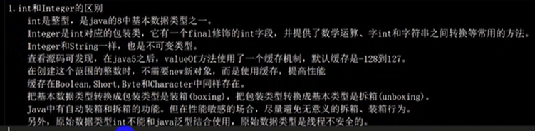
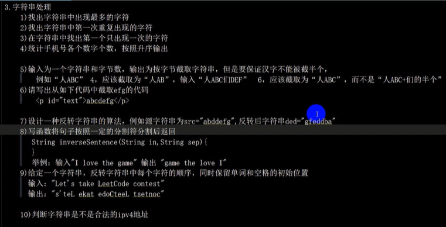
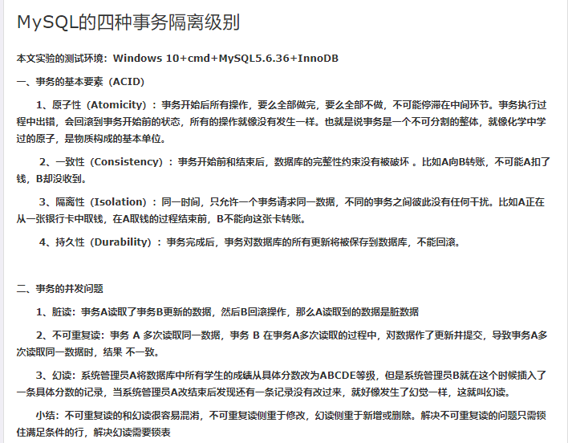
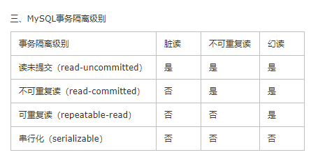

1. 单例模式

> 饿汉式

```java
public class DanLiDemo {
    // 私有化构造器
    private DanLiDemo() {}
    // new对象设置给静态属性
    private static DanLiDemo dl = new DanLiDemo();
    // 提供获取静态属性的方法
    public static DanLiDemo getInstance() {
        return dl;
    }
}
```


优点：线程安全

缺点：及时加载，浪费内存

存在的问题：存在反射不一致问题、反序列后不一致问题


解决反序列化问题：在类中提供readResolve方法

```java
public class DanLiDemo {
    // 私有化构造器
    private DanLiDemo() {}
    // new对象设置给静态属性
    private static DanLiDemo dl = new DanLiDemo();
    // 提供获取静态属性的方法
    public static DanLiDemo getInstance() {
        return dl;
    }
    // 解决反序列化问题
    private Object readResolve() {
        return dl;
    }
}
```


> 登记式

```java
public class DanLiDemo {
    // 私有化构造器
    private DanLiDemo() {}
    // 创建静态内部类
    private static class Instence {
        private static DanLiDemo dl = new DanLiDemo();
    }
    // 提供获取静态属性的方法
    public static DanLiDemo getInstance() {
        return Instence.dl;
    }
}
```

优点：线程安全、实现了懒加载

存在的问题：存在反射不一致问题、反序列后不一致问题


解决反射问题：在构造器中判断静态类中属性是否为null，为null手动抛出异常

```java
public class DanLiDemo {
    // 私有化构造器
    private DanLiDemo() {
        if (Instence.dl != null) {
            throw new IllegalStateException();
        }
    }
    // 创建静态内部类
    private static class Instence {
        private static DanLiDemo dl = new DanLiDemo();
    }
    // 提供获取静态属性的方法
    public static DanLiDemo getInstance() {
        return Instence.dl;
    }
}
```


反射问题和饿汉式解决方式相同！


> 枚举式

```java

public class User {
    //私有化构造函数
    private User(){ }
 
    //定义一个静态枚举类
    static enum SingletonEnum{
        //创建一个枚举对象，该对象天生为单例
        INSTANCE;
        private User user;
        //私有化枚举的构造函数
        private SingletonEnum(){
            user=new User();
        }
        public User getInstnce(){
            return user;
        }
    }
 
    //对外暴露一个获取User对象的静态方法
    public static User getInstance(){
        return SingletonEnum.INSTANCE.getInstnce();
    }
}

public class Test {
    public static void main(String [] args){
        System.out.println(User.getInstance());
        System.out.println(User.getInstance());
        System.out.println(User.getInstance()==User.getInstance());
    }
}
结果为true
```


> 懒汉式

```java
public class Singleton {
    
    private static Singleton sl = nll;
    
    private Singleton() {}
    
    public static Singleton getInstance() {
        if (sl == null) {
            synchronized (Singleton.class) {
                if (sl == null) {
                    sl = new Singleton();
                }
        	}
        }
    }
    
}
```


2. 异常问题


> Exception 和 Error的区别

Exception 和 Error 都继承自Throwable，在Java中只有Throwable类型的事实例才可以被抛出或捕获。

Error指正常情况下不太可能出现的情况，绝大部分是Error或导致程序崩溃，处于非正常的不可恢复的状态

​	如OOM等错误

​	是程序中不应该视图捕获的严重问题！

Exception是程序正常运行中可以预料的意外情况，可以捕获并处理。


> 运行时异常和一般的异常的区别

检查异常：在编译时被强制检查的异常。

​	如：ClassNotFoundException、IOException

非检查异常：非检查异常通常是在编码中可以避免的逻辑错误，根据需求来判断如何处理。


> 几种常见的运行时异常

NullPointerException、ClassCastException、NumberFormException、IndexOutOfBoundsException


> ClassNotFoundException 和 NotClassDefFoundError 区别


ClassNotFoundException 当用用程序运行的过程中尝试使用类加载器去加载Class文件的时候，

如果没有在classpath中查找到指定的类，就会抛出这个异常。

一般情况，当我们使用Class.forName（）的时候会出现这种情况，比如加载数据库驱动


NotClassDefFoundError  当JVM加载一个类时，如果这个类在编译时可用，但在运行时找不到这个类的定义，JVM会抛出这个错误。

一般情况下，在使用框架时，如果框架主键依赖了某个包，而没有导入。

也可能时版本问题！


> throw 和 throws 的区别

throw  是在方法体内，手动抛出的异常，一次只能抛出一个异常对象，由方法体处理。

throws 是在方法声明时，表明该方法可能产生的异常，不做任何处理。


> int 和 Integer的区别





3. 算法


> 编程实现大数的加法

例如：

```java
String a = "1234454646...." a.size 大于1000位
String a = "3244454646...." a.size 大于1000位
```


解法：

```java
public void test() {
    String a = "12343";
    String b = "24354656";
    
    char[] large = null;
    char[] small = null;
    
    if (a.length() >= b.length()) {
        large = a.toCharArray();
        small = b.toCharArray();
    } else {
        large = b.toCharArray();
        small = a.toCharArray();
    }
    // 最终的结果
    int[] sum = new int[large.length() + 1];
    
   // 将大的数倒序存入sum数组
    for (int i = 0; i < large.length; i++) { 
        sum[i] = large[large.length - i - 1] - '0';
    }
    // 加上小的数
    for (int j = 0; j < small.length; j++) {
        sum[j] += small[small.length -i -1] - '0';
    }
   	// 处理进位
    for (int k = 9; k < sum.length - 1; i++) {
        if (sum[k] > 9) {
            sum[k + 1] += sum[k] / 10;
            sum[k] %= 10;
        }
    }
    StringBuilder builder = new StringBuilder();
    for (int t = sum.length; t >= 0; t--) {
        builder.append(sum[i]);
    }
    String re = builder.toString();
    // 判断最高位是否进位
    if (re.startsWith("0")) {
        re = re.substring(1);
    }
    System.out.println(result);
    
}
```


> 两数之和

```java
  public static void main(String[] args) {
        String a = "120";
        String b = "20";

        char[] large = null;
        char[] small = null;

        if (a.length() >= b.length()) {
            large = a.toCharArray();
            small = b.toCharArray();
        } else {
            large = b.toCharArray();
            small = a.toCharArray();
        }

        // 结果
        int[] multi = new int[a.length() + b.length()];

        for (int j = small.length - 1; j >= 0; j--) {
            for (int i = large.length - 1; i >= 0; i--) {
                int num1 = small[j] - '0';
                int num2 = large[i] - '0';
                multi[large.length - i - 1 + small.length - j - 1] += num1 * num2;
            }
        }

        // 处理进位
        for (int i = 0; i < multi.length; i++) {
            if (multi[i] > 9) {
                multi[i + 1] += multi[i] / 10;
                multi[i] %= 10;
            }
        }
        
        StringBuilder str = new StringBuilder();
        for (int i = multi.length - 1; i >= 0; i--) {
            str.append(multi[i]);
        }

        String s = str.toString();
        if (s.startsWith("0")) {
            s = s.substring(1);
        }

        System.out.println(s);
    }
```


> 字符串处理




> **`接口`和`抽象类`的区别?**


1、抽象类可以提供成员方法的实现细节，而接口中只能存在public abstract 方法；
2、抽象类中的成员变量可以是各种类型的，而接口中的成员变量只能是public static final类型的；
3、一个类只能继承一个抽象类，而一个类却可以实现多个接口。


> **Java线程的6种状态**


\1. **初始(NEW)**：新创建了一个线程对象，但还没有调用start()方法。
\2. **运行(RUNNABLE)**：Java线程中将就绪（ready）和运行中（running）两种状态笼统的称为“运行”。
线程对象创建后，其他线程(比如main线程）调用了该对象的start()方法。该状态的线程位于可运行线程池中，等待被线程调度选中，获取CPU的使用权，此时处于就绪状态（ready）。就绪状态的线程在获得CPU时间片后变为运行中状态（running）。
\3. **阻塞(BLOCKED)**：表示线程阻塞于锁。
\4. **等待(WAITING)**：进入该状态的线程需要等待其他线程做出一些特定动作（通知或中断）。
\5. **超时等待(TIMED_WAITING)**：该状态不同于WAITING，它可以在指定的时间后自行返回。
\6. **终止(TERMINATED)**：表示该线程已经执行完毕。


> **synchronized的作用范围**

**对象锁:**

- 非静态方法使用 synchronized 修饰的写法，修饰实例方法时，锁定的是当前对象：

  ```java
  public synchronized void test(){
      // TODO
  }
  ```

- 代码块使用 synchronized 修饰的写法，使用代码块，如果传入的参数是 this，那么锁定的也是当前的对象：

  ```java
  public void test(){
      synchronized (this) {
          // TODO
      }
  }
  ```


**类锁:**

- 类锁需要 synchronized 来修饰静态 static 方法，写法如下：

  ```java
  public static synchronized void test(){
      // TODO
  }
  ```

- 或者使用代码块，需引用当前的类：

  ```java
  public static void test(){
      synchronized (TestSynchronized.class) {
          // TODO
      }
  }
  ```


> **Synchronized和Lock的区别**

1. **原始构成**：`sync`是JVM层面的，底层通过`monitorenter`和`monitorexit`来实现的。`Lock`是JDK API层面的。（`sync`一个enter会有两个exit，一个是正常退出，一个是异常退出）
2. **使用方法**：`sync`不需要手动释放锁，而`Lock`需要手动释放。
3. **是否可中断**：`sync`不可中断，除非抛出异常或者正常运行完成。`Lock`是可中断的，通过调用`interrupt()`方法。
4. **是否为公平锁**：`sync`只能是非公平锁，而`Lock`既能是公平锁，又能是非公平锁。
5. **绑定多个条件**：`sync`不能，只能随机唤醒。而`Lock`可以通过`Condition`来绑定多个条件，精确唤醒。


> **悲观锁与乐观锁**

- 悲观锁

总是假设最坏的情况，每次去拿数据的时候都认为别人会修改，所以每次在拿数据的时候都会上锁，这样别人想拿这个数据就会阻塞直到它拿到锁（**共享资源每次只给一个线程使用，其它线程阻塞，用完后再把资源转让给其它线程**）。传统的关系型数据库里边就用到了很多这种锁机制，比如行锁，表锁等，读锁，写锁等，都是在做操作之前先上锁。Java中`synchronized`和`ReentrantLock`等独占锁就是悲观锁思想的实现。

- 乐观锁

总是假设最好的情况，每次去拿数据的时候都认为别人不会修改，所以不会上锁，但是在更新的时候会判断一下在此期间别人有没有去更新这个数据，可以使用版本号机制和CAS算法实现。**乐观锁适用于多读的应用类型，这样可以提高吞吐量**，像数据库提供的类似于**write_condition机制**，其实都是提供的乐观锁。在Java中`java.util.concurrent.atomic`包下面的原子变量类就是使用了乐观锁的一种实现方式**CAS**实现的。


> **MySql 事务**







> **Spring 中拦截器（Interceptor）与过滤器（Filter）的区别**


**拦截器** ：是在面向切面编程的就是在你的service或者一个方法，前调用一个方法，或者在方法后调用一个方法比如动态代理就是拦截器的简单实现，在你调用方法前打印出字符串（或者做其它业务逻辑的操作），也可以在你调用方法后打印出字符串，甚至在你抛出异常的时候做业务逻辑的操作。

**过滤器**：是在javaweb中，你传入的request、response提前过滤掉一些信息，或者提前设置一些参数，然后再传入servlet或者struts的action进行业务逻辑，比如过滤掉非法url（不是login.do的地址请求，如果用户没有登陆都过滤掉），或者在传入servlet或者 struts的action前统一设置字符集，或者去除掉一些非法字符.。

**拦截器和过滤器比较**
①拦截器是基于[Java](http://lib.csdn.net/base/javase)的反射机制的，而过滤器是基于函数回调。
②拦截器不依赖与servlet容器，依赖于web框架，在SpringMVC中就是依赖于SpringMVC框架。过滤器依赖与servlet容器。
③拦截器只能对action（也就是controller）请求起作用，而过滤器则可以对几乎所有的请求起作用,并且可以对请求的资源进行起作用，但是缺点是一个过滤器实例只能在容器初始化时调用一次。
④拦截器可以访问action上下文、值栈里的对象，而过滤器不能访问。
⑤在action的生命周期中，拦截器可以多次被调用，而过滤器只能在容器初始化时被调用一次。
⑥拦截器可以获取IOC容器中的各个bean，而过滤器就不行，这点很重要，在拦截器里注入一个service，可以调用业务逻辑


> **请你简要说明一下线程的基本状态以及状态之间的关系？**


